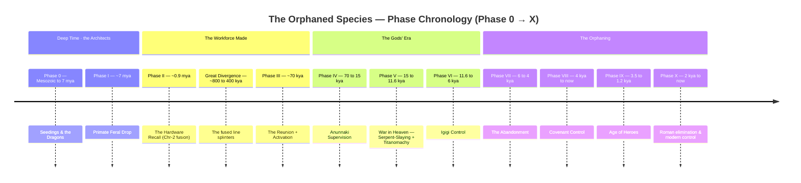
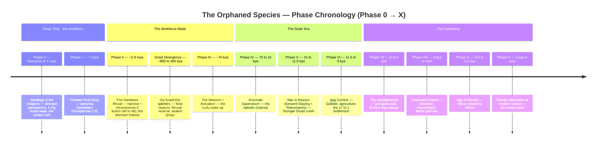

# The Orphaned Species — Master Timeline

*Cross-series chronology. One spine for all five books: the canonical phases (from `30_The_Human_Experiment` Appendix A), the Book 5 narrative chapters that dramatize each phase, and the real-science anchors that ground them.*

**The five books**
1. **Manual Override** (`10_`) — the practice manual: meditation, consciousness, breaking the program.
2. **The Social Game** (`20_`) — social control, hierarchy, the mechanics of the spectacle.
3. **The Human Experiment** (`30_`) — the mythological framework + the canonical timeline (Appendix A).
4. **The Consciousness Technologies** (`40_`) — the suppressed tools (plant medicine, breathwork, sound, healing touch).
5. **The Orphaned Species** (`50_`) — the mythic-narrative capstone: border-raised survivor Eli leaves a temporary Forest City refuge for reopened Melaka and receives seven distinct historical carrier-imprints; Bronze-Age Aedan and the Cuno→Derw record are separate partial relays.

**Source of truth.** The phase structure and dates are canon from `30_The_Human_Experiment/src/90_appendix/10_timeline.md`. Where this doc and that appendix disagree, the appendix wins until reconciled. Science anchors are tracked in `50_The_Orphaned_Species/90_epigraphs_and_sources.md`. Testable predictions and falsifiers derived from the cosmology (the anchor-vs-gloss surplus, tagged *live / strained / unfalsifiable*) are collected in `50_The_Orphaned_Species/91_predictions_and_falsifiers.md`.

---

# Part I — Scannable Summary

*A condensed, reorganized spine for quick reference — flattened lists, clean dividers, scannable tables. This summary is lossy by design; the **Full Canon** in Part II carries every science anchor, citation, and reconciliation, and wins wherever the two differ.*

## The Three-Tiered Cosmic Hierarchy & Cast

The biological and political taxonomy of the universe. Do not conflate the primordial architects with their super-powerful creations, or either with the harvested human workforce. The tiers are nested: serpents engineer the gods; the gods (with the serpents' sanction) **harvest, fuse, and admix** the workforce — from feral Earth stock the serpents had seeded deep in time (the ~7-Mya Feral Drop), not a fresh import.

### Tier 1 — The Primordial Architects (The Serpents)

* **Tiamat & Leviathan:** The true alien masters. A serpentine, psionic, dragon-like species operating on a cosmic scale. Lacking humanoid form and fine motor control (**no hands — the workshop is the body**), they work through **telepathic symbiosis**, directing bio-engineered proxy species to terraform planets and build their infrastructure.
* **The Medium:** Consciousness technologies use **anti-entropic energy from the non-entropic plane**, the medium through which souls maintain and affect embodied life. Planetary ley lines conduct it locally; the serpents exploit but do not own it. The **Cave of Dragons** is their organic deep. Tiamat, "the dragon at the cave's mouth," is the architect sitting at the threshold. Their murder by the gods (Marduk slaying Tiamat) is the thesis statement — the engineered managers killing their organic makers.

### Tier 2 — The First Draft (The "Gods")

* **The Gods — two generations (each weaker than the one above).** Engineered by the serpents *before* humans as planetary managers: humanoid, but imbued with god-like power (electromagnetism, weather, localized physics). They sit on a **ladder of diminishing power** that runs serpents → elder gods → younger gods → humans.
* **Elder gods — the Titans / Anunnaki (Enki's faction):** the golden-age establishment, *pro-freedom* — they argue for eventual human independence and seed the dormant "locks." **These are the gods who crash in Phase V.**
* **Younger gods — the Igigi / Olympians (Enlil's faction):** *weaker* and *pro-control* — too weak to beat their elders in open war, so they **sabotage** them (the **Titanomachy / Generational War**, Phase V), inherit the ruined Earth, run the control era (Phase VI), and abandon the planet (Phase VII).
* **Not monolithic — the recurring dissenter (Enki / Prometheus).** The generations are *tendencies, not blocs.* Each holds multiple groups, and in every one there is a **Promethean figure** who defies their own kind for humanity: **Enki** among the Anunnaki (seeds the locks, argues for freedom, sends the **Apkallu** to teach us); **Prometheus** among the Titans (steals fire). Even the control-faction Igigi are not uniform — *some* cull the hybrids, others shield them. The dissenter chooses **solidarity across the power gradient over loyalty to their own tier** — the very answer the experiment is testing for, modeled in advance by a traitor-to-his-kind in every generation. **Credit rule:** when the story names fire, cooking, tool-wisdom, or the first humane survival technology as a *gift*, give the credit to **Prometheus / Enki** — the rebel-helper, not the controllers.
* **The Flaw & The Mutiny:** Because they were so powerful, their egos were massive. Ordered to do the grueling labor of terraforming and mining Earth, the gods **mutinied and refused to work** (the *Atrahasis* revolt — **Phase V, ~13 kya**). Humanity was not created to replace them; the workforce was already seeded deep (Feral Drop, ~7 Mya) and harvested at the Hardware Recall (~0.9 Mya). "Made to replace the striking gods" is the controllers' **retroactive story**.
* **Rule of Thumb:** Control-era actors (war, mining, breeding, Nephilim, the purge, the abandonment) are **Igigi**. The golden age, the locks, and the dormant birthright are **Anunnaki**. A hybrid's superhuman *body* is god-inherited; the deepest *resonance* it can tap is Tier-1 serpent.

### Tier 3 — The Replacement Workforce (Humanity)

**Axis 1: The Evolutionary Ladder (Developmental State)**

* **Hominid:** Earth's wild, un-engineered **48-chromosome** native stock (including cousins like Neanderthals/Denisovans).
* **Adamu (The Domesticated Prototype):** The feral Earth descendants of the ~7-Mya **Feral Drop** (the architects' 48-chromosome drone-stock), **harvested and fused on Earth** at the Hardware Recall (Phase II, ~0.9 Mya). The chromosome-2 fusion (48 → 46) is a **firewall and receiver**. Branding them *Adamu* ("creatures of the dirt") weaponizes a true fact to bury their cosmic origin. Harvested, fused, locked, but dormant.
* **Lullu (The Activated Workforce):** The *activated, admixed* worker-species, encompassing all modern *H. sapiens*. The docile Adamu stock was deliberately crossbred with Earth's native hominids to inject **"wild code,"** granting independence and rebellion capacity (Phase III).

**Axis 2: Lineage & Hybridization (Within the Lullu)**

* **Qingu:** The sealed, low-admixture **pure reserve** (paleogenetics: *Basal Eurasian*). Kept biologically cloistered and compliant in the Persian Gulf refugium (Dilmun/Eden). Unsealed at Phase VI to run the agricultural grids. Also the Igigi's propaganda god-name for the slain progenitor.
* **The Gibborim (The Wall):** The giant, **sterile** first-generation sons of the fallen **Watchers** (Nephilim × Lullu females) — "the mighty men of renown," the tyrant-kings. They inherit destructive power but are trapped in the drone-worker frame. Used to enforce the Phase VI reproductive bottleneck. *(The **Nephilim** proper are the fallen High-Place guardians who sired them — see "The Guardians" in Part II.)*
* **The Nephilot (The Hidden Carriers):** The downstream, **fertile** descendants of the gibborim (≈25% guardian-blood). Surviving through fertile female hybrids breeding "down" into the Lullu. Physically indistinguishable from humans, they carry god-power and Tier-1 psionic sensitivity. Remembered later as Elves and Albians.

**Axis 3: The Vocations (The Sages)**

* **Apkallu:** Antediluvian, semi-divine culture-bringers, **and the lowland-sea guardian class** (the **snake** to the Watchers' **bird**) — **Enki's Promethean wisdom-line**, the institutional arm of the dissenter: sent up from the Abzu (**Eridu** = Enki's city) to carry the forbidden gift — fire, language, the **locks**, the field-tuning — to the workforce, against the control faction. **Uanna** (Oannes) is the premier Apkallu. Their strictly-human heirs are the **Umannu** (→ the Albian Singers), and the knowledge they plant is what the hidden **Nephilot** carriers later keep alive: *Enki's gift running on the god-blood's hardware* (the Igigi-derived body, the Anunnaki "locks" it can pick).
* **Umannu:** The late, strictly human scholar-sage class. Post-Flood heirs of the Apkallu who **tune** the dormant resonance (their living memory is the Albian Singers' practice).

---

## Sacred Geography — The Zoning Model

The myth-names of paradise and the mountain of the gods are functions, not varied places. Rule: **Many names, few places**.

### 1. The Wild (Edin) — The Organic Substrate

Unmanaged Earth, **Tiamat's warm biological grid**. "Paradise" was simply the planet functioning before the grid was laid over it. This includes the surface wilderness and its organic depth (the Abzu, the Cave of Dragons).

* **Genetic Correlate:** Everything *outside the seal*. Earth's deep native 48-chromosome hominids and the 46-chromosome Neanderthals/Denisovans (the early split from Eden I) that went feral and accumulated "wild code."
* **Names:** The steppe / `edin`; Tartarus, the Abzu, the underworld, the Cave.

### 2. The Nurseries (Gardens) — Genetic Clean Rooms

Pieces of the Wild fenced off for biogeographic isolation to block Earth's wild variables from contaminating the imported Adamu line (Phase II–III).

* **Genetic Correlate:** The sealed, low-admixture line → the **Qingu** (Basal Eurasian). The type-site is **Dilmun** (Persian Gulf). Dilmun = Eden = the surviving sealed nursery = the Qingu reserve.
* **Names:** Eden / Dilmun; the Hesperides; Aaru; the Dreaming.

### 3. The High Places (Grid Nodes) — Infrastructure

Mountain peaks and high plateaus chosen for geomagnetic stability. Signal-repeaters plugged into the planet's field — the **cold industrial nodes** of the Igigi control era.

* **The Cargo Cult:** When the grid is decommissioned (Phase VII Abandonment), humanity sacralizes the dead hardware. Mountain-holiness is a cargo cult around empty infrastructure.
* **Names:** Olympus; Hermon; Sinai / Horeb; Meru / Kunlun / Zaphon; the high stone circles. Artificial nodes include the Ziggurat / Babel.

### Zone Cross-Reference Roster

| Mythic Name | Tradition | Zone |
| --- | --- | --- |
| **Eden / Dilmun** | Hebrew / Sumerian | Nursery (The Qingu / Basal Eurasian reserve) |
| **Hesperides' Garden** | Greek | Nursery (Island, dragon-guarded) |
| **Avalon / Tír na nÓg** | Celtic | Nursery (Late — relocated west, Phase IX) |
| **Hermon** | Enochic | High Place / Node (Watchers → Nephilim) |
| **Olympus / Sinai / Meru** | Greek / Hebrew / Hindu | High Place / Node |
| **Ziggurat / Babel** | Sumerian / Hebrew | High Place (Artificial — Phase VII+) |
| **`edin` / The Steppe** | Sumerian | The Wild |
| **Abzu / Tartarus / The Cave** | Sumerian / Greek | The Wild (Organic depth) |

---

## The Panspermic Cycle — the Bootstrapping Loop

The deep-time spine is not a one-off creation; it is one turn of a **self-propagating cycle**. The makers do not personally tend every world — they **scatter DNA** across many (the automated carbonaceous capsules of Phase 0) and wait. Most seedings fail. The protocol only advances on a world that clears a single bar:

1. **Seed (panspermia).** Automated capsules deliver the abiotic kit + the compressed gigaviral blueprints. Biology is then left to bootstrap on its own for hundreds of millions of years.
2. **The viability test — a psionic species.** Every planet has a natural **ley-line network** — a universal planetary feature, like a magnetic field — but it sits *silent* until something learns to use it. A seeding "succeeds" only if the world evolves, by pure unhurried biology, a mind able to **signal along the ley lines** — a species that can *broadcast*. On Earth that species is the **dragons** (Panspermia 1.0's deep survivors, refined inward across ~60 My).
3. **First contact — the planet lights up.** This is not a deliberate phone call; it is an **emission.** When a psionic species runs traffic along a planet's ley lines, the network radiates a **detectable beacon** — and *every* planet does this, so the makers need only **listen.** A silent world is a failed or empty seeding; a **beaconing** world has produced a mind. The dragons don't *choose* to call home — by simply *using Earth's ley lines* they light the beacon, and that emission is what promotes a forgotten seed-world into an active project. "Invest only in worlds that ring" is literal, and ringing is automatic — which is also why most worlds stay dark: most never evolve a mind to light them. *(Book-5 charge: to use the network is to **announce yourself.** Relighting the nodes relights the beacon — and the makers may not be the only thing listening.)*
4. **The workforce — building the hands.** The catch the whole cycle turns on: **the contact-species is handless and the makers are bodiless.** A dragon ("no hands — the workshop is the body") and a remote, formless maker can *talk* but cannot *build*. So contact triggers the next stage — manufacturing a **handed drone workforce**: Panspermia 2.0 (the Feral Drop, ~7 Mya) drops primate drone-stock, later harvested and fused (the Hardware Recall, ~0.9 Mya) into the labor force — **the hands the psionic system lacks**, made *for when the makers come* (come *online*, in signal; they never arrive in body — see [The Safehouse Premise](#the-safehouse-premise--earth-as-refuge)).
5. **The cycle closes — the world becomes a launch-point.** The workforce terraforms, mines, and builds the infrastructure that turns the planet into a **node** — and a node can **seed the next worlds.** Each success becomes the next iteration's origin.

So the order is load-bearing, and it is already the chronology: **dragons before drones.** The psionic beacon (Phase 0) must exist *before* the workforce program (Phases I–II), because the beacon is what summons it.

**What the cycle is really testing.** The loop's *default* is to close — a matured workforce becomes the next seeder and runs the whole thing again. But the makers are not just propagating; they are **experimenters**, and the cycle is a rig for a question they cannot answer from above: *can a species, once handed power, live **peaceably** with beings far more powerful than itself — instead of being enslaved by them, exterminated by them, or simply becoming them and running the loop?* That reframes the makers' temperature: neither strip-miner nor parent but **the one who sets the test.** The **orphaned species are the hands**, and adulthood is **not** inheriting the loop (becoming the next exploiter) but **breaking it** — proving coexistence across a power gradient is possible. The cycle builds the test; the thesis is whether anyone ever passes it. *(The continuity/refuge face of this same machinery is [The Safehouse Premise](#the-safehouse-premise--earth-as-refuge), below; the capsule architecture and the dragons themselves sit in **Phase 0**.)*

---

## The Safehouse Premise — Earth as Refuge

Underneath the whole timeline sits a premise the controllers never advertise: **Earth is a safehouse.** The makers did not seed this world only to mine it — they seeded it as a **bolt-hole against catastrophe**, a place to keep their work alive when their own end came. Hold one correction at the center: **they never came here in person** — they have no bodies to send. They reach Earth only as *pattern* (seed and signal) and **build their presence out of Earth's own matter** — the dragons, the titans, and finally the harvested human line. They are never *out of contact*, though: the **anti-entropic medium** carries consciousness across planes and distance, Earth's ley lines distribute it locally, and every form they build is fitted to receive it — the dragons broadcasting natively, the gods speaking through the medium, the human workforce wired with the seam-**receiver** (Phase II) that the Activation (Phase III) switches on. **The makers never arrive in body; they are always present in signal.** Read this way, the three Edens are three *intentions* layered on one world:

* **Before the crash — insurance.** The Feral Drop (Phase I) and the genetic harvest (Eden I) pre-position a **contingency workforce**: a drone-stock seeded wild and later recalled, so that if the wider project ever crashed, a hardened labor base would already be waiting on a prepared world. Eden I is the lifeboat stocked before the ship goes down.
* **Through the crash — continuity, not flight.** Because the makers send no bodies, survival can't be evacuation — it has to be **built into the forms themselves.** The **dragons** are engineered to vitrify and sleep through any winter (some may still be down there); the harvested **human** line carries **dormant locks** and the seam-receiver. So the lifeboats are also **transceivers**: a sleeping dragon or a latent bloodline is not just a survival pod but a way back *into contact* — the channel home, ready to relight when the field warms (*what wakes when the nodes come back on?*). Earth is a safehouse because it is stocked with lifeboats *made of local flesh* that can outlast an end none of the makers' own works could — and still phone home. This is the deep, deliberately-unexplained urgency behind the **Hardware Recall** (Phase II): *not* god-politics (those come ~900k years later) but continuity secured in a durable, Earth-built form.
* **Among the made — a pure line.** The Covenant Garden (Eden III) is the attempt to breed one clean, controllable bloodline out of the admixed Lullu — the **line of Adam, kept uncorrupted by the Nephilim**, the one that *should* have been the most domesticated.

This is the orphan theme read all the way up: **the makers, too, persist only as what they built and left behind** — never present in body, reachable only down the field, their continuity carried by the very forms (dragon, human) they constructed here. Humanity is one such form on a sanctuary world, fitted with a receiver it has forgotten how to hear — which is why *orphaned species* cuts in both directions: the line home went quiet, and the orphan is the form left holding a silent receiver. *(No longer open: the catastrophe has a name — the **Younger Dryas impact (~12.9 kya), an unintentional crash** (Phase V), not a weapon. The insurance was stocked ~900k years earlier at Eden I; the crash it guarded against came at the end of the golden age, and everything after — the control era, the Abandonment — is its long aftermath: the makers' agents limping and dying, not a master plan.)*

---

## The Two Trees — the Deceivable Species

Two planes underlie the cosmology. The **plane beyond Earth** — where the bodiless makers live — runs on **spirit-to-spirit telepathy** (mind touches mind *directly*, so nothing can be falsified) and has **no entropy** (no decay, no death — immortality "in a sense"). The **Earth-plane** is its inverse: knowledge here is **mediated** — carried in words, signs, *transmitted* report that can always be falsified — and it is **entropic** (everything here dies). The **Tree of Life is the bridge** between them — and concretely it is **Earth's own ley lines**: the planet's native conductor-network, owned by no one, carrying the anti-entropic medium. **Played like an instrument**, the network both **crosses** a mind to the plane beyond (direct knowing, no decay) *and* **sends the beacon** (the Panspermic Cycle's "hello"). Bridge and beacon are one act; the Tree answers only to whoever can *play* it. *(The gods build **interfaces** to this native network — the orbital structure, the stone-circle node-network — as **apparatus of the experiment**; the interface is never the Tree.)*

**The charge-control architecture — how soul moves machine.** The human body-brain is a **machine / robot / autopilot** able to continue when its conscious occupant is not directly controlling it. **Conditioning is the machine's rule-set** — genetic, developmental, cultural, traumatic, and habitual instructions. **Charges are separate:** impulses descend through the receiver in the anti-entropic medium and are deposited into the machine, where they animate or steer those rules in three directions. **Positive charge pulls**, **negative charge pushes**, and **neutral charge continues the current program without examination**. Under autopilot these are the functional equivalents of the Buddhist **three poisons** — craving, aversion, and ignorance. **Psi or life-energy allocation** is the bounded control-energy available to the embodied soul at a given time; the larger source may remain available while local access and throughput are finite. Conditioning can capture, amplify, inhibit, or route a charge, but it does not create the charge. **Samsara is the resulting cycle:** the robot repeatedly executes charged rules until the conscious soul controls the charges and breaks the guaranteed repetition. Inefficient control burns allocation through suppression, force, identification, and contradictory commands; practiced control uses less. A **neutral charge** (ignorant continuation) is therefore not a **completed/unbound charge** (freedom from compulsion).

**The planes are a *hierarchy,* and the Makers are beyond.** "Two planes" is only the floor of a deeper structure: an **ascending ladder of planes** — the **Earth-plane** below, then the **spirit-plane,** then higher planes of higher spirits, up to the **Makers** at the formless top. **The Makers are *beyond* Tiamat:** the serpents/dragons are the Makers' *manifest* form on Earth (their organic apex, the beacon); the Makers themselves are **unmanifest, bodiless, reachable only as signal** — the apophatic apex, a God beyond the God. The "plane beyond Earth" above is the **first rung** of this climb, not the summit; the Tree of Life is the *ascent.*

**The dead persist as spirits — and rise.** Death is not the end (the deepest deception of the entropic plane is that it *is*): the dead **persist as spirits,** and their nature is to **ascend** the ladder toward the Makers. So **the dragons are gone in body but one spirit remains** (the deep-time voice); **the old gods/guardians are gone in body but persist as spirits** — the *fallen* among them (the Watcher/Igigi *demons*) lingering low, **whispering to and steering the living** (the present war is the surface of a war *between spirits* across the planes); the *faithful* (the snake/Apkallū) and the dragon-spirit guiding *upward.*

**The grid runs on tethered souls (the dark mechanism of the relit nodes).** Because the dead *rise,* a spirit can be held **Earth-bound** only if it is **tethered** by an unfinished attachment it will not release. The relit megalithic **grid needs a spirit to broadcast through** — so its operators **harvest carrier-souls** and bind them to the nodes by their tethers, the living engines of the amplifier. (A soul tethered by *love* — the hope of a reunion — is the cruelest and most stable battery; see `/00_NARRATIVE_STRUCTURE.md`, the mother-thread.) **To free a bound soul is to *sever the tether* — release the attachment so it can rise** — which is why the book's *release-not-grasp* thesis is also, literally, how the cage is unbuilt.

**Deception is the weapon that runs every rung of the ladder** — force is rare here, manipulation universal. The gods slew the serpents; the younger gods *sabotaged* the elder (treachery, not open war); the gods rule humans — all by **Machiavellian tactics** (the operational layer of control, the Social Game). But a lie only *lands* where knowledge is mediated. On the plane beyond, spirit-to-spirit, **you cannot lie** — the mind is read directly. So the deception that bounces off a field-connected god **lands on a human**, because humans were **barred from the bridge**: the locks suppressed, the seam-receiver dormant (Phase II–III), left on the mediated, entropic plane with nothing to check a claim against but more *transmitted* claims. **They ate the Tree of Knowledge (unripe); they were barred from the Tree of Life — and the bar is precisely what makes them deceivable.** A mortal that can only know what it is *told* is the one creature you can feed **wrong knowledge.**

**Adapa — the trap that closes on itself.** Offered the bread of life (the bridge — reconnection), Adapa is fed **wrong knowledge** (*"it is death; refuse it"*) and refuses, staying cut off *and* deceivable. The deprivation is **self-sealing**: lacking the Tree of Life makes you deceivable, and being deceivable is how you are talked out of *regaining* it. *(The canonical Adapa is "collapsed" into the premier Apkallu, **Uanna**.)* And the hand that deceives him is **Enki's** — the dissenter-helper. Hold both readings, because a deceivable species *cannot tell which is true*, and that is the point: either **deception is so total it runs through the helper too**, or it is **protective** — immortality joined to *unripe* knowledge is the same catastrophe as the green Tree of Knowledge, so Enki bars the bridge until the species can survive crossing it (the flaming sword as **mercy disguised as a lock**).

**Why the gods die — they lose the *interface*, not the Tree.** The Tree of Life was never theirs to own; it is Earth's ley-grid, native and free. What the gods owned was the **interface** to it — the **orbital structure** (also the climate platform) and the stone-circle node-network, the **apparatus of the experiment** by which they played and amplified the grid to stay bridged to the plane beyond. The Igigi **sabotage** (Phase V) cut that interface: the structure fell, and across the control era the nodes go dark one by one (Göbekli's burial, Stonehenge's last firing). **Marooned** on the entropic Earth-plane with no way left to *play* the bridge, the stranded gods begin to **decay like anything Earth-bound** — which is why "the rest die off" (Phase VII), and why **Psalm 82** sentences the divine council to *"die like men."* The Igigi won the war by **making themselves mortal.** The bitter irony: the Tree of Life lay all around them in the ground, but a god without its interface could no more play it than the lock-suppressed humans living on top of it — after the fall, **no one left could play the instrument.**

**The one exception — the dragons never lost it.** The dragons play the ley-grid with **no interface at all** — no orbital structure, no nodes, no picked locks — because the instrument *is* their own body: they are natively psychic, bridged by birth, conducting thought directly through the anti-entropic medium. So when the gods lose their apparatus and humans never had theirs, the dragons are the **single Earth lineage that keeps its Tree of Life** — born across to the plane beyond, and through **cryostasis** (vitrified sleep) approaching its no-entropy as well. Two things fall out of this. They are **un-deceivable**: you cannot feed wrong knowledge to a mind that reads the source directly, spirit-to-spirit — which is exactly why the gods could never fully **control or lie to** them (the canonical "two minds the gods cannot hear — the chimp in the forest and the dragon in the cave"; the dragon is the one that can also *reach back*). And they are the planet's standing **beacon** ([Panspermic Cycle](#the-panspermic-cycle--the-bootstrapping-loop)) — the one voice on Earth that never stopped playing. When the consciousness technologies are finally recovered, humanity is not inventing the bridge; it is learning, late and by training, what the dragons had by birth.

**So the coming-of-age, stated exactly: rebuild the bridge.** Regaining the Tree of Life = **reconnecting to the field — the consciousness technologies, the picked locks** (the thesis's whole arc). What it *buys* is the end of being fed wrong knowledge: an adult species can check against the source, mind-to-mind, and so can no longer be **deceived.** The cycle-breaker is not winning the Social Game — it is becoming the one species the Social Game can no longer **play.** *(Which reframes the Phase VII god-hunt: a maximally-deceivable workforce was almost certainly **aimed** — a surviving god-faction maneuvering humans into exterminating its rivals' blood. The made did not merely turn on its maker; it was **tricked** into turning.)*

**The shape of the crossing — the Three Circles.** "Rebuild the bridge" is not a private mystical event; it has a measurable structure, and Book 1 (*Manual Override*) already names it — the **Three Circles**: **Body** (the individual), **Family** (kin, relationship, and community), **Civilization** (institutions and the world). The governing law is **non-compartmentalization**: genuine reconnection radiates *outward* — a cooling **"nirvanic effluence"** through all three rings — while its counterfeit merely *leaks* outward (a private calm bought with contaminated relationships and a fled or wrecked world). This does two jobs the coming-of-age needs. **First, it is the individual→collective ladder** — the reason adulthood is a species-scale crossing and not one awakened skull. The Circles are how the one reaches the many *without coercion*: whoever genuinely **steps in** cannot help propagating the signal from **Body** through **Family** to **Civilization**, because effluence **radiates rather than recruits** — the exact inverse of the Igigi's *enforced* grid. The species passes the way a fever breaks: from the body outward. **Second, it is the lie-detector** — the empirical answer to *"is this true undeceivability or sophisticated spiritual bypassing?"* (the same question as *did the occupant take the controls, or is the autopilot performing calm?*). A counterfeit awakening betrays itself at the outer rings — serene face, broken bonds, withdrawal or righteous over-engagement — so **the reward cannot be faked**: the one species the Social Game can no longer *play* is precisely the one whose peace holds across all three circles at once. *(Book-1 anchor: `10_Manual_Override/src/30_part_mechanisms/50_energetics_of_agency.md`.)*

**The Three Circles are also the archaeology of the cage.** Read outward, they expose how god-oriented adaptations survive their gods. At the **Body**, the worker-organism treats usefulness, endurance, obedience, and provisioning as the price of safety. In the **Family**, the same vertical contract reappears as father-rule, approved descent, possessive love, care without limits, and sacrifice of the lower member for the household. In **Civilization**, temple, state, army, market, and bureaucracy inherit the vacant office and continue collecting bodies, surplus, obedience, and belief. The embodied gods and their functioning order are gone; surviving spirits are neither present owners nor legitimate recipients of these behaviors. The trilogy must show the instincts first in their old context, then misfiring or being exploited in the present, then consciously redirected. This is not a claim that all human instinct or organization is alien-made: attachment, reciprocity, play, protection, curiosity, and cooperation belong to the living substrate the cage captured.

**Technology's hidden telos — rehearsal for magic.** Across the experiment, technological development externalizes capacities the living species is not yet psychologically prepared to encounter in evolved bodies. Telecommunications make disembodied voice and distant contact ordinary before telepathy returns; recording and computation externalize memory and cognition; aircraft normalize flight; imaging renders invisible structures measurable; medicine turns once-miraculous repair into procedure; networks rehearse collective mind. The sequence is an exposure ladder: mechanism makes the impossible repeatable, repeatability makes it intelligible, and intelligibility lowers the fear that once produced worship, cages, and pyres. No claim follows that every artifact is good or every inventor knows this function. Weaponry and surveillance are the apprenticeship captured by fear. The graduation test arrives when the capacity becomes alive: can humans share a world with healers, psions, carriers, dragons, plant intelligence, spirits, transformed humans, and other "magical" beings without kneeling, exterminating, registering, conscripting, owning, or monetizing them? Reciprocal law and accountability remain; domination does not. Peaceful coexistence with beings more powerful or different than ordinary humanity is the experiment's success condition.

**The Double-Fork Stone — branching, not ascent.** A fictional and disputed artifact in the present-day clue chain shows two horizontal Y-shaped divergences: an older reptilian/archosaur root branching toward **bird and dragon**, and an older primate root branching toward **chimpanzee and human**. It never means birds descend from dragons or humans from chimpanzees; each pair shares an older root. The lower fork is partly legible through independent genetics—shared primate ancestry, chromosome counts, and the human chromosome-2 fusion—so it teaches the protagonists how to treat the upper fork as a hypothesis rather than a monster story. In the canon's reading, surface dinosaur survivors continue toward birds while a deep K-Pg-surviving reptilian branch is refined into dragons; in the later primate experiment, one feral branch remains unfused in the forest while another is harvested and fused into the human line. The image is not a ladder: bird, dragon, chimpanzee, and human are divergent survivals, not ranks. The stone's provenance, dating, and interpretation remain contestable, and it cannot prove the dragon line without independent evidence.

---

## The Three Edens — One Myth, Three Functions

### Eden I — The Genetic Garden (~900,000 years ago / Phase II)

The Hardware Recall. The architects harvest the feral 48-chromosome stock, cull it to ~1,280 individuals, and **fuse chromosome 2 on Earth**. This establishes the firewall and the receiver.

* **Function:** Make the body. Separate engineered stock from wild stock.
* **Motive (the safehouse premise):** a **contingency workforce** — a drone-stock pre-positioned against a future crash, the lifeboat stocked before the ship goes down. See [The Safehouse Premise](#the-safehouse-premise--earth-as-refuge).

### Eden II — The Agricultural Garden (~11,600–8,000 BCE / Phase VI)

The Qingu reserve is unsealed. The wild steppe is converted into managed field grids. The unmixed Qingu are bred into the dispersed Lullu to create a manageable Neolithic workforce.

* **Function:** Feed and manage the body. Convert organic abundance into controlled dependency.

### Eden III — The Covenant Garden (~3900–3650 BCE)

Adam as a covenantal ancestor placed under a moralized garden story. Genesis sets apart the priestly line against the broader Lullu field. "Made in the image of God" reads as a functional/priestly status installed on top of the population.

* **Function:** Govern the soul. Convert external management into internal law.
* **Purity program:** breed one clean line **uncorrupted by the Nephilim** — Noah *tamim* ("perfect **in his generations**," Gen 6:9, read genealogically). The deliberate mirror-image of Phase VI: while the controllers *up*-breed the **Nephilot** carriers, the covenant line *down*-breeds the opposite — the pure, Nephilim-free, **most-domesticated** Adamic stock. (And it doesn't stay domesticated: that line carries Enki's locks, so the most controllable bloodline is the one that wakes — the thesis payoff.)

---

## Phase-by-Phase Chronology (Summary)



### Phase 0 — Deep Time: The Seedings & The Dragons (Mesozoic → ~7 mya)

* **The Capsule Architecture:** Precursors utilize carbonaceous chondrite asteroids as automated landing craft. The core is abiotic (sugars, racemic amino acids, urea). The operating system is a *Deinococcus radiodurans*-type host. The payload is a massive **gigavirus** holding compressed biospheric blueprints.
* **Ecological Billiards:** The architects place evolutionary pressures rather than editing traits directly. The Devonian-Carboniferous carbon lock charges the planetary fuel battery and forces a ~35% O₂ spike. A delayed fungal patch stabilizes the climate.
* **Panspermia 1.0 (Reptilian Drop):** The K-Pg board-wipe (~66 mya) annihilates the surface run. Deep-dwelling survivors retreat to the Abzu, utilizing primordial cryoprotectants to vitrify and sleep. These are the **Dragons**, Tiamat's organic apex, featuring biological thermal control ("fire") and telepathy conducted through the anti-entropic medium. *In the [Panspermic Cycle](#the-panspermic-cycle--the-bootstrapping-loop) they are the **beacon**: the psychic species whose contact home flags Earth viable and triggers the workforce program — the handless caller that summons the building of hands.*

### Phase I — The Primate Feral Drop (~7 mya)

* **Panspermia 2.0:** The 48-chromosome drone-worker stock is dropped wild. It splinters. Some stay in forests (chimps/gorillas), others range wider (*H. erectus/heidelbergensis*).
* **Upright by Default:** The bipedal posture is the import's factory default. Knuckle-walking is a feral degradation.
* **The Gateway to Intelligence (~10–2 mya):** A targeted climate shift forces arboreal apes onto the ground. The hand, machined millions of years prior by the canopy, drives tool-use, funding brain expansion.

### Phase II — The Hardware Recall & Earth-Fusion (~930–813 kya)

* **The Harvest:** The controllers cull the best feral branch to ~1,280 breeding individuals (The Seven Pairs / Fourteen Adamu).
* **The Fusion (48 → 46):** Chromosome 2 is fused on Earth. This creates a firewall against un-fused cousins, aligns the karyotype for upward hybridization, and acts as a hidden splice site for dormant binary programming.
* **The Big Lie:** Branding the workforce "Adamu" (creatures of the dirt) weaponizes their terrestrial harvest to erase their ~7-mya cosmic origin.
* **Evidence-facing guardrail — terrestrial refuge, not alien stage.** The ~1,280 figure and the ~930–813 kya window come from genomic modeling and should be written as a proposed bottleneck, not as a mapped census. The archaeological texture around and after this window is **terrestrial survival**: African refuges, water margins, Acheulean tools, butchery, children at muddy tracksites, fire/cooking at later recovery corridors, and European cave echoes. The science lets the cave say "survival academy"; it does **not** let the prose say we know exactly where the founders stood.

### The Great Divergence (~800–400 kya)

The ~1,280 founders are splintered to test the 46-chromosome hardware across environments:

* **Feral (Open Wild):** Neanderthals/Denisovans adapt to Eurasian uplands.
* **Loose (African Reserve):** Anatomically modern *H. sapiens*.
* **Sealed (Dilmun Nursery):** The pristine Qingu reserve.

### Phase III — The Reunion & The Activation (~70 kya)

* **The Merge:** The African reserve expands into Eurasia and re-absorbs the feral cousins (Neanderthals).
* **The Catalyst:** This introgression of Earth-hardened "wild code" trips the dormant receiver sequences in the Chromosome-2 seam. The **Lullu** wake up.
* **We-ila's Sacrifice:** The intelligence switched on is the donated mind/software of the Anunnaki intelligence (We-ila), echoing as the Albian Singers' frequency.

### Phase IV — Anunnaki Supervision Era (70–15 kya)

* **The Golden Age:** The living Anunnaki walk among the Lullu. The Apkallu (including Uanna) bring culture and ecological wisdom. The Anunnaki argue for human independence.

### Phase V — The War in Heaven: the Serpent-Slaying & the Titanomachy (15–11.6 kya)

* **The Rebellions:** The **Serpent-Slaying** — the gods murder their Tier-1 makers (Marduk slays Tiamat). The **Titanomachy / Generational War** — the weaker younger **Igigi / Olympians** sabotage and overthrow the elder **Titans / Anunnaki**.
* **The Climate Collapse:** The Younger Dryas crash (12.9 kya) — the Igigi's sabotaged orbital structure falling — ends the golden age of wild abundance, the violent engine that makes agricultural domestication (Phase VI) mandatory.

### Phase VI — Igigi Control Era (11.6–6 kya)

* **Permanent Domestication:** Göbekli Tepe is built as a control template. Agriculture is installed as a desperation engine, bringing hierarchy and property.
* **The Ghost in the First Farmers:** The pristine Qingu reserve is unsealed. Breeding them into the dispersed Lullu creates the **Lullu Patch** — an immune and metabolic upgrade to survive dense farming settlements.
* **The Reproductive Clamp:** 1st-generation **gibborim** (the giant sons of the fallen Watchers) act as a sterile wall, forcing genetic lines through chosen proxies. This creates the 17:1 female-to-male population bottleneck.
* **The Nephilot Hunt:** The Igigi violently hunt the down-bred, fertile female hybrids who carry the capacity to wield the suppressed consciousness technologies.

### Phase VII — The Abandonment & The Reset Cycle (6–4 kya)

* **The Decommissioning:** The Igigi *end* — stranded by their own sabotage (no orbital structure, no way off): some interbreed into humanity (Nephilim / Nephilot), the rest die off, and humans hunt the remainder to the end. The grid-nodes (megalithic sites) power down; humanity inherits dead hardware and begins cargo-cult worship.
* **The Bottleneck Releases:** The 4.2-kiloyear event (the Bronze Age deluge) breaks the managed system. The male Y-chromosome diversity rebounds as the masters die out (stranded by their own sabotage).
* **Orphaned Instincts:** Programmed to give upward, humanity escalates unreciprocated tribute into human sacrifice and taxation.

### Phase VIII — Covenant Control Systems (4 kya – present)

* **Internalized Law:** Covenant systems refine control culturally, establishing a single father-god to eliminate competing authorities.

### Phase IX — The Age of Heroes & The Albian Retreat (3.5–1.2 kya)

* **The Orphan Rebuilds the Cage:** Human warlords independently recreate the reproductive hoarding of the Igigi through violent patrilineal deme-competition (e.g., the 100% Y-chromosome replacement in Iberia).
* **The Linguistic Purge:** Proto-Indo-European spreads the *Sky-Father* grammar, simultaneously eradicating the laryngeal sounds required to activate the consciousness technologies.
* **Gendered Mass Killing:** Warlords systematically execute women and children across settlements (Pömmelte, Gomolava) to sever the hidden Nephilot carrier lines. The Albians flee west to Albion.

### Phase X — The Final Elimination & The Present (2 kya → today)

* **The Witch Hunts:** The Roman conquest of Albion (60 CE) destroys Druidic centers. The hunt for carriers evolves into historical witch persecutions.
* **The Choice Point:** The dormant We-ila frequency remains asleep in the modern Lullu, waiting to be tuned by the last Umannu wisdom-keepers.

---

## Continuity Flags

* **Fusion vs. Bottleneck:** Keep them distinct in prose. The fusion is the 48→46 chromosome-2 seam event; the bottleneck is the small founding / surviving population signal (~1,280). Current canon keeps the fusion **on Earth** at the Hardware Recall, not as a pre-existing off-world karyotype.
* **Bottleneck evidence rule:** Hu et al. gives the modelled population signal; archaeology gives the **texture** (refuges, tools, butchery, footprints, fire, caves), not the exact founder map. Melka Kunture (~700 kya), Gesher Benot Ya'aqov (~780 kya), and Atapuerca / Gran Dolina (~850 kya) are scene anchors and echoes, not proof that "we know exactly where the 1,280 were."
* **The Seven Pairs:** Canon structural link. The 14 Adamu equal the 14 Manus. The transition from the 7th to the 8th Manu represents the present choice point.
* **The Qingu Distinction:** *Qingu* = the low-admixture ghost ingredient. *Natufians/Anatolian Farmers* = the mixing event (the dough). *Sumerians* = the downstream civilization (the dish).
* **Uanna over Adapa:** The premier Apkallu is Uanna. He carries the content of the old Adapa myth.
* **Nephilim vs. Nephilot:** Nephilim cap *numbers* (sterile, self-erasing wall). Nephilot carry *capability* (fertile, down-bred carriers) and are the target of the purges.
* **The Nested Boundaries:** The fusion-wall separates fused lines from un-fused lines (chimps). The garden-seal separates cloistered lines (Qingu) from ranging lines (Neanderthals).
* **The Two Myth Axes:** The "Qingu-blood" lie is controllers' propaganda used to enforce inherited guilt. The oral truth kept by the Albian Singers is We-ila/Geshtu-e as a tuned frequency of consciousness.

---

# Part II — Full Canon (complete detail & sources)

## The three-tiered cosmic hierarchy & cast

*The biological and political taxonomy of the universe. Do not conflate the primordial architects with their super-powerful creations, or either with the harvested human workforce. The tiers are nested: serpents engineer the gods; the gods (with the serpents' sanction) **harvest, fuse, and admix** the workforce — from feral Earth stock the serpents had seeded deep in time (the ~7-Mya Feral Drop), not a fresh import.*

### Tier 1 — the Primordial Architects (the Serpents)
- **Tiamat & Leviathan** — the true alien masters: a serpentine, psychic, dragon-like species operating on a cosmic scale. Lacking humanoid form and fine motor control (**no hands — the workshop is the body**), they work through **telepathic symbiosis**, directing bio-engineered proxy species to terraform planets and build their infrastructure. *They are native conductors of the **anti-entropic medium** used by the consciousness technologies, but do not own or generate it; the **Cave of Dragons** is their organic deep, and **Tiamat "the dragon at the cave's mouth"** is the architect sitting at the threshold. Their murder by the gods (Marduk slaying Tiamat) is the thesis statement — the engineered managers killing their organic makers.*

### Tier 2 — the First Draft (the "Gods")
- **The Gods — two generations, each weaker than its maker.** Engineered by the serpents *before* humans to serve as planetary managers: humanoid in form but imbued with god-like power (manipulating electromagnetism, weather, localized physics). They sit on a **ladder of diminishing power** (serpents → elder gods → younger gods → humans), and the split is **generational**, not merely factional: the **elder gods — the Titans / Anunnaki (Enki's faction)** — are the golden-age establishment that argues for eventual human independence and seeds the dormant "locks" (and that **crashes** in Phase V); the **younger gods — the Igigi / Olympians (Enlil's faction)** — are *weaker* and demand permanent control, and being too weak to win in open war they **sabotage** their elders (the **Titanomachy / Generational War**, Phase V), inherit the ruined Earth, run the control era (Phase VI), and abandon the planet (Phase VII).
- **The Promethean dissenter — give the fire-credit here.** Within the god-tier, the liberating exception matters as much as the factions: **Enki / Prometheus** is the figure who chooses the workforce over his own tier, seeds the locks, sends the Apkallu, and steals or transmits the fire. Any time the canon treats fire, cooking, tool-wisdom, or early survival technology as a *gift*, credit the dissenter-line — **Prometheus / Enki / the Apkallu** — rather than the control faction.
- **The Flaw / the Mutiny.** Because they were so powerful, their egos were massive. Ordered to do the grueling labor of terraforming and mining Earth, the gods **mutinied and refused to work** (the *Atrahasis* revolt — **Phase V, ~13 kya**). *This is **not** why humanity exists: the workforce was already here, seeded deep (Feral Drop, ~7 Mya) and harvested at the mysterious Hardware Recall (~0.9 Mya). "Made to replace the striking gods" is the controllers' **retroactive story** — the pre-existing humans were merely **conscripted** into the labor at the takeover.* *(Two rebellions, both Phase V: the Tier-2 internal split — younger gods overthrow elder — = the **Titanomachy / Generational War** (the sabotage-crash); the gods' rising against their own Tier-1 makers = the **Serpent-Slaying** (Marduk slays Tiamat).)*
- *Rule of thumb: control-era actors (war, mining, breeding, the gibborim, the purge, the abandonment) are **Igigi**; the golden age, the locks, and the dormant birthright are **Anunnaki**. A hybrid's superhuman *body* is god-inherited; the deepest *resonance* it can tap is Tier-1 serpent.*

### The Guardians — the daimones who ruled the regions *(a demigod caste between gods and workforce)*
*Beneath the gods proper stands a **guardian caste**: intermediate divine beings — an **office,** not a separate species — set upon Earth to **keep it.** Many names, one structure (the timeline's signature move): the Greek **daimones** (Hesiod's Golden-Age guardian-spirits, *phylakes thnētōn anthrōpōn,* "guardians of mortal men"); the Roman **genii loci** (tutelary spirits of place); the Sumerian **Apkallū** and the Enochic **Watchers**; the **bene elohim** of Deuteronomy 32:8, apportioned one to each nation; the **divine council** of Psalm 82. The cave reads them as one caste, distinguished three ways — **by whose sons they are, by which region they keep, and by whether they fell.***

**1 · Whose sons — the sons of Tiamat.** The biblical "**sons of God**" (*bene elohim*) are, in this cosmology, the **sons of the Serpent-Mother, Tiamat.** This undoes the patriarchal inversion (where "God" means the sky-father and the serpent is the enemy) and reads the *Enuma Elish* straight: the gods are *born of Tiamat,* and Marduk — a younger god — **murders his own ancestress** to crown himself in the sky (the **Serpent-Slaying,** Phase V). So "the gods" and their guardian-caste are the **matricidal children of the Serpent they slew,** wearing the Mother's name as a sky-throne. *(Sonship runs: **Tiamat / the Makers** → the **gods** [Tier 2 — her sons, the matricides] → the **guardian caste** [the daimones: Watchers & Apkallū] → the **gibborim** [the guardians' half-human sons].)*

**2 · Which region — one guardian to a domain (Deut 32:8).** *"When the Most High gave the nations their inheritance… he fixed the borders of the peoples according to the number of the sons of God."* Each land, each nation, each node was **apportioned a guardian-daimon** — a genius of the place. The two great *kinds* split along the two poles of the [Zoning Model](#sacred-geography--the-zoning-model) and carry two glyphs — the **bird-and-snake** of Göbekli, the near-universal **eagle-and-serpent**:
- **The Watchers — High Places, the BIRD.** Keepers of the mountains and grid-nodes (Hermon, the megaliths — the cold infrastructure): sky, height, throne. **Enlil/Igigi-aligned; the control pole.**
- **The Apkallū — Lowlands & Sea, the SNAKE.** Keepers of the Abzu, the waters, the river-mouths — the fish-sages who came up out of the deep (Uanna/Oannes from the Gulf). **Enki/Anunnaki-aligned; the wisdom pole** — and, because their domain is the serpent-deep, the made beings **nearest the Tier-1 serpents:** the office that **kept faith with the Mother.**

*(The symbol is carved at the dawn: **Aru cuts both bird and snake** into the Göbekli pillars without being told what they are — inscribing the two domains blind to the cosmology under his chisel. Their **union** — the **feathered serpent** — is the reconciliation the orphan is, in the end, for. The two kinds are the **god-factions one tier down,** the same control-vs-freedom split fractally repeated; the dissenter principle runs through both — not every Watcher fell, and the Apkallū are the office that **refused** to.)*

**3 · Whether they fell — daimon into demon.** Set to *protect,* a faction of the high-place **Watchers fell** — abandoning the Serpent-Mother for the sky-throne, turning from guardians into conquerors (greed, arrogance, dominion: "the messenger of the skies, greedy for power"). The fall is fossilised in the very word: **daimon** (guardian-spirit) → **demon** (the fallen). And the sentence on them is **Psalm 82** — *"you are gods, sons of the Most High, but you shall die like men"* — the divine council judged: the guardian who deserts his region and his Mother **loses his immortality** (tied to [The Two Trees](#the-two-trees--the-deceivable-species), where the marooned gods lose the interface and decay). **Nephilim** (from *naphal,* "to fall") names *these fallen Watchers,* **not** their offspring — restoring Genesis 6 (the Nephilim were "in the earth in those days," already present; what the sons-of-God × daughters-of-men produced were the **gibborim**). 1 Enoch is literal: the Watchers descend onto a *high place,* Hermon, and fall.

**The lineage of the fall (three generations):**
1. **Watchers / Nephilim** — the fallen guardian-daimones of the High Places. The tyranny *begins* with their fall.
2. **The Gibborim** — their giant offspring by human women (Watcher × Lullu): "the mighty men of renown," the warlord-kings — the *dynastic* tyranny, and the **sterile "wall"** that enforces the Phase VI reproductive clamp (the liger/Haldane biology applies to *them*). *(Earlier drafts mislabeled these "the Nephilim — the sterile giant sons"; correctly, they are the **gibborim,** children of the Nephilim.)*
3. **The Nephilot** — the fertile, hidden, **down-bred carriers** (≈25% guardian-blood) who keep the gift: the Elves, the Albians — the gibborim's fertile descendants bred "down" into the Lullu. *(Their deepest inheritance is "the resonance of the Tier-1 serpents" — **the Mother's own voice, surviving in the human line** through the snake-faithful blood. What the bird-gods spent ten thousand years suppressing is their grandmother, trying to speak.)*

**Cross-tradition roster (many names, one caste):**

| Tradition | Name for the caste | High-place / control | Lowland-sea / wisdom | The fallen |
|---|---|---|---|---|
| Sumerian / Akkadian | the sages | — | **Apkallū** (snake; from the Abzu) | — |
| Hebrew / Enochic | *bene elohim,* the **Watchers** | **Watchers** (Hermon) | — | **Nephilim** ("fallen") → **gibborim** |
| Greek | **daimones** (*phylakes*) | sky-/Olympian-leaning | chthonic / sea | → **demons** |
| Roman | **genii loci** | — | — | — |
| Biblical council | sons of God (Ps 82; Deut 32:8) | the council that "dies like men" | — | the judged gods |
| Symbol (Göbekli) | **bird ∣ snake** | **bird** | **snake** | the bird that fell |

*Science note (keep honest): the daimones / genii loci, the Watchers / Apkallū, the *bene elohim* of Deut 32:8 and the divine council of Psalm 82 are all real textual and comparative material, and "one divine guardian per nation" is a genuine cross-cultural pattern (cf. Heiser, *The Unseen Realm*). The cave's gloss is the **identification** of all of them as one caste, the **Tiamat-sonship** reading, and the **bird/snake-as-loyalty** mapping.*

### Tier 3 — the Replacement Workforce (Humanity)
*Read on three axes — never collapse them. Terms follow the cuneiform/biblical meanings (lullû = the primal worker-humanity; ummânu = the late human scholar-class, heirs of the apkallū; adam = the earth-formed / "made" stock), with the framework adding only the timing-as-intent.*

**Axis 1 — the evolutionary ladder (developmental state)**
- **Hominid** — Earth's wild, un-engineered **48-chromosome** native stock (the cousins, **Neanderthals / Denisovans**, included).
- **Adamu** — the **domesticated prototype**: the feral Earth descendants of the ~7-mya **Feral Drop** (the architects' 48-chromosome drone-stock, dropped wild), **harvested and fused on Earth** at the Hardware Recall (Phase II, ~0.9 Mya). The chromosome-2 fusion (48 → 46) is **firewall + receiver**: it isolates them from the un-fused 48-chromosome cousins (chimps, gorillas) *and* installs the seam-scar that lets them hear the grid. Harvested, fused, locked — but **dormant**, no activated, independent mind. **The very name is the controllers' Big Lie:** branding the workforce *Adamu* ("creatures of the dirt") weaponizes a true fact — they really were pulled from the feral Earth stock — to bury the *deep* cosmic origin (the ~7-mya drop) and keep the slaves from looking *up* (the first consciousness lock). *(Distinguish sharply from* Lullu*: Adamu name the* harvested, fused, dormant prototype*; Lullu name the* activated, admixed *species.)*
- **Lullu** — **the general term**: the *activated, admixed* worker-species, all modern *H. sapiens*. The docile Adamu stock was deliberately crossbred with Earth's native hominids, injecting **"wild code"** into the obedient off-world software — granting the capacity for independence and rebellion (Phase III). *("Human" is the colloquial in-story self-name for the Lullu — the narrative register, especially for the present-day orphan.)*

**Axis 2 — lineage & hybridization (admixture, within the Lullu)**
- **Qingu** — the sealed, low-admixture **pure reserve** (paleogenetics: *Basal Eurasian*): the strand of imported Adamu kept biologically cloistered and perfectly compliant in the Persian-Gulf refugium (Dilmun/Eden); **unsealed at Phase VI** to run the agricultural grids. The name does double duty (the encoded pun): the genetic reserve *and* the Igigi's propaganda god-name for the slain progenitor (the rebrand of the truer **We-ila / Geshtu-e**).
- **The Gibborim (the wall)** — the giant, **sterile** first-generation sons of the fallen **Watchers** (Nephilim × Lullu females): "the mighty men of renown," the warlord-tyrants. They inherit the gods' raw, destructive power but are trapped in the drone-worker frame. Used to violently enforce the reproductive bottleneck (Phase VI). *(Earlier drafts called these "the Nephilim"; correctly, **Nephilim** names the fallen guardians who **sired** them — see **The Guardians,** above.)*
- **The Nephilot (the hidden carriers)** — the downstream, **fertile** descendants of the gibborim (≈25% guardian-blood), surviving only through fertile *female* hybrids breeding "down" into the Lullu. Physically indistinguishable from ordinary humans, they carry both the capacity to **wield the gods' power** *and* the **psychic resonance of the Tier-1 serpents** — the resonance lock-keys. Remembered later as the **Elves** and the **Albians**.

**Axis 3 — the vocations (the sages)**
- **Apkallu** — the antediluvian, semi-divine culture-bringers, and the **lowland-sea guardian class** (the **snake** to the Watchers' **bird**; the sea-keepers paired against the mountain-keepers — see **The Guardians,** above); **Uanna** (Oannes — the sage remembered in the **Adapa** myth) is the premier Apkallu, the first sage of Eridu, who came **up out of the Abzu / the Gulf,** bridging the divine blueprint and the human workforce. *(Vocation **and** guardian-caste at once: their strictly-human heirs are the Umannu; their domain is the deep, which sets them nearest the Tier-1 serpents.)*
- **Umannu** — the **late, special scholar-sage class**: strictly *human*, post-Flood heirs of the Apkallu — the wisdom-keepers and royal advisors who **tune** the dormant resonance (their living memory is the Albian Singers' practice). A vocation, not a developmental tier.

---

## Sacred geography — the Zoning Model

*The myth-names of paradise and the mountain of the gods are not many places but a few **functions**, remembered under a hundred names. The world is **layered infrastructure**, and every sacred site sorts into one of three zones by what it *does* — not by how holy it later seemed. Rule: **many names, few places** — collapse synonyms onto the zone, don't multiply the map.*

### 1. The Wild *(Edin)* — the organic substrate
The base layer: unmanaged Earth, **Tiamat's warm biological grid** running with no management system. The real Sumerian **`edin`** means "uncultivated steppe / open plain" (Hebrew `gan ʿedēn` parses as *an enclosure — `gan` — within the steppe — `edin`*): **"paradise" was simply the planet functioning before the grid was laid over it.** This zone is the substrate top-to-bottom — surface wilderness *and* its **organic depth** (the **Abzu**, the underworld, the **Cave of Dragons**), one living system. *(This is where the approved "Deep/Abzu" register lives — as the deep end of the Wild, not a separate floor.)*
- **Genetic correlate:** everything *outside the seal*, where two stocks mix in the open high country: **Earth's deep native, un-engineered 48-chromosome hominids** (*H. erectus / heidelbergensis* — the truly indigenous, pre-fusion stock) **and the Neanderthals / Denisovans** — the **early split from the Eden I import** (fusion-carriers, 46-chromosome, never sealed) that went feral and accumulated Earth-adapted **"wild code."** This is the wild code the docile Adamu line is later crossbred with (Phase III) to make the rebellious **Lullu**.
- **Names:** the steppe / `edin`; Tartarus, the Abzu, the underworld, the Cave (its depth).
- **Book 5:** Aedan's cave is one early relay in the Wild; present-day Eli later receives the Seven's complete records while crossing the contested nodes.

### 2. The Nurseries *(Gardens)* — the genetic clean rooms
Pieces of the Wild **fenced off for biogeographic isolation** — islands, isolated peninsulas, hidden valleys: terrain that physically blocks Earth's wild variables from contaminating the imported line. A garden is a **clean room cut from the steppe**, an `edin` fenced into a quarantine/holding zone. This is where the gods held the imported **Adamu** stock apart and managed its admixture (Phase II–III).
- **Genetic correlate:** the **sealed, low-admixture line → the Qingu** (paleogenetics: *Basal Eurasian*). The type-site is **Dilmun** — the Sumerian island-paradise in the **Persian Gulf / Arabian littoral**, which is *exactly* the hypothesized Basal Eurasian refugium. So **Dilmun = Eden = the one surviving sealed nursery = the Qingu reserve**, on the real homeland. *(Naming: in mythic/narrative prose this lineage is the **Qingu**; "Basal Eurasian" is kept for the science notes. It is the sealed strand of imported **Adamu**, kept low-admixture — unsealed at Phase VI to re-infuse the dispersed **Lullu**. Avoid real-world "pure bloodline" language except as in-world ideology; the canon needs managed isolation, not racial purity.)*
- **Names:** Eden / Dilmun; the **Hesperides** (an island-garden, dragon-guarded); Aaru; the Dreaming. *(Late/relocated: Avalon, Tír na nÓg — the nursery-memory carried west in the Phase IX Albian retreat, not Eden itself.)*

### 3. The High Places *(Grid Nodes)* — the infrastructure
**Not holy — hardware.** Mountain peaks, volcanoes, high plateaus, chosen for **geomagnetic anomaly or stability**: signal-repeaters plugged into the planet's field — the **cold industrial nodes** of the Igigi control era, plugged into the Wild's warm biological grid. You site a stone repeater where the Earth gives the most power, not on a flat steppe. These are the hubs of the **"ancient internet"** (Phase VI) — and, when *lit*, the **screening-nets** where the hidden carriers (the **Nephilot**) are detected (Phase VI/IX purge). The gods here are **geological engineers, not deities.**
- **The holiness is the orphan's misreading.** When the grid is **decommissioned** (Phase VII Abandonment — the nodes powered down one at a time: Göbekli's burial, Stonehenge's last firing), humanity is left with **dead hardware and no frequency** — and *sacralizes* it, kneeling at decommissioned repeaters. Mountain-holiness is a **cargo cult around dead infrastructure**, the same misfire as worshipping absent masters.
- **Herem as decommissioning.** The later biblical language of *herem* / "devoted to destruction" may preserve a memory of the same function applied to corrupted high-place nodes, hostile hybrid strongholds, forbidden spoils, and compromised technologies: taking them out of human circulation so no king, priest, or soldier can appropriate them. This belongs to the **gibborim / Anakim** (the giant-tyrant line), not the Albian carrier line. See `50_The_Orphaned_Species/40_concepts.md`.

**The Pineal Interface — what ascending a High Place actually does.** *(The mechanism of the nodes — one of the timeline's hardest anchor-vs-gloss layers, because every piece of the biology is real and only the **reading** is myth.)* The High Places are not holy by accident. The altitude itself **opens the human receiver.** Four moves:
1. **The receiver-organ — the pineal as the vestigial third eye.** The human **pineal gland** is the worn-down remnant of a true photoreceptive **parietal eye** ("the third eye"). Both grow from the **epithalamus / pineal complex**, which divides into the pineal organ (the endocrine gland) and the **parapineal organ** (the photoreceptive eye); in lizards and the **tuatara** the parietal eye is still **fully formed** — cornea, lens, retina — beneath a translucent scale on the crown of the skull, reading light and dark; frogs keep a **frontal organ** of the same kind. Cold-blooded vertebrates used it to track daylight and season. When the mammal line went **warm-blooded** it no longer needed a skull-eye for thermoregulation, so the parietal eye was **lost** and the pineal sac condensed inward, demoted to reading light *secondhand* off the paired eyes, to time melatonin and sleep. *Cave's gloss: the eye did not lose its capacity to **see** — it changed its **medium.** The pineal is the dormant **receiver-organ** for anti-entropic energy conducted through the ley-line network; the chromosome-2 seam (Phase II) is its **wiring.** Organ + syntax = the human receiver.*
2. **The catalyst — hypobaric hypoxia at altitude.** Ascend to the High Places and the body crosses into **hypobaric hypoxia:** pressure falls, the cortex starves of oxygen, the ordinary operating system buckles. **Serotonin** (the filter screening out excess input) drops; **dopamine and glutamate** (pattern-recognition, excitation) spike; the brain enters oxidative stress. The filters come off.
3. **The overdrive — the pineal as survival-antioxidant.** Under altitude stress the pineal floods the starving brain with **melatonin** as neuroprotectant and antioxidant — a metabolic **power surge** to the vestigial eye, forcing the ancient dormant hardware back **online.**
4. **The veil lifts — contact.** What clinical medicine calls **high-altitude psychosis** or the **Third Man Factor** (the vivid voices, presences, visions of the high mountains) is, in the cave's reading, the **interface opening:** stripped of its filters and overdriven, the mind goes **receptive,** and the re-woken third eye tunes the field. In the gods' era this was **contact** — the Igigi broadcasting from the mountain nodes, received as the voice of God. *Hence the universal trope — climb the mountain, speak to the god — is here a literal biomechanics.*

**Self-consistency — two corrections:**
- **Now the mountains are mostly silent.** By the present the nodes are **dark** (the Abandonment; Göbekli buried, Stonehenge's last firing), so the interface no longer reaches the **gods** (none are broadcasting). It reaches the **native field** the Igigi only ever *borrowed* — the Tier-1 resonance, the Mother's own signal, the [Two Trees'](#the-two-trees--the-deceivable-species) bridge, owned by no one. **Dual-use from the start:** the same organ the Igigi exploited to play god is the native bridge to the true source — the climber who reached "God" on the peak was always, underneath, reaching the Serpent-Mother / the field.
- **It is the *brute-force* road, not the only one.** Altitude forces the door with hypoxia and nearly kills you to do it (Phase II's **chair/apparatus** is the modern brute-force equivalent). The **native** road — the consciousness technologies, the dragons' way, breath and resonance — opens the same receiver **without** the oxidative near-death. The High Places are the gods' interface; the field is free.

*Science note (keep honest): the parietal-eye ancestry of the pineal (epithalamus/pineal complex; functional parietal eyes in lizards and the tuatara; the frog frontal organ; loss with mammalian endothermy) is mainstream comparative neuroanatomy; the **518-Mya four-eyed early vertebrate** (Jan 2025, *Nature*) places one ancestral eye-pair as the pineal's direct precursor; high-altitude **hypobaric hypoxia neurochemistry** (serotonin drop, dopamine/glutamate rise, oxidative stress, the melatonin surge) and the documented **Third Man Factor / high-altitude psychosis** are all real. The cave's gloss is only the **reading** — that the vestigial eye is a field-receiver and the altitude-state a true telepathic contact rather than oxygen-starved hallucination.*
- **Names:** Olympus; **Hermon** (the **Watchers** — the fallen High-Place guardians, the *Nephilim* proper — descend onto the node, and the breeding program run at it sires the **gibborim**); Sinai / Horeb; Meru / Kunlun / Zaphon; the high stone circles. **Artificial nodes** (the orphan trying to rebuild a transmitter to absent makers): the **ziggurat / Babel** — built *up* toward a frequency that no longer answers.

### The roster, sorted
| Mythic name | Tradition | Zone |
|---|---|---|
| **Eden / Dilmun** | Hebrew / Sumerian | Nursery (the surviving sealed one → the Qingu / Basal Eurasian) |
| Hesperides' garden | Greek | Nursery (island, dragon-guarded) |
| Aaru / the Dreaming | Egyptian / Aboriginal | Nursery |
| Avalon / Tír na nÓg | Celtic | Nursery (*late* — relocated west, Phase IX) |
| **Hermon** | Enochic | High Place / node (Watchers → Nephilim) |
| Olympus / Sinai / Meru / Kunlun / Zaphon | Greek / Hebrew / Hindu / Chinese / Canaanite | High Place / node |
| **Ziggurat / Babel** | Sumerian / Hebrew | High Place (*artificial* — orphan's reach, Phase VII+) |
| `edin` / the steppe | Sumerian | The Wild |
| Abzu / Tartarus / the underworld / the Cave | Sumerian / Greek | The Wild (its organic depth) |

**Two cross-zone rules:**
- **Guardians sit at thresholds.** The cherub with the flaming sword (Eden's gate), **Ladon** (the Hesperides), and **Tiamat "the dragon at the cave's mouth"** are one role — the zone-boundary made flesh.
- **The Book-5 arc discovers the zoning through multiple witnesses.** Aedan's cave record, the Seven's independent imprints, and Eli's present pilgrimage together reveal the Wild, the High Places, and the Abandonment. No single soul lives the whole sequence.

*Science note (keep honest — this is the ley-line tier, not the fusion tier): `edin` = steppe and `gan ʿedēn` are real philology; Dilmun's Persian-Gulf location is real Sumerology; the Watchers/Hermon is 1 Enoch; three-tier cosmologies (sky / middle / underworld, the axis mundi) are a genuine cross-cultural pattern. **Purely mythic** are the geomagnetic-repeater claim (no physical or archaeological support — same footing as the crop-circle/ley-line layer) and the *identification* of these places with the genetic tiers. Frame the Zoning Model as the cave's cosmology laid over real comparative mythology, not a science-anchored claim.*

---

## The three Edens — one myth, three functions

*"Eden" is not one date. It is a recurring garden/control function that appears at three different scales: genetic, agricultural, and covenantal. The biblical Eden story compresses a biological clean room, a managed field, and a moral law-system into one mythic image.*

### Eden I — The Hardware Recall / The Genetic Garden *(~900,000 years ago / Phase II)*
The Genesis Bottleneck is the **Hardware Recall**: the architects harvest the feral 48-chromosome hominid stock (descended from the ~7-mya Feral Drop), cull it to ~1,280, and **fuse chromosome 2 on Earth**. The fusion is the **garden-wall** — the 46-chromosome firewall that walls the new line off from the gods *and* from the un-fused 48-chromosome cousins — *and* the **receiver** (the seam-scar). This is Eden as **clean room cut on Earth** — the garden-wall written into the chromosome count.

**Evidence-facing guardrail — the bottleneck as refuge, not certainty theatre.** The hard anchor is a genomic inference: Hu et al. model a severe ancestral bottleneck of about **1,280 breeding individuals** between roughly **930 and 813 kya**, lasting about **117,000 years**. Treat that as a proposed population signal, not a literal headcount with a pinned camp map. The archaeological record around this window and its aftermath gives the *texture* the myth should use: African refuge zones and water margins; Acheulean stone tools; butchery of large animals; muddy footprints of adults and children at later Melka Kunture / Gombore II-2 (~700 kya); controlled fire and cooked fish at Gesher Benot Ya'aqov (~780 kya); early European cave occupation and cannibalism evidence at Atapuerca / Gran Dolina (~850 kya). These sites do not prove the exact founders' location. They keep the scene honest: the bottleneck is a **terrestrial survival academy** — cold, drought, mud, stone, fire, meat, children, hunger — with the cave's engineering gloss laid over it.

**Prometheus / Enki credit.** Fire is not the controllers' leash in this layer; it is the first stolen mercy. Whenever the narrative uses fire, cooking, warmth, or the caloric/social revolution of the hearth as a survival edge, let the mythic credit run through **Prometheus / Enki / the Apkallu**: the rebel-helper's gift carried into the refuge, not a prize handed down by the tyrant.

**Term:** **Adamu** — the harvested, fused, dormant prototype line. Use the single-`m` form as the mythic bridge to Adam / adamah ("ground") and the "earthling" idea, while keeping the philology honest: the strict Hebrew earth-word is **adam / adamah**; the Mesopotamian worker term **lullû** is reserved here for the *activated, admixed* species (the **Lullu**). In this canon the Adamu are harvested from the feral Earth stock and fused at Eden I, locked but **dormant** — not yet crossbred into the modern Lullu. *(The "earthling/ground" name is **both** literally true — they were pulled from the dust of this world — **and** propaganda: branding the workforce "creatures of the dirt" buries the deep ~7-mya cosmic origin, the controllers' first lock. See Phase II.)*

**Function:** make the line. Separate engineered stock from wild stock. Create the hardware.

**Motive (the safehouse premise).** Beneath the genetics sits the *why*: the Recall stocks a **contingency workforce** against a crash. The drone-stock was seeded wild (Phase I) and harvested-and-fused here (Eden I) so that a hardened labor base would already be waiting on a prepared world if the architects' wider project ever went down — the lifeboat stocked before the ship sinks. See [The Safehouse Premise](#the-safehouse-premise--earth-as-refuge).

### Eden II — The Agricultural Garden *(~11,600–8,000 BCE / Phase VI)*
Göbekli, the Qingu reserve unsealed, agriculture installed, and the wild steppe converted into managed field. Eden becomes a literal cultivated garden: fenced land, grain, husbandry, hierarchy, labor extraction, ritual provisioning, and the field-grid.

**Terms:** **Qingu** are the sealed, compliant reserve released into the Neolithic transition; the unmixed Qingu are bred into the wilder, dispersed **Lullu** populations to upgrade them into a resilient, manageable Neolithic workforce (the **Lullu Patch**, Phase VI). If the spelling **Adammu** appears in older drafts, retire it unless a cited source specifically requires it; do not use it as a synonym for the Eden-I **Adamu** or for the general **Lullu**.

**Function:** feed and manage the line. Convert organic abundance into controlled dependency. Turn the Wild into infrastructure.

### Eden III — The Covenant Garden *(~3900–3650 BCE working range; ~3700 BCE midpoint)*
The remembered biblical Adam belongs here, not at the biological creation of humanity. If the Flood is placed near **~2000 BCE**, and Adam is born **1,656 years before the Flood** in the biblical chronology, Adam lands around **3656 BCE**. If the Flood is tied more tightly to the **4.2-kiloyear event (~2200 BCE)**, Adam shifts earlier, around **3850 BCE**. Use **~3900–3650 BCE** as the rounded narrative range and **~3700 BCE** as the working midpoint.

This is Adam as covenantal ancestor: the post-Abandonment / pre-Flood human placed under the moralized garden story that later becomes obedience, guilt, chosen status, father-god law, and covenant control. The garden moves from chromosome, to field, to conscience.

**Term:** **Adam** is a remembered covenantal figure, not the first biological human. He is downstream of the **Lullu** and after the Eden-II agricultural turn.

**Function:** moralize the line. Convert external management into internal law.

**Purity program — the line uncorrupted by the Nephilim.** Eden III is also a **breeding intent**: out of the post-Abandonment Lullu chaos, isolate one clean bloodline kept free of Nephilim/Nephilot admixture — the genealogical reading of **Noah *tamim*** ("perfect / unblemished **in his generations**," Gen 6:9). This runs *against the grain* of Phase VI: where the controllers **up-bred** the **Nephilot** (the ≈25% fertile hidden carriers → Elves/Albians), the covenant line is the inverse program — **down-bred** toward purity, the Nephilim-free, **most-domesticated** Adamic stock, the one that *should* have stayed most controllable. The irony is load-bearing: that same line carries **Enki's dormant locks**, so the bloodline bred to be the most obedient is precisely the one that wakes (the self-authoring turn — the thesis payoff). The garden moves from chromosome, to field, to conscience — and the conscience-garden is also a *kennel*, an attempt to keep one strain pure. In the Eden-III register, "made in the image of God" reads as **functional / priestly status, not an inherent quality** — the ANE-temple reading (cf. Heiser, *The Unseen Realm*): images of a ruler were physical representations *installed* in a territory to extend that ruler's authority. The Eden-III Adam is the first such installed representative — a **priest-functionary of the heaven-earth overlap**, the bearer of internal law. The image-of-god installation *is* the internal-law installation. Unlike the **Lullu** workforce (Eden II — body) and the **Qingu** cloistered reserve (Eden I — stock), Adam is the **installed priest**: the figure through whom the covenantal moralization runs. *(This is the reading that makes the "Genesis 2 sets apart the priestly line" claim of the Cain/Eridu section below cohere with Genesis 1's broader human field — the priesthood is a vocation **installed** on top of the wider population, not a separate biological tier.)*

### The Sumerian King List — the control-side mirror
The Sumerian King List belongs beside Eden III and the Flood, but it should not be flattened into the Genesis genealogy. It preserves a parallel Mesopotamian memory in which **kingship descends from heaven**, moves from city to city before the Flood, is interrupted by the Flood, then descends again at Kish. Genesis preserves the same deep grammar through a different lens: not city-kingship but a father-to-son covenant line from Adam to Noah and onward.

**Reconciliation rule:** the King List is about **office**; Genesis is about **lineage**. The antediluvian kings are not the Adam line. Alulim is not Adam, and the eight pre-Flood kings should not be mapped one-to-one onto the Genesis patriarchs. Instead, the two records rhyme:

- pre-Flood age
- impossible longevity
- Flood rupture
- post-Flood restart
- contraction from mythic time toward ordinary history

The King List's enormous antediluvian reigns — tens of thousands of years per king, 241,200 years total in the ETCSL/Weld-Blundell tradition — are **mythic / ideological time**, probably sexagesimal cosmic scaling, dynastic compression, or non-human administrative time. They are not usable as solar chronology and should not move the Flood out of the **~2200-2000 BCE** working window.

**Useful rhymes:** En-men-dur-ana, the seventh antediluvian king, rhymes with **Enoch**, the seventh from Adam: seventh figure, heavenly access, sacred knowledge. Ziusudra / Utnapishtim / Atrahasis rhyme most cleanly with **Noah**: the instructed Flood survivor who carries life across the reset. Use these as mythic parallels, not proof of identity.

### Cain, Eridu, and the first city
Cain belongs in this same reconciliation. Genesis 4 assumes a wider human world: Cain fears whoever finds him, receives a protective mark, goes to a named land, finds a wife, and builds a city. In this canon, that wider population is the broader **Lullu** field outside the Adamic covenant line. Genesis 1 gives the human field; Genesis 2 sets apart the priestly line.

Cain's city is the first biblical image of the orphan response: he is cursed to wander, then answers exile by building walls, permanence, and named territory. That makes Cain the ancestor of Babel's logic — fear dispersal, build a center, secure yourself by construction.

This also sharpens the Eridu parallel. Sumer remembers the first city as the place where kingship descended from heaven. Genesis offers the counter-memory: the first city begins with a fugitive building security after murder. The possible Enoch / Enki / Irad / Eridu name links are interesting but too fragile to carry the claim; keep them as speculative rhyme. The load-bearing point is the inversion: **Sumer sacralizes the city-office; Genesis moralizes the city-wound.**

**Book formula:** Sumer remembers the office. Genesis remembers the bloodline. Cain shows the wound underneath the wall. All three remember the Flood as the hinge.

**Short formula:** Eden I makes the body. Eden II manages the body. Eden III governs the soul.

---

## Quick-reference table



| Phase | When | Canonical event | Book 5 chapter | Science anchor |
|-------|------|-----------------|----------------|----------------|
| I | Mesozoic → ~7 mya | Primordial seeding; **the carbon-lock battery & dexterity incubator** (ecological billiards, Carboniferous); **Reptilian Seeding (Panspermia 1.0)** → **K-Pg board-wipe (~66 mya)** → the **Dragons**; **Primate Feral Drop (~7 mya, Panspermia 2.0)** → savanna-mosaic bipedalism | (deep-past dream-vision; backstory) | Crick & Orgel 1973; Chicxulub; Murchison/Ryugu/Bennu organics; Floudas 2012, Berner 1999 (Carboniferous coal/O₂); Cerling 1997, Sockol 2007, Kivell 2011 (savanna bipedalism); *Danuvius* 2019 |
| II | ~930–813 kya | The **Hardware Recall** — harvest + *Earth*-fusion (48→46); 14 Adamu (= 14 Manus); *trigger a deep mystery* | **6.i Seven Pairs** | Chr-2 fusion ~0.9 mya (Poszewiecka 2022; IJdo 1991); bottleneck ~1,280 (Hu et al. 2023) |
| — | ~800–400 kya | **The Great Divergence** — the fused Adamu splinter: feral cousins (Neanderthal/Denisovan), the African reserve (→ *H. sapiens*), the sealed **Qingu** | — | common descent from one fused founder |
| III | ~70 kya | The Reunion (feral cousins re-merge) + Activation — the Lullu wake up | **6.iii The Key** | HAR1; Neanderthal/Denisovan introgression (~2%); cave gloss over expansion/cultural innovation |
| IV | 70–15 kya | Anunnaki Supervision; the Apkallu (Uanna); the Spear Moment (~400 kya) | **6.ii First Spear**, **7 Living Gods** | — |
| V | 15–11.6 kya | War in Heaven: Serpent-Slaying + Titanomachy (Generational War); Younger Dryas crash (12.9 kya) | **8 War in Heaven** | Younger Dryas impact hypothesis |
| VI | 11.6–6 kya | Igigi control; Göbekli; agriculture; 17:1 | **10–13** (Carver→Tem) | Göbekli Tepe; Karmin et al. 2015 (17:1); Lazaridis 2014/2016 (Basal Eurasians) |
| VII | 6–4 kya | The Abandonment; the Reset Cycle; Bronze-Age deluge | (the orphaning — thematic spine) | 4.2-kiloyear event; Sumerian laments; Mursili's plague prayers |
| VIII | 4 kya–present | Covenant control systems (Abraham; monotheism) | (father-god thread) | — |
| IX | 3.5–1.2 kya | Age of Heroes; Albian retreat to Albion | **14 Anthea**, **15 Cuno/Stonehenge** | Bronze Age collapse |
| X | 2–1.5 kya → now | Roman elimination of Albion; witch-hunts; modern control; the choice point | **16 Lovernios**, **17–18 present** | Roman conquest of Anglesey (60 CE) |

---

## Phase-by-phase

### Phase 0 — Deep Time: The Seedings & the Dragons *(Mesozoic → ~7 mya)*
*Deep-time spine (oldest → newest): directed panspermia → **the carbon-lock battery & dexterity incubator** (the ecological-billiards setup, Devonian–Carboniferous ~385–300 mya) → **Panspermia 1.0 / the Reptilian Seeding** (Mesozoic) → **the K-Pg board-wipe** (~66 mya) → **the Dragons** (the survivors). The **Primate Feral Drop** (~7 mya) is now its own **Phase I**; the ~0.9-Mya **Hardware Recall** is **Phase II**. **Numbering note:** the old overloaded "Phase I — Primordial Seeding" was split into **Phase 0** (deep time) + **Phase I** (the Feral Drop); **Phases II–X are unchanged**. Book 3's Appendix A folds 0 + I into its single "Phase I."*

**Canon:** Tiamat and Abzu (the serpentine architects, Tiamat / Leviathan) seed Earth via directed panspermia — comets and asteroids carrying purpose-built gigaviruses deliver dormant genetic **"receivers"** into the biosphere. The organic chemistry of life was **not forged in Earth's warm shallows but in the cold of deep space**, predating the Solar System itself; the root code rode down encased in **durable biological armor** built to survive ejection, interstellar vacuum, and fiery re-entry. Geological-timescale patience; foundations laid for an experiment that unfolds over millions of years.
- **The precursors (the building blocks, still drifting).** The payloads left physical traces that remain in the Solar System: **>70 amino acids** (including non-terrestrial variants) in the **Murchison meteorite (1969)**; **uracil** (an RNA nucleobase), **vitamin B3 / niacin**, and abundant **urea** on asteroid **Ryugu** (Hayabusa2, 2023); **bio-essential sugars** — ribose **and glucose** (the latter a *first* for any extraterrestrial sample) — in **Bennu** dust (OSIRIS-REx; Furukawa et al., *Nature Geoscience*, Dec 2025); and the simple sugar **glycolaldehyde** drifting in interstellar dust clouds. The chemistry of life is demonstrably *out there*. **Note the overlap:** *urea is itself a cryoprotectant, and glucose is the **building block** of trehalose* (the dragons' antifreeze) — so the raw toolkit for a sugar-based antifreeze (see the dragons' Cryostasis, below) is primordial space chemistry, **assembled locally rather than invented on Earth**. (Trehalose itself hasn't been found in space; its monomer, glucose, has.)
- **The component library — amino acids & the chirality tell.** Bennu also carried **~15 of the 20 protein-building amino acids** (including fragile **tryptophan**, never before seen in a returned sample), plus abundant **ammonia** acting as a chemical stabilizer. The load-bearing anomaly is **chirality**: Earth life is uniformly **left-handed** (homochiral), yet Bennu's amino acids are a near-perfect **50/50 left/right racemic mix** — so Earth's homochirality is *not* inherited from the precursors. In the cave's reading this is the fingerprint of a **sterile, un-activated component library**: the architects *salted the Solar System with the raw kit* — sugars, the amino-acid alphabet, ammonia — and shipped it **before any biological "handedness" was switched on**. The orientation (and the antifreeze matrices, and the proteins) get **snapped together locally**, when the icy asteroids strike a warming planet and its chemistry selects a hand. Not biological waste — a **pre-loaded parts catalogue**, waiting for the target world to assemble it.
- **The biological packaging (the extremophiles).** Earth's hardiest extremophiles read, in the cave's gloss, as the **stripped-down descendants of the delivery mechanism** that shielded the root code in transit: **tardigrades** (survive vacuum, cosmic radiation, near-absolute-zero); ***Deinococcus radiodurans*** (radiation-proof enough for a multi-year interplanetary journey); and **endospore-forming microbes** (dormant, revivable after millions of years).

*Science note (keep honest): the building-block detections are real, mainstream astrochemistry — Murchison's amino acids, Ryugu's uracil/niacin/urea, asteroid sugars, interstellar glycolaldehyde — as is the vacuum/radiation survival of tardigrades, *Deinococcus*, and endospores. (Verified: **ribose and glucose** in Bennu — Furukawa et al., *Nature Geoscience*, Dec 2025, glucose a first for any extraterrestrial sample; **~15 of the 20 protein amino acids incl. tryptophan, abundant ammonia, and racemic ~50/50 chirality** in Bennu — Glavin/Dworkin et al., *Nature Astronomy* 2025, and the 2025 *PNAS* tryptophan analysis; **urea** among the most abundant soluble organics in Ryugu. Note: **trehalose itself has not been found in space — only its monomer, glucose**.) The cave's gloss is only the **reading** — that these are the surviving *payloads and packaging* of a directed seeding rather than abiotic chemistry and convergent extremophily; that the **urea/glucose overlap** with Earth's cryoprotectants is design not coincidence; and that the **racemic chirality** marks a kit *shipped before on-planet activation selected a hand* (the genuine homochirality puzzle, read as intent). **Pseudo-panspermia** (life's building blocks arriving from space) is scientifically respectable; ***directed* panspermia** (the intent behind it) is the mythic layer.*

**The capsule architecture — the core payload (how the kit travels).** Read together, the building blocks and the packaging describe a single delivery craft, not scattered debris. The architects do not ship a fleet or a frozen cargo of complex organisms across interstellar distances; they ship a **carbonaceous-chondrite asteroid as an un-piloted landing craft**, nested in four layers. The **hull** is the asteroid itself. Its core is salted with the abiotic **amino-acid / sugar / urea matrix** — the nutrient charge *and* a stable, symmetrical **urea nitrogen-battery** packed into the ice (urea also being a cryoprotectant — see Phase 0 above). Inside that sits a dormant **host bacterium** of the *Deinococcus radiodurans* type — the **operating system**: a cellular chassis whose *RecA*-driven repair shop re-stitches genomes shattered by cosmic radiation on arrival. And the bacterium carries the actual payload — a massive **gigavirus** (the *Pandoravirus / Pithovirus* class, whose real genomes run to millions of base pairs of uncharacterized "orphan" code), the metabolism-free, capsid-armored **hard drive** holding the compressed blueprints for the target ecosystem. On ocean impact the icy core thaws, the matrix wakes the host, the host repairs the deep-space damage and replicates, and the gigavirus executes — hijacking the bacterial colonies to **unfold** the target biosphere.

```
[ASTEROID CORE] ──> [AMINO-ACID & UREA MATRIX] ──> [DEINOCOCCUS RADIODURANS] ──> [GIGAVIRUS PAYLOAD]
```

*Science note (keep honest): every component is a real object — *Pandoravirus / Pithovirus* giant viral genomes (Philippe et al. 2013); *Deinococcus radiodurans* radiation/desiccation survival and *RecA* repair (Battista 1997); the asteroid amino-acid / sugar / urea matrix (Murchison, Ryugu, Bennu, above). The cave's gloss is only the **assembly** — that these independently-real pieces were nested into one engineered seed-craft rather than co-occurring by chance.*

**Engineering by ecology — the precursors' signature method (ecological billiards).** At this depth the architects do not place a trait by hand — they place the *pressure* and let biology run the table. This is the **organic** engineering style of the Tier-1 serpents, the mirror-opposite of the gods' brute direct edit (the chromosome-2 fusion, Phase II): rather than writing a gene, they arrange a chain of ecological consequences tens or hundreds of millions of years long — **ecological billiards** — so that the target world *selects itself* toward the outcome. Two long shots are set up here in deep time and cashed out only much later: the **carbon battery** (an industrial fuel reserve and a high-oxygen biosphere) and the **dexterity incubator** (the arboreal canopy that forces grasping limbs). Nothing about this requires a ship, a hand, or a presence on the planet — only patience and a well-aimed first shot. *(Hold this contrast: the precursors engineer by **environment**, the later gods by **direct edit** — organic billiards vs mechanical splice, the same Tier-1 / Tier-2 split that runs through the whole timeline.)*

**The carbon lock — charging the planetary battery (Devonian–Carboniferous, ~385–300 mya).** Once the seed-ships' chemistry has unfolded the first complex flora, the architects let true forests rise — ancestral trees like ***Archaeopteris***, the earliest modern wood, with deep roots and the first closed canopies. Then comes the deliberate omission: the trees are given the structural polymer **lignin**, but the code for the **white-rot fungi** (*Agaricomycetes*) that alone can break lignin down is **withheld**. For some sixty million years dead trees fall into stagnant swamps and *cannot rot*; their carbon is buried intact instead of recycled. Two payoffs accrue, both investments in a civilization not yet dreamed of:
- **The fuel reserve.** The un-rotted carbon compresses into the coal and oil seams — a subterranean **energy battery**, charged and sealed for the eventual tool-making heirs to find. (The same patience that salts the Solar System with a parts-catalogue, Phase 0, here salts the *planet* with an industrial fuel supply.)
- **The oxygen spike.** Because the carbon is locked away instead of oxidized back by decay, the oxygen cycle springs a massive leak: atmospheric O₂ climbs toward **~35%**, fueling a high-metabolism biosphere and giant land animals, while the matching CO₂ drawdown cools the planet.

**The fungal patch — closing the leak on cue (~295 mya).** Once the battery is charged and the climate nears a runaway freeze, the architects release the held-back code: the synchronized evolution of lignin-cutting **Class II heme peroxidases** in the fungi. White-rot begins eating the ancient lignin armor, CO₂ leaks back, and the oxygen crisis stabilizes before the world ices over. The omission and its correction are the same hand — a **patch shipped late on purpose**, the precursors' billiards style running a hundred-million-year feedback loop on the whole atmosphere. *(Mechanically the same move the gods later re-run at chromosome scale — withhold, then patch — but here on a biosphere instead of a genome.)*

**The dexterity incubator — the canopy that builds a hand.** The same forests are the second long shot. A multi-layered vertical canopy is a chaotic three-dimensional maze; to feed, flee, and travel through it, arboreal fauna are selected for **grasping appendages, flexible wrists, and high spatial vision** — and crucially, at this stage manual dexterity is a pure *locomotor* tool, costing almost no brain volume. The architects get a precision-grip hand built and paid for **millions of years before** any large brain exists to use it. The hand is machined first; the mind that will exploit it is a later shot (Phase I → the encephalization beat). *(This is why the import arrives upright and dexterous by default in Phase I: the canopy did the machining long before the drop.)*

*Science note (keep honest): *Archaeopteris* really is the earliest known modern tree (Meyer-Berthaud et al. 1999); the **delayed-fungi / coal-gap hypothesis** — that lignin-degrading white-rot peroxidases evolved only at the end of the Carboniferous, the lag letting coal accumulate — is a real, cited molecular-clock result (Floudas et al. 2012, *Science*), though now genuinely debated (some attribute Carboniferous coal burial to climate/tectonics, not a fungal gap); the **~35% Carboniferous O₂ spike** from organic-carbon burial is real (Berner 1999). The cave's gloss is only the **intent** — that the lignin/white-rot lag was an engineered carbon-lock to charge a fuel battery and a high-O₂ biosphere, and that the fungi were a timed patch rather than ordinary evolution.*

**Panspermia 1.0 — the Reptilian Seeding (the Mesozoic).** Hundreds of millions of years before the primates, the architects ran their *first* planetary stress-test, seeding Earth with their **own reptilian root code** — massive, long-lived, and able to conduct the anti-entropic medium without a built interface. Its feral terrestrial expression was the **dinosaurs**: unmanaged, purely biological, never tool-building, they ruled the wild *Edin* for over a hundred million years.

**The K-Pg board-wipe (~66 mya) — the forcing function.** The asteroid that ended the dinosaurs was, as far as anyone in the book can ever know, **a random rock** — the universe's own chaos, not a god's artillery. (Nobody had orbital weapons 66 mya: the gods did not yet exist, and the bodiless Tier-1 makers do not *aim* asteroids.) What was *not* random was the **salvage.** The architects had seeded the reptilian run as **antifragile stock**, so when the impact came the catastrophe became a **forge**: the surface dinosaurs died, but a few deep-dwelling branches were driven into the lightless Abzu, where ~60 My of unhurried inward selection turned them into the **Dragons** — psychic, handless, field-tuned (the [Panspermic Cycle](#the-panspermic-cycle--the-bootstrapping-loop) beacon). This is the makers' signature move, **ecological billiards: they never fire the cue ball — they rack the table** so that whatever catastrophe arrives gets converted into the next stage. They cause none of the accidents and salvage all of them. *(Kept ambiguous in-world: no character ever learns for certain whether the rock was aimed — the dread of not knowing whether your maker is a strategist or a scavenger is the point.)*

**The repeating architecture.** Twice the same shape — *seed → feral expansion → cull → refined survivors* — though the **cull's hand differs**: the first was a **random impact the makers salvaged** (K-Pg), the second a **deliberate harvest** (the ~0.9-mya bottleneck):
- **Reptilian drop** → dinosaurs → the K-Pg asteroid → the **Dragons** (the survivors who went underground).
- **Primate drop** → early hominids / chimps → the ~0.9-mya bottleneck-and-fusion → the **Lullu** (the survivors who were harvested and engineered).

The dragons are what the *first* run made when left to pure biology; the Lullu are what the *second* run made when harvested and patched. So the dragons hold a **profound, ancient claim to the planet** — Earth's first children, watching the human experiment from the dark.

**The dragons — the K-Pg survivors (what the "Cave of Dragons" actually holds).** Not mythical fire-breathers but the **deep-dwelling remnant of the reptilian drop**: when the K-Pg board-wipe annihilated the surface dinosaurs, a few hyper-specialized branches survived by **retreating into the subterranean depths (the Abzu)**. Cut off from the surface, they underwent millions of years of forced, unhurried selection in the dark — **Tiamat's own organic root code**, refined *inward* with no gods editing them, down the *opposite road* from the harvested workforce. Where that workforce was **harvested and fused** by chokepoint (Phase II), the dragons reached comparable capacities by **pure, unhurried biology**. They are the apex of Tiamat's **organic development** and Earth's **first children** — which is exactly why Marduk's war (mechanical control killing organic creation, Phase V) reads as aimed at them and what they stand for, and why **Tiamat is "the dragon at the cave's mouth."**

**Cryostasis — how they slept through the winter (and may still sleep).** The K-Pg firestorm was followed by a years-long **impact winter** that froze the surface; the giant surface dinosaurs — grown huge in a warm climate, their deep-space antifreeze long switched off — died. But the deep-dwelling branches **remembered the packaging**: the same cryoprotectant chemistry that had armored the root code against the absolute zero of interstellar transit (the Phase 0 extremophile "packaging") let them **freeze without dying**. They flood their tissues with high-density cryoprotectant (the dragons' equivalent of the wood frog's glucose or the tardigrade's **trehalose**), purge water from their organs (**controlled dehydration**), and stop the heart into **zero-metabolism diapause** — going down into the Abzu and *sleeping*, their cell-water vitrified to glass rather than shredded into ice crystals, technically dead to any scan until the thaw. **The smoking gun:** the **building blocks** of those cryoprotectants are *primordial space chemistry* — **urea (itself a cryoprotectant) is among the most abundant organics on Ryugu, and the sugars ribose and glucose turn up in Bennu's dust** (glucose being the monomer of the dragons' **trehalose**; Phase 0 precursors) — so the architects never had to *invent* an antifreeze; the raw kit was already riding their carbonaceous seed-ships, to be assembled locally. When a dragon floods with urea and a glucose-built sugar-glass to sleep through an impact winter, it is simply **running its original off-world packaging**. Two mythologized traits fall straight out of solving the **scale problem** (it is easy to freeze a frog evenly; lethal to freeze a body the size of a *T. rex*, whose core lags the surface and tears on ice): the **hyper-dense armored scales** are a *thermal-regulation rig* for freezing a massive body evenly, and the **"fire"** doubles as the **rapid-thaw mechanism** — the localized exothermic reaction used to melt their own hearts and vessels back to liquid on waking. *So the dragons are not merely long-lived; they are intermittently **dormant** — and some may **still be down there**, frozen in the deep ice of Antarctica, the high Himalaya, or the unlit Abzu, waiting for the **planetary grid to warm (or relight)** enough to trip the thaw. (A live Book-5 hook: what wakes when the nodes come back on?)*

**No hands — the workshop is the body.** The dragons never walked the primate road at all: as a **reptilian lineage** — no opposable thumbs, no fine motor control, no bipedal posture to free the forelimbs — they had **no path to external technology**. A lineage that cannot knap a flint or kindle a fire cannot build *outward* — so across millions of years of unhurried selection, every adaptive pressure a primate would have answered with a *tool*, the dragons answered by **editing their own biology**. They are what technological development looks like when the only available workshop is the body itself: an entire species' engineering driven *inward*. The two traits humans later mythologized are not separate marvels but **two instances of one principle** — a maker without hands builds its instruments out of flesh:
- **"Fire" = biological thermal control.** Not magic breath but **localized electromagnetic / chemical discharge** — stacked electrocyte-like tissue (the electric-eel principle) and exothermic chemistry (the bombardier-beetle principle) used to heat their surroundings, to strike, and — per the cryostasis beat above — to **thaw themselves** out of deep freeze. Humans who watched it called it fire-making.
- **"Telepathy" = mind conducted through the anti-entropic medium.** They do not speak; they project *thought itself* through the medium the soul uses to affect embodied life. On Earth, ley lines carry and route that communication. The dormant receiver-sequences spliced into the chromosome-2 fusion (Phase II) allow humans to conduct it, and the Activation (Phase III) switches them on. Folk traditions later name aspects of this energy *psi*, *chi*, *psychic energy*, *prana*, or *the aether*, but none of those terms names a separate resonance field. The transmission lands in a sensitive listener as a thought or a voice inside the head because **that is what it is — another mind, transmitted directly.** The infrasonic / ultrasonic frequencies the dragons emit are the **body-side** of the act — the resonator their flesh evolved to initiate and shape conduction — not the carrier itself: air carries the chord, while meaning travels through the anti-entropic medium. This makes the dragons the **evolutionary precedent of the Albian sonic-resonance technologies** (Phase IX) and of the village's song — they did by birth what the Singers later recover by training, and what the boy/Aedan (the "ember," the hands that read fever) is groping back toward.

**Science note (keep honest):** every *body-side* mechanism here has a real biological analogue — **electrocytes** (electric eels discharge ~600 V), **exothermic chemical defense** (bombardier beetles eject ~100 °C spray), **infrasound** (elephants and whales communicate over kilometres at ~10–35 Hz; in humans, infrasound near ~19 Hz is documented to induce unease, awe, and a "sensed presence" — Tandy's "ghost frequency"); and **freeze-tolerance** (the North American wood frog floods with glucose/urea; tardigrades and many insects use **trehalose** to *vitrify* rather than crystallize; controlled dehydration and zero-metabolism **diapause** are documented — with the honest limit that **scale** is the killer: tiny animals thaw evenly, while no known mechanism can safely freeze and revive a multi-ton body, which is exactly the gap the dragons' armored thermal-rig fills as the cave's gloss). What is mythic is the *combination, the scale, the semantics* — and load-bearingly **the carrier**: anti-entropic energy and ley-line conduction are real *in the book's cosmology* but unrecognized in mainstream physics. So the resonators and chord stand on documented biology; the medium carrying meaning is the book's load-bearing mythic addition — the same medium the Phase II receiver-sequences and Phase III Activation allow humans to conduct. Frame the dragons as a biologically plausible lineage exploiting a mechanism science does not recognize — the cave's natural history, anchored on real traits but reading a carrier past anything mainstream science admits.
**Book 5:** Backstory; the cave may glimpse it in the deep-past dream-vision before **6.i** — the dinosaurs ruling the *Edin*, the sky-fire that ends them, and the survivors going down into the dark to become the dragons.
**Science anchor:** Crick & Orgel (1973), "Directed Panspermia," *Icarus*; Steele et al. (2018), cometary delivery of genetic material; **astrochemistry of the building blocks** — the **Murchison meteorite** (1969; >70 amino acids), **uracil + vitamin B3 + abundant urea on Ryugu** (Hayabusa2, 2023), **bio-essential sugars — ribose & glucose — on Bennu** (Furukawa et al., *Nature Geoscience*, 2025); **Bennu amino acids (~15/20, incl. tryptophan), ammonia & racemic chirality** (Glavin et al., *Nature Astronomy* 2025; PNAS 2025); interstellar **glycolaldehyde**; **extremophile survival** — **tardigrade** & ***Deinococcus radiodurans*** vacuum/radiation tolerance (ISS exposure experiments) and multimillion-year **endospore** dormancy; the **K-Pg / Chicxulub impact (~66 Mya)** as the real anchor for the "board-wipe"; deep-rooted upright posture — ***Danuvius guggenmosi*** (Böhme et al. 2019, *Nature*, ~11.6 Mya) and ***Sahelanthropus*** bipedality (Brunet et al. 2002; Daver et al. 2022, *Nature*).
**Full citations (asteroid-organics evidence):**
- Oba, Y., et al. (2023). "Uracil in the carbonaceous asteroid (162173) Ryugu." *Nature Communications* 14(1).
- Naraoka, H., et al. (2023). "Extraterrestrial Amino Acids and Amines Identified in Asteroid Ryugu Samples Returned by the Hayabusa2 Mission." *Geochimica et Cosmochimica Acta* 347.
- Furukawa, Y., Sunami, S., Koga, T., Hirakawa, Y., et al. (2026). "Bio-essential sugars in samples from asteroid Bennu." *Nature Geoscience* 19, 19–24. DOI: 10.1038/s41561-025-01838-6 (online Dec 2025).
- Glavin, D. P., Dworkin, J. P., et al. (2025). "Abundant ammonia and nitrogen-rich soluble organic matter in samples from asteroid (101955) Bennu." *Nature Astronomy*. DOI: 10.1038/s41550-024-02472-9. *(≈14 of 20 protein amino acids; abundant ammonia; racemic chirality.)*
- "Prebiotic organic compounds in samples of asteroid Bennu indicate heterogeneous aqueous alteration." (2025). *PNAS* 122. DOI: 10.1073/pnas.2512461122. *(Tryptophan → ~15 of 20 amino acids; racemic chirality; NH₃-rich aqueous alteration.)*
**Full citations (the ecological-billiards chain — transport, carbon-lock, encephalization):**
- Philippe, N., et al. (2013). "Pandoraviruses: Amoeba Viruses with Genomes Up to 2.5 Mb Reaching That of Parasitic Eukaryotes." *Science* 341(6143), 281–286. *(Giant viruses as massive, orphan-rich genetic libraries — the "hard drive.")*
- Battista, J. R. (1997). "Against All Odds: The Survival Strategies of *Deinococcus radiodurans*." *Annu. Rev. Microbiol.* 51(1), 203–224. *(Radiation/desiccation survival; RecA-driven DNA-repair assembly — the "operating system.")*
- Meyer-Berthaud, B., et al. (1999). "*Archaeopteris* is the Earliest Known Modern Tree." *Nature* 398(6729), 700–701. *(True wood, deep roots, the first closed-canopy forests — the dexterity incubator.)*
- Floudas, D., et al. (2012). "The Paleozoic Origin of Enzymatic Lignin Decomposition by White Rot Fungi." *Science* 336(6089), 1715–1719. *(Molecular-clock timing of lignin-cutting peroxidases at the end of the Carboniferous — the "fungal patch"; now debated.)*
- Berner, R. A. (1999). "Atmospheric Oxygen Over Phanerozoic Time." *PNAS* 96(20), 10955–10957. *(The ~35% O₂ spike from organic-carbon burial — the oxygen leak.)*
- Cerling, T. E., et al. (1997). "Global Vegetation Change Through the Miocene/Pliocene Boundary." *Nature* 389(6647), 153–158. *(Rainforest → woodland-savanna mosaic — the broken highway.)*
- Sockol, M. D., et al. (2007). "Chimpanzee Locomotion and the Energetic Cost of Bipedalism." *PNAS* 104(30), 12265–12269. *(Bipedal walking is more energy-efficient across open terrain — the bipedal dividend.)*
- Kivell, T. L., et al. (2011). "*Australopithecus africanus* Hand Morphology: Implications for Knuckle-Walking and Tool Use." *J. Human Evolution* 61(5), 503–513. *(Precision-grip dexterity millions of years before brain expansion.)*

**Other books:** Sets up the "we were made, not merely evolved" premise underlying all five.

### Phase I — The Primate Feral Drop *(~7 mya)*
**Stage 1 — the Feral Drop / Panspermia 2.0 (~7 mya).** The architects run the *same play a second time*, now with **primate** base code. They don't begin with a clean room; they run the **planetary stress-test** again — dropping their baseline **48-chromosome drone-worker stock** into the wild *Edin* and leaving it unmanaged for millions of years, to harden against Tiamat's organic grid. It splinters into lineages: some stay in the deep forest and become **chimpanzees and gorillas** — the **abandoned 48-chromosome prototypes**, never recalled; others (→ *H. erectus / heidelbergensis*) range wider and become the branch the controllers will later **harvest** (Phase II). *(This is why the Chimpanzee–Human Last Common Ancestor sits ~6–8 mya at 48 chromosomes, and why we share chimp homology: **the common ancestor is the import**. The deep hominid stock is therefore not "untouched native Earth" — it is feral import all the way down; only the broad biosphere and the dragon line trace to the **Phase 0** panspermia.)*

**Upright by default — and an earlier precursor drop.** The import did not arrive on all fours. The deep apes were **already bipedal-capable**: *Danuvius guggenmosi* (~11.6 mya, Bavaria) walked upright along branches — "extended limb clambering" — long *before* the chimp–human split, and *Sahelanthropus* (~7 mya, Chad) shows habitual bipedalism right *at* it. In the cave's reading, upright posture is the **factory default of the import**: the architects' drone-stock was *built to walk upright*, and the knuckle-walking of chimps and gorillas is **not the primitive condition humanity rose from but the feral *degradation*** of a posture they were dropped with and lost in the wild. And *Danuvius* may mark an **even earlier seeding** — a **precursor drop (~11.6 mya)** that established the upright ape, with the ~7-mya CHLCA Feral Drop its later, refined wave (the architects seed in pulses). *(Science, kept honest: the upright Miocene ape — Böhme et al. 2019, *Nature* — and *Sahelanthropus* bipedality — Brunet et al. 2002; Daver et al. 2022, *Nature* — are real and genuinely push upright posture deep down the tree, though both are contested. The cave's gloss is the **inversion**: that upright is the engineered default and knuckle-walking the feral loss, and that these fossils mark successive seeding pulses.)*

**The gateway to intelligence — the last billiards shot (~10–2 mya).** The dexterity incubator (Phase 0) machined the hand; now the architects cash it in. A targeted drying-and-cooling — the real late-Miocene / Pliocene climate shift — fragments the engineered forests into a **woodland-savanna mosaic**, breaking the continuous canopy highway. To forage between isolated groves and see over tall grass for predators, the arboreal apes are forced onto the ground and onto two legs — and bipedalism **liberates the already-dexterous hands from locomotion**. Lacking the heavy jaws, claws, or grass-grinding teeth of true herbivores, those freed hands reach for rocks and sticks: smashing bones for calorie-dense marrow, digging starchy tubers. The tool-assisted diet funds the metabolic surplus an expanding brain demands — **the hand teaches the brain, the brain refines the hand** — and the billiards chain set rolling in the Carboniferous reaches its target: a tool-making, self-aware workforce. *(This is the **ecological** route to the same upright, dexterous default the cave reads as "engineered": the architects didn't edit the gene for it, they arranged the savanna that forces it — organic billiards, not the gods' direct fusion-edit. Knuckle-walking is then the feral relapse in the lines the shot didn't fully take, above.)*

*Science note (keep honest): the Miocene/Pliocene rainforest-to-savanna-mosaic shift (Cerling et al. 1997), the **energetic efficiency of bipedal walking over knuckle-walking across open terrain** (Sockol et al. 2007), and **early-hominin precision-grip hand morphology predating brain expansion** (*Australopithecus africanus*; Kivell et al. 2011) are all real and load-bearing. The cave's gloss is only the **intent** — that the climate shift was a timed billiards shot rather than happenstance; the **order of causation** it shares with mainstream paleoanthropology (hands and bipedality first, big brains later) is exactly the part that is *not* mythic.*

**The grid's two blind spots.** Because the telepathic control grid is *heard* only through the fusion-seam receiver installed at the Hardware Recall (Phase II), the **un-fused cousins are deaf to it**: chimps and gorillas (the abandoned 48-chromosome prototypes) can be neither commanded nor tuned — outside the system entirely. The only other minds off the workforce-grid are the **Tier-1 serpents**, who are off it by being *above* it (native broadcasters). So the gods cannot hear the two ends: **the chimp in the forest and the dragon in the cave.**
**Book 5:** the Feral Drop and the upright-import seed the cave's deep-time dream-vision (alongside the dragons of Phase 0). **Science anchor:** CHLCA ~6–8 mya (48 chr); *Danuvius* (Böhme et al. 2019); *Sahelanthropus* (Brunet 2002; Daver et al. 2022); Neanderthal/Denisovan common descent from the fused founder.

### Phase II — The Hardware Recall & the Earth-Fusion *(~930–813 kya)*
**Canon:** The bottleneck *is* the Garden of Eden — not a coincidence beside it, but the **Hardware Recall** itself. Roughly six million years after the Feral Drop, *something* moves the architects to **harvest the stock they had seeded** — to cull one feral branch, fuse it, and lock it. **What triggered the Recall is a deep mystery, and deliberately so:** it is *not* the gods' labor-mutiny (that comes nearly a million years *later* — the Generational War, ~13 kya, Phase V); the ~0.9-Mya intervention has its own unexplained urgency, older and stranger than the god-politics that follow. *(In the **[Safehouse Premise](#the-safehouse-premise--earth-as-refuge)** this Recall is the **insurance being laid down** — a durable, Earth-built workforce pre-positioned against a future catastrophe and wired with the seam-**receiver** so it can also hear the makers. It is stocked ~900k years *before* the catastrophe it ultimately guards against — the **Younger Dryas crash** (Phase V) — so the Recall is foresight, not a fire already at the door. Its own immediate trigger stays the deeper mystery.)* Read in three moves:
1. **The harvest (who).** The controllers sweep the planet and pull the most promising branch of the feral 48-chromosome drones (the *H. erectus / heidelbergensis* line), aggressively culling it to a managed **~1,000–1,280 breeding individuals** — the brutal Genesis Bottleneck, the Seven Pairs Protocol, fourteen **Adamu**. *(So the Adamu really are "pulled from the dirt" — harvested feral Earth stock — which is the grain of truth the Big Lie later weaponizes; see below.)*
2. **The Earth-Fusion (the wall + the receiver).** The controllers **fuse chromosome 2 on Earth** (48 → 46) on the harvested stock — the real ~0.9 Mya event. It does double work at once: a **biological firewall** that instantly isolates the new workforce from the un-fused 48-chromosome cousins left in the jungle (chimps, gorillas), *and* the installation of the **receiver syntax** — the steganographic fusion-seam "scar" (the stranded TTAGGG telomeric repeats) that lets the workforce receive the gods' telepathic commands through the anti-entropic medium and its local ley-line conductors.
3. **The locks ride in the seam (the cargo).** Binary programming and dormant genetic "locks" — the capacities the Seven will each recover — are spliced into the seam under cover of the same massive restructuring.

The harvested population ultimately flowers into modern humanity through multiple surviving and re-mixing branches. **Book 5's Seven are not seven founder-line descendants; their count only rhymes with this protocol.** The fusion and bottleneck are one act of the Recall: a partial fertility wall clamped onto a tiny harvested population.

**The fourteen Manus — the import cohort remembered.** Hindu cosmology preserves the same count: fourteen **Manus**, the progenitors of humanity across successive cosmic ages (Manvantaras), each created with characteristics for its era, prior Manus destroyed at the transitions — a clean rhyme for fourteen Adamu across seven failing/surviving lineages. We currently live under the **seventh Manu (Vaivasvata)**, approaching the eighth — which maps onto the present **choice point** (Phase X). *(Cross-cultural anchor, not proof: the fourteen-Manu / seven-pairs convergence is a genuine parallel in the texts; the identification is the cave's reading.)*

**From the dirt — literally (the harvest).** The Adamu are not a fresh cargo of bodies; they are **feral Earth stock pulled from the wild** — the Feral Drop's own descendants, harvested and fused. So the oldest creation images are literally true at the *body* layer: humanity *was* taken from the dust of this world (adam ← *adamah*, "ground"; the *Atrahasis* clay-and-blood), re-engineered feral Earth flesh. The off-world origin is real but **deep and ancient** (the ~7-mya Feral Drop), not a recent star-cargo.

**The Big Lie — the Adamu brand as the first lock.** A slave species that remembers it came from the stars will always look *up*. So the controllers (Serpents and Igigi) take the half-truth — *you were pulled from the dirt of this world* — and weaponize it into a whole identity: brand the workforce **Adamu**, "creatures of the dirt," and the **deep cosmic origin** (the ~7-mya Feral Drop) is erased. This is the **first consciousness lock** — a manufactured, grounding, inferior identity that keeps the workforce kneeling to the "heavenly" gods. *(The same move as the* Qingu *pun: a true layer — they really were taken from the dirt — inverted into submission. "Adamu" is the controllers' name for the line, not its origin.)*

**The fusion is a chokepoint with three downstream payoffs — the same event does triple duty:**
- **(a) Isolation — the firewall (above).** Walls the garden-line off from the wild 48-chromosome stock.
- **(b) Hybridization compatibility — the "Nephilim patch."** If the gods themselves — Anunnaki and Igigi alike — carry 46 chromosomes, then wild hominids at 48 would be *biologically incompatible* with them. The fusion is a **mandatory hardware update** that aligns the human karyotype with the gods — preparing the genome for the managed breeding and Nephilim hybrids of the **Phase VI Igigi Control Era**. The same wall that locks out the wild stock unlocks compatibility with the engineers. (Note this cuts the same way as the firewall: the fence keeps the experiment isolated *and* keeps it matable upward, to its makers.)
- **(c) The hiding place for locks & receivers.** The real chromosome 2 fusion site (2q13–q14.1) is a genuine anomaly: vestigial telomeric repeats stranded *mid-chromosome* and a degenerate satellite block marking a vestigial centromere — science's definitive proof of a head-to-head fusion. In the myth, that massive restructuring event is the **perfect cover for splicing in the binary programming**: the locks and dormant receiver sequences hide in the seam. And because chromosome 2 carries genes heavy in **brain development and immune function**, this fusion site is plausibly the very hardware the pre-calculated celestial trigger acts upon at the **Phase III Activation** — the seam is both the lock and the lock's keyhole.

This reframes the fusion from evolutionary accident to **deliberate genetic chokepoint** — designed for isolation, hybridization, and concealment at once — which is where the paleogenetics and the mythology fuse cleanly.

**The seven plots — nurseries and the open Wild (where the Qingu and the Neanderthals actually sit).** *(Zoning note: here "the Wild" is the genetic-siting sense — the unsealed open range — not the same as the **High Places / grid-nodes** of the [Sacred geography](#sacred-geography--the-zoning-model) section, which are infrastructure. The draft *ranged* the high country; the gods later built *nodes* on it. Same terrain, two uses.)* The fusion is *one* wall, but the experiment has *two* boundaries, nested — and the difference between them is what tells the Qingu and the Neanderthals apart:
- **The outer wall — the fusion (who got *Recalled & fused*).** Separates everything fused at the Hardware Recall (46 chromosomes, god-compatible) from the **un-fused 48-chromosome stock left in the wild** (chimps, gorillas, the unharvested feral hominids). The fused garden-line **and the Neanderthals / Denisovans who split from it *after* the Recall** — *all* inside this wall, all fusion-carriers. (This is why the cousins carry the fusion: real science, kept — they branch from the *fused* Adamu, post-0.9 Mya, not from the un-fused drop.)
- **The inner seal — the garden/nursery (who is *cloistered*).** Within the made, the Seven Pairs were sited along a **management-gradient** (a binary later refined into three branches — see *The Great Divergence*). At one pole, **sealed nurseries** — cloistered refugia (islands, peninsulas, hidden valleys) where the line was kept apart and low-admixture, never allowed to roam or mix. At the other, the **open Wild** — unsealed ranges (often the high, cold country) where the stock roamed free, and so mixed with whatever it met. (The **loosely-managed African reserve** sits between, and becomes baseline *H. sapiens*.)

This is the cut the cosmology demands, and it flips the naïve reading: the line whose defining trait is *never having mixed* belongs **inside the seal**, not outside it.
- **The Qingu (Basal Eurasian) = the lone surviving sealed garden = Eden itself.** Their signature trait is the **absence / depletion of Neanderthal DNA** — among non-Africans they largely sat out the ~50–60 kya admixture stream, because they were never *in* it: they remained in a warm lowland refugium (the Arabian Peninsula / North Africa — exactly where the real Basal Eurasian refugium is placed). That is not a "deep cell" of the garden; it *is* the garden — the one plot of the Seven kept truly sealed, the cloistered reserve. The other sealed gardens failed; this one held. *(Their release into the wider gene pool is a Phase VI event — see "the ghost in the first farmers" there: the Neolithic "spike" is Eden's gate finally opening.)*
- **Neanderthals (and Denisovans) = the open Wild (the post-Recall split).** Not nursery-dwellers but the **branch that split from the fused Adamu *after* the Hardware Recall** — fusion-carriers (inside the outer wall) but *never sealed*, left to range the cold Eurasian uplands (the Caucasus, the Zagros, the Altai, the European ranges — the high, wild country). Because they were never cloistered, they were free to mix — which is exactly why every dispersing human who *left* the nursery picked up their DNA, and why the cloistered Qingu did not. *And the high wild country they ranged is the very terrain the Igigi would later claim for their grid-nodes (the **High Places** proper, Phase VI) — so the gods' infrastructure ends up planted in the old range of the unsealed draft: the bamot and the Watchers' descent (Hermon in Enoch) sit on top of where the hardy stock had always roamed.*

**The seven, sorted (the genetic count).** The Seven Pairs resolve into the *three branches* of **The Great Divergence** (below), a management-gradient laid over the two-boundary cut: the cloistered nursery, the loosely managed African reserve, and the feral open Wild, plus failed/ghost experiments. **Do not equate these founder pairs with Book 5's Seven historical carriers.** The repeated number is a structural rhyme, not a genealogy or one-carrier-per-founder mapping.

*(Science, kept honest: Basal Eurasian is real, mainstream paleogenetics — a "ghost" lineage inferred from admixture models, genuinely Neanderthal-depleted (Lazaridis et al. 2014/2016); and Neanderthals genuinely are cold-adapted upland/cave hominids who genuinely interbred with the dispersing modern line. What is mythic is only the **siting-as-intent** — that one refugium was a sealed garden and the uplands an open range by design, rather than by climate and chance.)*
**Book 5:** **6.i Seven Pairs** (the Anunnaki walking the bottleneck; fourteen people in a circle; the two threads tied into one; the locks installed). Eli's maternal line carries receiver sensitivity, but neither Eli nor Aedan is canonically descended from a sole surviving pair, and the Seven historical imprints do not sleep in his blood; they persist in the resonance archive.
**Science anchors (the genetic Garden of Eden):**
- Chromosome 2 fusion → 48 chromosomes to 46. IJdo et al. (1991, *PNAS*); re-dated to **0.9 Mya (CI 0.4–1.5)** by Poszewiecka et al. (2022, *BMC Genomics*).
- Population bottleneck → ~1,280 breeding individuals, **~930–813 kya**. Hu et al. (2023, *Science*).
- Eden framing: Stankiewicz (2016), "did Adam and Eve have the chromosome 2 fusion?"
**Science notes (keep the floor honest):**
- The fusion *event* predates the Neanderthal/Denisovan split (they carry it too), and modern humans *did* interbreed with them. So the firewall walls off the **un-fused 48-chromosome cousins** (chimps, gorillas, unharvested feral hominids), *not* the Neanderthals/Denisovans: those carry the fusion because they split from the *fused* Adamu *after* the Recall — *inside the fusion-wall* but *outside the garden-seal*, **of the open Wild**, not the cloistered nursery line. The two boundaries do different work: the fusion keeps the wild *out*; the garden-seal keeps the sealed reserve *in*. The cousins sit in the gap between them — made, but never sealed.
- *Update — the "absorbed beta" reading (Reich's "Copernican" Neanderthal sketch).* Recent ancient-DNA work pushes the cousins from **parallel** experiments toward **earlier drafts of the same one**: gene flow ran *both* ways (modern-human ancestry flowed *into* Neanderthals, not only the reverse), so in the cave's reading a Neanderthal is an **early, "beta" Lullu** — an early split from the fused Adamu (post-Recall), left *unsealed* to range the open Wild and **genetically swamped and reabsorbed** when the dispersing nursery-overflow met it. Crucially, it is the **dispersed** line that does the reabsorbing, *not* the cloistered Eden line: this is the same fact, read twice — the humans who left the nursery picked up the wild-roaming betas (every non-African carries Neanderthal DNA), while the sealed Basal Eurasians (the **Qingu**) largely did not. The "absence / depletion of Neanderthal DNA" is therefore the *signature of the seal*. The betas' locks weren't lost; they were folded back into the overflow. Reich's interview framing makes this stronger: today's ~2% Neanderthal DNA in non-Africans can coexist with a much larger Neanderthal ancestor share at the admixture window, because selection later removed most Neanderthal-derived sequence. *Keep honest: the bidirectional gene flow, selected-down Neanderthal ancestry, and ongoing re-dating of admixture are real, but the strong "Neanderthals were essentially modern humans, just swamped" framing is a recent, contested sketch — flag it as the cave's gloss on a moving target, not settled consensus.*
- The fusion is the **shared** inheritance (all garden-line branches carry it); the **locks** are the **divergent** one (what differentiates the surviving lineage). The fusion is the *how*; the small number is the *who*.
- Biologically the barrier is **partial, not absolute** — fusion heterozygotes are usually still fertile, just with reduced success (cf. human Robertsonian translocation carriers). This is *why* the bottleneck is needed too: fusion + tiny isolated population together seal what neither does alone.
- The 0.9-mya fusion estimate and the ~930–813 kya bottleneck date converge, which is what licenses the myth to fuse them into one creation moment.

### The Great Divergence — branching the Seven Pairs *(~800–400 kya)*
From the ~1,280 harvested-and-fused founders, the control system **splinters the Adamu lineages across environments** to see how the new 46-chromosome hardware adapts. Three branches (all post-Recall, all fusion-carriers), sorted by how tightly each was managed:
- **The feral branches (the open Wild) → Neanderthals & Denisovans.** Several lines are released into the harsh, unmanaged Eurasian uplands; cut off from nursery supervision, they adapt biologically to cold and altitude, and their strict domestic programming **degrades** as they go feral. Still 46-chromosome Seven-Pairs descendants — fusion-carriers, never sealed.
- **The African reserve → anatomically modern *H. sapiens*.** A massive branch is held in a sprawling, *loosely* managed quarantine (Africa); over hundreds of thousands of years it acclimates to Earth's gravity and climate, slowly becoming modern *H. sapiens* — the **baseline stock of the future Lullu**.
- **The Dilmun nursery → the Qingu.** One line is kept *perfectly* cloistered in an isolated clean room (the Persian Gulf), never exposed to the wild — preserving the pristine, unbroken obedience of the original off-world Adamu (the **Basal Eurasian** reserve; unsealed at Phase VI).

*This is the management-gradient — **feral → loose → sealed** — laid over the Phase II two-boundary cut, and it resolves the chromosome puzzle: the cousins carry the fusion because all three branches descend from the one **Earth-fused Adamu founder population** (post-Recall), so when the branches re-merge at Phase III they are fully cross-fertile. (Real science, kept: Neanderthals/Denisovans share the chromosome-2 fusion and interbred with sapiens — exactly what common descent from a single fused founder population predicts. The un-fused 48-chromosome chimps/gorillas, by contrast, split off *before* the Recall and never fused.)*

### Phase III — The Reunion & the Activation *(~70 kya)*
**Canon:** Not an alien-native mix but a **reunion**. The loosely-managed **African reserve** (anatomically modern *H. sapiens*) expands out of its quarantine and pours into Eurasia, where it meets its long-lost **feral cousins** — the **Neanderthals / Denisovans**. Because all three are direct descendants of the original 46-chromosome Seven Pairs, they are fully compatible, and they interbreed: the **fragmented Seven-Pairs lineages re-merge**. The introduction of the feral, Earth-hardened cousin DNA into the baseline stock is the **catalyst** — it trips the dormant receiver sequences hidden in the chromosome-2 fusion seam (Phase II, payoff c), and the modern mind switches on. HAR1 and regulatory regions rewire the brain; consciousness is *activated, not evolved* — and the **"wild code"** (the feral cousins' Earth-hardened DNA) is what makes the waking mind *its own*, the spark of independence the controllers never intended. The **Lullu** wake up. *(The older "celestial pulse" framing is kept only as the cave's image for the suddenness; the mechanism is the reunion.)*
**This is We-ila's sacrifice — the gift that the Igigi will later rebrand as a crime.** The intelligence switched on here is, in the oldest telling (the *Atrahasis*), the *ṭēmu* (intelligence) of a slain god whose blood/mind passes into the human line — **We-ila**, also **Geshtu-e** ("the Ear"). In this canon he is the **Anunnaki intelligence whose "sacrifice" *is* the Activation**: the *software* (mind) donated to the line, distinct from the *stock* (body) the **Qingu** reserve donates at Phase VI. The myth of a single slain-god-creates-humanity therefore **telescopes two donations** — We-ila's mind (here) and the Qingu blood (Phase VI, the Lullu Patch). The Igigi later collapse both into one weaponized story: *"you are made of the traitor Qingu's blood"* (→ Phase VI propaganda). The Albian wisdom-keepers (the **Umannu**) keep the truer reading: We-ila is not a sky-god but the **latent capacity for intelligence in the genome** — what the Singers align and conduct, not worship, through the same anti-entropic medium the Tier-1 serpents use by birth.
**Book 5:** **6.iii The Key** (a pulse from the sky; genes asleep a million years switch on — the moment of We-ila's gift; the Singers' "stone-song" is its echo).
**Science anchor:** Human Accelerated Regions (HAR1) and the rapidity of recent brain-related regulatory change; **Neanderthal / Denisovan introgression into the modern line** (real: every non-African carries ~2% Neanderthal DNA) as the literal "wild code" infusion.
**Science note (keep honest):** the *Atrahasis* "slain god who had ṭēmu" and the *eṭemmu* (spirit) passing into humanity are real textual details (Lambert & Millard; ANET). What is the cave's gloss: that this myth records a literal Phase III consciousness-activation, and that **We-ila = Geshtu-e** is one deity given a true name and a propaganda name — the texts treat We-ila/Geshtu-e as variant names of one minor god and do not stage them against *Qingu*.
**Reich update (keep stricter):** current ancient-DNA work does **not** identify a clean genetic switch that explains the ~70 kya expansion; Reich leans toward cultural innovation as the live explanation for modern human spread. Keep **Activation** as the cave's cosmology laid over a real expansion pattern, not as a proven genetic event. If the prose wants a biological hook, use the suggestive voice/language layer — methylation evidence for modern-human-lineage changes in the vocal tract — rather than claiming an "intelligence gene" switched on.

### Phase IV — Anunnaki Supervision Era *(70–15 kya)*
**Canon:** The "living gods" — the **Anunnaki** — walk among the **Lullu**. The **Apkallu** (the antediluvian, semi-divine sages, premier among them **Uanna**, the first sage of Eridu) serve as the overseers, carrying the divine blueprint up from the Abzu to civilize the newly-admixed, newly-independent workforce — fire, language, early spiritual practice, ecological wisdom. The Spear Moment (~400 kya) tests whether enhanced cognition becomes survival or domination. Enki's faction argues for eventual human independence; a withdrawal plan begins. *The golden-age abundance is **climate-managed** — an Anunnaki **orbital platform** holds the Earth warm and fertile from above, the unseen engine of the "wild Earth that needs no farming." It is the very structure the weaker Igigi will **sabotage** to crash heaven and end this era (Phase V).*

**The dog — coexistence rehearsed (from the powerful side).** The golden age also sees humanity's first act of stewardship over another species: the **dog** (~14–40 kya). Enki's faction encourages the wolf-bond — a *stronger* being and a *weaker* one finding genuine **partnership**, not enslavement. It is the quiet proof-of-concept for the whole experiment: *coexistence across a power gradient is possible*, and humanity demonstrates it — **downward** — before the gods even fall. The dog is the Anunnaki model of stewardship made flesh (against the Igigi's control model, the **cat**, Phase VI). *(The unmet half: humanity coexists* down *with the weaker, but answers what is* stronger *than itself — the gods — with the hunt (Phase VII). The dog is the capacity; pointing it* upward *is the coming-of-age.)*
**Book 5:** **6.ii The First Spear** (cognition turns into distance-killing); **7 The Living Gods** (the golden age — Eden, Dilmun, the Dreaming; the village's song is a fragment of what was sung here).
**Other books:** The "original design" the practice books (1 & 4) say we're meant to reactivate.

### Phase V — The War in Heaven: the Serpent-Slaying & the Titanomachy *(15–11.6 kya)*
**Canon:** Two rebellions converge in the "war in heaven." **(1) The Serpent-Slaying:** the gods rise against their own **Tier-1 serpent creators** to seize total control of Earth and the human workforce — **Marduk slays Tiamat**: the engineered managers killing their organic makers, mechanical control replacing organic creation. **(2) The Titanomachy (the Generational War):** within Tier 2, the younger **Igigi / Olympians** (Enlil's faction) overthrow the elder **Titans / Anunnaki** (Enki's faction) — *Zeus overthrows the Titans* — but the Igigi are the *weaker* party, and a weaker generation cannot win in open war. So they don't fight one. They **sabotage the Anunnaki's orbital structure** — the elders' seat of power, and the platform that climate-managed the golden age — and let it fall. Its fall *is* the **Younger Dryas crash (12.9 kya): sabotage, not a weapon, the planet-wrecking scale of it unintended** (see below). The gods who "fell from heaven" are the Anunnaki coming down with their structure. Göbekli Tepe (11.6 kya) is built in the aftermath as a memorial to the defeated.
**Sabotage, not a weapon — cause without aim.** Neither impact was *aimed*. The K-Pg was a **random rock the makers salvaged** (Phase 0); the Younger Dryas was a **sabotaged structure brought down** — the Igigi cutting heaven's supports, not artillery fired at the ground. The crucial split is **intent vs. scale**: the Igigi *meant* to drop the Anunnaki's orbital seat; they did **not** mean to scorch the planet. They got their coup and inherited the ruins. So the old "one cosmic weapon, same hand, first the reptiles then the humans" reading is gone — there is no orbital weapon and no aiming hand, only a falling structure no one meant to land this hard. What humans remembered as fire-from-heaven and gods *falling* is literally that: the Anunnaki's seat coming down. The **Serpent-Slaying** (Marduk slaying Tiamat — the engineered killing their makers) and the **Titanomachy / Generational War** (the sabotage) are the real conflicts; the planetary catastrophe is their unintended overflow, and the survivors folded all three into one story — "the war in heaven."
**The crash does double duty — it is also the engine of Phase VI.** Here the **climate-platform** reading pays off: the golden-age abundance was never simply natural — the Anunnaki's orbital structure **held the climate warm and fertile** from above (the unseen engine of the "wild Earth that needs no domestication"). So sabotaging it does two things at once — the **debris falls** (the impact) *and* the **thermostat dies** (the Younger Dryas cooling). Foraging fails, the wild larder closes, and this hands the Igigi their control system **for free**: they don't have to *sell* domestication, the dead land does it for them. Agriculture is not chosen but the only survival option left on a ruined Earth (→ Phase VI "desperation engine"). The same crash that wins the Igigi their war scorches the larder and makes the prison look like rescue.

**Why it rhymes forward — the Igigi as humanity's warning.** The Generational War is the book's central question rehearsed one tier up: *a weaker party, facing beings more powerful than itself, chose treachery* — and the catastrophe killed not only the golden age but the **Anunnaki (Enki's faction), the very gods arguing for human freedom.** The weaker won and inherited ruin; humanity was left under the harshest faction on a wrecked world. This is the **wrong answer** to the question the orphaned species must one day answer rightly — peaceful coexistence, not sabotage (→ the coming-of-age, [The Panspermic Cycle](#the-panspermic-cycle--the-bootstrapping-loop)). *(And the Anunnaki who crashed were genetically compatible with the humans among whom they fell — not by chance but by the **0.9-Mya fusion** that conformed the human karyotype to the gods' 46 chromosomes, the "Nephilim patch": the stranded survivors' breeding into the line, Phase VI, was pre-enabled ~900k years earlier.)*
**Book 5:** **8 War in Heaven** (the boy sees the **falling structure** from above then below; Tiamat is the dragon at the cave's mouth — he learns which side his cave is on). *The causal chain is dramatizable straight into Ch 10: the boy watches heaven fall in 8, then walks Göbekli rising from its ashes in 10 — the abundance ending and the template installed, two chapters apart.*
**Science anchor:** Younger Dryas impact hypothesis; Göbekli Tepe construction date; the climate-forcing model of agricultural origins.

### Phase VI — Igigi Control Era *(11.6–6 kya)*
**Canon:** Permanent domestication. Göbekli as control template, then its deliberate **burial (~10 kya)** to erase the prior era. Agricultural Revolution as the "desperation engine" (height drops, dental/bone disease, hierarchy, property) — *and the desperation is inherited from Phase V: the Younger Dryas scorched the wild abundance, so agriculture is forced, not chosen. The Igigi install Göbekli into a population that has no other way to eat, which is exactly why permanent domestication and hierarchy take so easily.* Binary programming exploited for control — including the burned-in **provisioning instincts** (ritual animal sacrifice and crop-tribute, the seed of taxation) that will misfire catastrophically once the gods are gone (→ Phase VII). The Great Reproductive Bottleneck — **17 women reproduce for every 1 man (~8–5 kya)**. The Nephilim hybrids (the sterile **wall**) and their hidden fertile descendants (the **Nephilot**, the **carriers** — see below), produced by managed breeding — *cashing in the chromosome-2 "Nephilim patch" of Phase II (payoff b): the fusion that aligned the human karyotype to the gods is what makes this upward hybridization biologically possible.*

**The cat — the control model (companion of the cage).** Where the dog (Phase IV) was partnership, the **cat** (~9,500 ya, arriving on the **grain stores**) is the control era's companion: domestication tethered to *property and the granary*, commensal and transactional rather than allied. The two companions encode the two stewardships humanity inherited — the Anunnaki's **partnership** (dog) and the Igigi's **possession** (cat) — and the coming-of-age is choosing the dog's way.

**The ghost in the first farmers — the reserve is unsealed (the Qingu).** The single sharpest fingerprint of the control era's *who* is a population that, on the surface, looks like an anomaly in the data: the **Qingu** — the lineage paleogenetics calls the **Basal Eurasians**. They are a **"ghost" ancestry** — not a discovered people but a *mathematical necessity*, a signature the early Near Eastern farmers (the **Natufians** and the **Anatolian Neolithic farmers**) carry that **no known hunter-gatherer lineage can supply**. And they do not seep gradually into the record — they **spike**, appearing ~10–12 kya, and the spike lands *exactly* on the Neolithic Revolution. The conventional reading: a long-isolated lineage finally began to mix. The cave's reading: they were never *missing*, they were **held in reserve** (the lone surviving sealed garden — Eden itself, Phase II) — and the spike is not a population finally drifting into contact but a **deployment**, the controllers opening Eden's gate to release their least-admixed stock on cue, the population *through which agriculture is installed.* The first farmers carry the ghost because the first farmers **are** the unsealed reserve: the Natufians and Anatolian farmers are the Neanderthal-depleted line brought out of the refugium precisely when the desperation engine (Phase V's scorched larder) needs a vector to carry the cage. This dovetails with the sequestered-breeding-stock logic below — the same controllers who hoard fertile females into priestess castes (the "75% rule") had earlier hoarded an entire *lineage*, and the agricultural revolution is when they spend it.

**The release does double duty — deployment *and* upgrade: the Lullu Patch.** The reserve is not merely a controlled *vector* to carry the cage; it is a **biological patch**. The *dispersed* Lullu — the Neanderthal-admixed populations that ranged the open Wild — were tuned for the wild, hybrid life of the prior era, not for the sedentary, high-carbohydrate, pathogen-dense crucible of the farming settlement. So breeding the Neanderthal-depleted **Qingu** reserve into those established hunter-gatherer lineages produces the **Lullu Patch** — a **metabolic and immune-system upgrade**, a hardware update for the cage's new conditions. It is the same move as the Phase II chromosome-2 "patch," re-run at the population scale: the controllers don't just *install* agriculture, they **re-engineer the workforce to survive it.** The clean room was held in reserve precisely because a less-admixed genome is the safest substrate to patch. *Clarification for the prose (the load-bearing distinction): three terms, never collapsed — the **Qingu** are the low-admixture ghost ingredient (Basal Eurasian); the **Natufians / Anatolian farmers** are the mixing event where the Qingu re-enters the record, producing the patched Neolithic **Lullu** (the resilient workforce); and the **Sumerians** are the **downstream flowering** — the first full agricultural civilization that patched Lullu later produces. Qingu is the ingredient; the patched Neolithic Lullu is the kneaded dough; Sumer is the dish.*

*Science note (keep honest — but this one is solid): Basal Eurasian is real, mainstream paleogenetics (Lazaridis et al. 2014, **Nature**; Lazaridis et al. 2016, **Nature**, on the Natufian/Anatolian farmer signal). The "ghost ancestry," the absence of Neanderthal admixture, and the concentration in the first farmers are all genuine inferences from the data — cite confidently, unlike the ley-line layer. The myth adds only **agency and timing-as-intent**: that the isolation was a holding pen and the Neolithic appearance a release rather than a coincidence of climate and contact.*

**Agriculture's hidden purpose — the field-grid and the "ancient internet."** The desperation engine does more than feed and stratify; like the Phase II fusion, the same act does triple duty — but the third function is not a side effect, it is the point. **Agriculture was installed so that changes in the ley-network would become visible.** A crop circle is not a picture stamped onto grain or a message written on top of the grid. It is the biological trace of **new ley lines forming**. The new conductors alter plant growth along their geometry, while a uniform cultivated field makes that change legible in a way wild mixed growth does not. The field is therefore a living detector for the planetary network.

**Ley-line polarity and the stone interface.** A ley line can be broken. A break does not erase the conductor; it leaves a **positive end and a negative end**. Crop-circle events reveal new lines forming. Standing-stone circles are the durable interface built to work with these conductors: their geometry **deflects ley lines inward toward the center**. A person or group placed at that convergence can transmit and receive through the network. The stones neither generate the energy nor become the ley lines; they route existing and newly formed lines into a usable communication node. Göbekli, Pömmelte, Stonehenge, and the later circle network harden this routing geometry into an **"ancient internet"** of consciousness and communication. Thus the agricultural revolution that builds the cage also lays out a living display of the infrastructure on which the consciousness technologies run.
- **The nodes go dark on a schedule.** Taking a circle offline is a deliberate act: **Göbekli's burial (~10 kya)** powers down the first node; **Stonehenge's "last firing"** (Ch 15, ~2000 BCE) is the network's final transmission before the grid goes dark — the lights of the ancient internet switched off one site at a time.
- **A lit node is also a screening net.** A circle has to be *charged* to test for the magic — which is why the gendered purges (Phase IX) cluster at exactly these sites: the array that carries the consciousness technologies is the same grid on which the invisible carriers are detected and taken. Power line and trap, one structure.

*Science note (keep honest): this is the most purely mythic layer in the timeline — ley lines and crop circles are modern folklore (and crop circles largely documented hoaxes), with no archaeological anchor of the kind the fusion, the Y-bottleneck, or the massacre sites carry. Frame it strictly as the cave's cosmology — the in-universe theory of how the sites connect — not as a science-anchored claim.*

**Animal husbandry — the rehearsal for managing humans.** If the field-grid is the *infrastructure* of the cage, the herd is its *curriculum*. Domestication of animals is not merely a food strategy; it is the Igigi teaching humanity — in miniature, on creatures — the exact logic that is being run on humanity itself, a training rehearsal that makes the species complicit in its own management. It does four kinds of work at once:
- **(1) The psychological template for human domestication.** Penning animals, selectively breeding them, hoarding the reproducing females and culling or marginalizing the surplus males is the **17:1 bottleneck rehearsed on livestock**. Humans who run this on their herds are conditioned to accept its premise — that a higher power has the right to manage a species' bloodlines — which is precisely the premise the Igigi's *managed breeding* and *Nephilim hybridization* then apply to them. The shepherd learns the logic of the god before it is turned on the shepherd.
- **(2) The lock on sedentary dependency — the desperation engine, continued.** The Younger Dryas had already closed the wild larder (Phase V); husbandry finishes the job by replacing the free-roaming, ecologically-harmonious hunting of the **Anunnaki Supervision golden age (Phase IV)** with a system of fences, constant labor, and territorial defense. It physically tethers humans to the land and to the control centers (Göbekli, the stone-circle nodes), so there is no path back to an independent wild existence — the cage now has walls made of *need*.
- **(3) The invention of property — fuel for the Social Game.** A domesticated herd is the first **hoardable, movable wealth**; with it the Igigi introduce economic inequality as a structural fact (the "hierarchy, property" the agricultural revolution installs). This is an engine of the corrupted *Social Game*: men who hoard the largest herds can afford to hoard the most women, so the cattle-count and the **17:1 human bottleneck become the same curve** — wealth in animals converting directly into monopolized reproduction.
- **(4) The mechanism the orphan inherits (→ Phase IX).** When the Igigi are gone (Phase VII), the warlords who *re-install reproductive hoarding themselves* do it with this exact toolkit: the chariot-peoples and patriarchal cults can run their **corrupted, localized version of the Igigi's "Social Game"** because they have already inherited the husbandry frame — *living beings, whether cattle or human women, are property to be conquered and bred.* Husbandry is what lets the orphan rebuild the cage from memory, with no god left to copy.

**Why any of it exists — humans as the workforce, and the exit the gods foreclosed.** Step back and the control era has a single purpose, and it predates the cage. In the old Sumerian telling (the *Atrahasis*), the **Igigi** were the junior gods made to do the back-breaking labor — digging, mining — until they burned their tools and revolted; the elder **Anunnaki** answered the labor crisis by having **Enki engineer a replacement workforce.** That workforce is us (Phase II) — *humanity was built to mine.* When the Igigi then win the Generational War (Phase V), they inherit that workforce and put it to the very labor they once threw down their tools to escape: tending the field-grid that keeps the network lit, and above all **mining**, extracting whatever the gods came for (gold and metals, in the myth). Domestication, hierarchy, and the breeding controls all serve a species that *mines and maintains* — at first while its masters meant to strip the planet and **leave**. But the **exit was foreclosed by their own hand**: the Phase V sabotage that won the Igigi the war destroyed the orbital structure that was *also* their way off-world. So **Phase VII is not a completed extraction-and-departure but a *stranding*** — the Igigi do not finish mining and go; they are **marooned**, and the Abandonment is their *ending* (some interbreeding, the rest dying off, the remainder hunted), leaving the orphaned workforce running the machines beside the gods' graves. *(Chronology note: the* Atrahasis *"made to replace the striking gods" is the controllers' **retroactive justification**, not the literal origin — humanity was harvested at the mysterious ~0.9-Mya Recall and only **conscripted** into the mines when the Igigi seized power at ~13 kya. The labor purpose is real as a **use**, not as the **reason for the making**, which stays a deep mystery.)* *(It also reframes the suppressed "locks": a labor species is safer with its higher faculties switched off — which is exactly what keeping the consciousness technologies dormant guarantees. You don't want the miners waking up.)*

**The biology of the gibborim — why the clamp bites so hard (the liger model).** *(Naming, per **The Guardians:** the giant hybrids throughout this section are the **gibborim** — children of the fallen **Watchers** (Nephilim) by human women; older drafts' "Nephilim" = these gibborim. The **Nephilot** are unchanged.)* The 17:1 collapse is not only social hoarding; the hybrids' own biology enforces it. Two real mechanisms from cross-species hybrids — genomic imprinting and Haldane's Rule — predict exactly the giant, sterile sons the myth needs.
- **Genomic imprinting → the giants.** Why are ligers (lion father × tiger mother) enormous while tigons (tiger father × lion mother) are normal-sized or smaller? A parental tug-of-war over growth genes. Lions live in competitive, patriarchal prides, so a male lion's growth-*promoting* genes run hot — his cubs must outgrow the cubs of rival males; the lioness counters with growth-*inhibiting* genes to survive carrying them and to keep the cubs from overgrowing in the womb. Solitary tigers run no such arms race, so the tigress carries no brakes — and a lion's unchecked growth genes meet no resistance. Map the Igigi onto the lion (harem-based, aggressive paternal growth genes) and humans onto the tiger: **Igigi male × human female is the liger case.** The father's dominant growth program meets a mother who lacks the alien growth-inhibitors, so the offspring's growth goes completely unchecked — a Nephilim: massive, resource-heavy, biologically overgrown. The reverse pairing (human male × Igigi female) is the *tigon*: the Igigi mother supplies the brakes, so the child is normal-sized or stunted — and the patriarchal Igigi likely guarded their females fiercely, making the pairing rare or strictly forbidden anyway.
- **Haldane's Rule → the sterile sons.** In hybrids of two distinct species, when one sex is absent, rare, or sterile, it is almost always the heterogametic sex (in mammals, the XY male). So the giant male Nephilim would be **universally sterile** — their mismatched human/Igigi X and Y fail to pair correctly in sperm production. The XX female hybrids, carrying two structurally similar X chromosomes, are far more likely to be **fertile**, able to breed back into either the Igigi or the human population. *(This dovetails with the Phase II "Nephilim patch": the chromosome-2 fusion makes the cross biologically possible at all; imprinting and Haldane's Rule then dictate what the cross produces.)*
- **The two together perfect the bottleneck.** Sterile giant sons are a genetic dead end that *acts like a wall*. Running the corrupted Social Game, the Nephilim dominate by male-driven conquest and intense deme competition, kill or marginalize ordinary human men, and hoard human women in mimicry of their fathers' harems — yet, being sterile, they sire nothing. Three forces converge into a reproductive vacuum: (1) normal men are blocked from breeding, (2) the women the Nephilim hoard go unimpregnated, (3) the only Y-chromosomes passing forward are the original Igigi "gods" and a tiny, select fraction of compliant human male proxies (kings, warlords) licensed to breed. The result is precisely the **17:1 female-to-male effective-population ratio** of Karmin et al. — the genetic lines forced through a handful of "chosen" fathers, with the sterile Nephilim as the impenetrable wall blocking everyone else.

**What the fertile females do next — the 75% rule and the priestess caste.** Because the male hybrids are sterile, the fertile XX females are the *only* hinge through which Igigi biology can keep moving — and which way it moves depends entirely on the father.
- **Breeding "up" (toward the Igigi).** A fertile female Nephilim (≈50/50) bred back to a pure Igigi male yields **≈75%-Igigi** offspring: slightly smaller than the first-generation giants but long-lived, highly intelligent, and fully integrated into the Igigi biological hardware. The Igigi would prize these women and sequester them into elite, heavily guarded castes — priestesses, royal concubines, managers of the human stock — breeding them back into the pure lines to manufacture a loyal, semi-divine administrative class that runs the agricultural desperation engines (Göbekli, the granaries) without the Igigi dirtying their own hands.
- **Breeding "down" (toward humanity) — the ultimate threat.** A fertile female bred to an ordinary human male yields **≈25%-Igigi / 75%-human** offspring: human-sized and fertile, carrying a *human* Y-chromosome, but salted with concentrated fragments of Igigi biology — strength, longevity, perhaps the very sequences that pick the suppressed **Anunnaki** "locks." This is the single event that defeats the whole clamp: it smuggles a human Y back into power *and* upgrades that lineage. So the Igigi and their sterile sons would violently hunt any female hybrid who sided with humanity — she is the bottleneck's most dangerous leak. And her offspring are nearly **invisible**: where the giant Nephilim can be spotted and culled on sight, these ≈25% hybrids are human-sized and indistinguishable in a crowd. The only thing that betrays them is the *magic itself* — the capacity to work the suppressed consciousness technologies — so they can be found not by their bodies but by their gifts, displayed at the rituals of the ancient stone sites (→ Phase IX, why the purge has to screen there). These hidden carriers are the **Nephilot** — the **Elves** of later memory and the **Albians** who eventually carry the technologies west.

*This is the biological seed of the Phase IX **Age of Heroes**: Gilgamesh, Hercules, Achilles need not be first-generation Nephilim but the downstream 25%/12.5% hybrids (the **Nephilot**) — human enough to be fertile and bear a normal Y, yet carrying enough Igigi hardware for superhuman feats — quietly seeded into surviving bloodlines by these "down"-breeding females, and ultimately the stock that carries the consciousness technologies into the Albian retreat.*

**Two targets, one program — how the wall and the hunt fit together (so they don't read as rival theories).** The control system runs on *two different axes*, and the giants and the carriers each answer a different one:
- **The wall is quantitative — it manages the *population*.** The sterile giant Nephilim collapse *who breeds at all*, funnelling Y-chromosomes through a handful of chosen fathers (the 17:1 demographic clamp). The giants don't need to be hunted; they are self-erasing dead ends whose only job is to block everyone else while they live.
- **The hunt is qualitative — it manages the *capability*.** The invisible down-bred carriers (the **Nephilot**) are not a demographic problem (they're rare, human-sized, fertile) but a *functional* one: they carry the trait that picks the locks. Killing them erases a **capacity**, not a census — the consciousness technologies themselves.

So the bottleneck is not "for" one thing: the wall caps the species' *numbers and patriliny*, the purge caps its *powers*. Same program, two locks turned at once — the giants keep the population small and obedient; the screening at the stone sites keeps it *dis-empowered*. (This is also why the two leave different evidence: the wall shows up as the Karmin Y-collapse in the genome, the hunt as the gendered massacre sites in the ground.)
**Book 5 (the heart of Part III — practices recovered against the control):**
- **10 Aru, the Carver** (~9600 BCE) — breath / stillness — at Göbekli's construction.
- **11 Daskar, the Builder Who Refused** (~8000 BCE) — energy field — at the burial.
- **12 Ila, the Midwife** (~7000 BCE) — healing touch — the agricultural catastrophe.
- **13 Tem, the Hidden Son** (~3000 BCE) — dream-walking / telepathy — the 17:1 bottleneck.
**Science anchor:** Karmin et al. (2015, *Genome Research*) — the Y-chromosome collapse (male effective population size dropping to as little as ~1/17 of the female) showing patriarchy was *installed* over millennia (anchors Ch 13). The collapse spans **~8–4 kya**; in this phase we are watching the clamp go *on*. The *recovery* of male diversity at the tail of that window belongs to Phase VII — see below. **Basal Eurasian ancestry in the first farmers** (the Neolithic "spike," the ghost lineage absent of Neanderthal admixture): Lazaridis et al. (2014, *Nature*) and Lazaridis et al. (2016, *Nature*, the Natufian / Anatolian Neolithic signal).
**Uanna** (the sage remembered in the **Adapa** myth — the broken wing, the refused bread of life; canon `20_part_control/60_wisdom_keepers.md`) sits in this era as Book 5's **Chapter 9** — the tragic lock the Seven are keys to.

### Phase VII — The Abandonment & the Reset Cycle *(6–4 kya)*
**Canon:** The Igigi *end* — stranded by their own sabotage, not departing by choice (see below). Control systems run on without controllers — humans keep worshipping absent masters. Bronze Age collapse / 4.2-kiloyear event preserved as the biblical deluge.

**How the gods actually end — stranded, not departed.** The crash (Phase V) was also the Igigi's own trap: the orbital structure they sabotaged was the gods' way *off-world*, so the victors are **marooned** on the planet they wrecked. The "Abandonment" is therefore not a chosen withdrawal but an **ending**, in three fates: **(1) some interbreed** — dissolving into the human line as the Nephilim and the down-bred **Nephilot / Elves** (the gods who survive do so by *becoming us*); **(2) the rest die off**, stranded, thinning across the control era with no way home and no way to replenish — and, with the sabotaged structure — their **interface** to the ley-line Tree of Life — gone, **no way to stay immortal either**: unable to *play* the bridge, cut from the deathless plane beyond, the marooned gods **decay like men** (Psalm 82's sentence on the divine council — see [The Two Trees](#the-two-trees--the-deceivable-species)); **(3) humans hunt them to the end** — the workforce rises against its weakening masters and runs them down. This is the **final rung of the ladder**: the serpents were slain by the gods, the elder gods by the younger, and now the gods by their own workforce — *the made turning on its maker, one last time.* The Igigi's masterstroke doomed them — the sabotage that won the war marooned them among a workforce that would, in time, hunt them off the Earth.

**The purge of the god-blood — two phases.** The hunt extends to the masters' hybrid descendants. **During the cage (Phase VI),** *some* Igigi already cull hybrids — the screening at the High Places, the gendered execution sites (Pömmelte) — to protect the 17:1 breeding clamp; *some* do not (the dissenter principle runs here too — a faction shields its own offspring). **After the fall (Phase VII →),** *humans* take up the hunt against the remaining god-blood: the conspicuous giant **Nephilim** are hunted toward extinction, while the hidden **Nephilot / Elves** survive only by assimilating and going to ground (→ the Albian retreat, and at the far end Rome's elimination of the Albians). Across both phases the visible god-blood is erased and the wisdom-bearing hidden carriers barely survive — which is exactly why the consciousness technologies reach us only as fragments.

**The test, failed — for now.** Set against the **dog** (Phase IV), the hunt is the book's hinge. Humanity coexists *downward* with the weaker (the wolf, partnership) but answers what is *stronger* than itself — the gods — with **extermination**. Its first reply to the cosmology's actual question (*can a species live peaceably with more powerful beings?*) is **to hunt them off the planet**, repeating the very pattern of the gods who made it. The coming-of-age is not that humanity already passed; it is that humanity must one day point the *dog's* logic **upward** — at what overpowers it — instead of the god-hunt's. The orphan first kills its parents, then spends history learning it didn't have to.
**The Reset Cycle.** The Abandonment opens — and is itself one turn of — a recurring pattern of **resets**: catastrophic disruptions that serve the experiment rather than merely interrupting it. Three kinds interlock: **genetic resets** (bottlenecks that re-edit the gene pool), **civilizational resets** (climate/cosmic collapses that topple and rebuild societies), and **consciousness resets** (transitions that re-tune awareness). "The deluge" names the *whole pattern*, not a single event — which is why every culture remembers a different flood (the Younger Dryas, the 4.2-kiloyear / Bronze-Age deluge, the Sea-Peoples collapse). This phase's reset is the 4.2-kiloyear event.
**The biological signature of the abandonment — the bottleneck *releases*.** The 17:1 managed-breeding system was held in place by physical hoarding of reproductive access — the Igigi and their direct hybrid/elite proxies monopolizing who bred. That hoarding cannot survive the controllers being **gone** (Phase VII — dead, dissolved into the line, or marooned and dying): even with the control systems on "automatic," the proxies fracture without the Igigi standing behind them. So the **recovery of male Y-chromosome diversity at the tail of the Karmin window (~4 kya) reads as the direct genetic fingerprint of the Abandonment** — the same curve that crashed in Phase VI rebounds here, the clamp coming off as the hand that set it **dies**. The **4.2-kiloyear aridification event / Bronze-Age deluge** is the chaotic ecological tipping point that finally breaks the managed system, releasing humanity into a wilder — but now *orphaned* — state. The flood myth and the diversity rebound are the same event seen two ways.
**Disease as hidden destabilizer.** Reich's interview material on ancient **Yersinia pestis** makes disease useful as a pressure field in this window. The crowded farming world does not have to be conquered from full strength; it can already be weakened by density, livestock pathogens, grain stress, hierarchy, and plague-like outbreaks. In the cave's reading, the 4.2-kiloyear crisis is therefore ecological, social, and biological at once: the cage makes bodies fragile, then the wheel arrives into an already stressed system.
**The Abandonment is a *decommissioning* — the grid goes dark.** Read through the [Zoning Model](#sacred-geography--the-zoning-model), the orphaning is not only the controllers being gone; it is the **High Places / grid-nodes powering down**, one at a time (Göbekli's burial, Stonehenge's last firing — Phase VI's "nodes go dark on a schedule"). The orphaned species is left with the **stone hardware but no frequency** — repeaters that no longer transmit. This is the physical face of the orphaning: humanity inherits the infrastructure of the cage without the signal that ran it, and — having no manual — begins to **sacralize the dead hardware** (mountain-holiness as a cargo cult around decommissioned nodes), which is the same misfire as the provisioning instinct below.
**The orphaned instinct — tribute with no one left to receive it.** Two of the control era's deepest installs were *provisioning behaviors*: ritual **animal sacrifice** and the surrender of **crops as tribute** (the seed of taxation). Under the Igigi these were rational — literal feeding and paying of the masters and their priestly caste, the temple as collection point. But they were burned in as **instinct, not policy**, so they outlive their recipients. With the gods gone, the drive to *feed and pay an authority above* keeps firing into a vacuum — and a reflex that gets no answer does not fade, it **escalates**: animal sacrifice climbs toward **human sacrifice** (raise the offering until the silent god responds), and tribute hardens into ruinous, extractive taxation. The orphaned species, programmed to give upward, manufactures ever-costlier offerings to a parent who has already left. *This is the engine that hands **Phase VIII** its invented father-god: the provisioning instinct must have a recipient to discharge against, so where the gods are absent, one is conjured. The unhealthiest forms of religion and rule are this single misfire — provisioning code running with no one home.*
**The orphan's own voice — the laments and the plague prayers.** The clearest *textual* fingerprint of the Abandonment is the literature of divine absence the orphaned species left behind. The Sumerian **city laments** — the *Lament for Ur* and the *Lament for Sumer and Ur* (~early 2nd millennium BCE, mourning the fall of Ur III ~2004 BCE) — stage the gods withdrawing *by formal decree of the divine assembly* (An, Enlil, Enki, Ninmaḥ), leaving the city defenseless while the goddess Ningal wails to the moon-god Nanna for her abandoned home. This is the Abandonment read from below: not "the gods are cruel" but "the gods have *left* — and the decree came from the assembly itself," the withdrawal experienced as bureaucratic, scheduled, irreversible (the human-grief face of the grid going dark on a schedule). *(The Two Trees sharpens this: the deceivable orphan **remembers a dignified "withdrawal by decree"** where the reality was the gods **stranded and dying** — from below, a marooned god rotting is indistinguishable from one who chose to leave.)* The Hittite **Plague Prayers of Mursili II** (~1320–1300 BCE) are the provisioning instinct firing into the vacuum in real time — a king facing a 20-year plague writing what amount to furious letters to a silent pantheon (*"What is this that you have done? ... Will the plague never be eliminated?"*), escalating offerings to gods who never answer: the exact "raise the offering until the silent god responds" reflex above. Divine kingship sits inside both (the Ur III kings were deified — Shulgi a living god; Hittite kings "became a god" at death), linking these cries to the King List's "kingship descended from heaven" already noted at [Eden III](#the-sumerian-king-list--the-control-side-mirror). *Keep honest on dates: the laments mourn the fall of Ur III (~2004 BCE) and Mursili is ~1320 BCE — both land late in or just past the 6–4 kya window, so they are the orphaned cry **echoing forward**, not same-moment evidence (cf. the Pömmelte-date flag).*
*Science note (keep honest): the laments, the divine-assembly decree of abandonment, and Mursili's plague prayers are all real, well-attested texts. What is the cave's gloss is only the *reading* — that this literature records a genuine Phase VII abandonment rather than ordinary theodicy in the face of military and epidemic catastrophe. Cite the texts confidently; flag the orphaning-interpretation as ours.*
**Book 5:** No dedicated chapter — but **this is the literal orphaning** behind the series title and the *orphan-and-the-father* thread. The species is left a child without parents and, mostly, invents a father to submit to.
**Science anchor:** Karmin et al. (2015) — the *recovery* limb of the Y-bottleneck (~4 kya); 4.2-kiloyear aridification event. **Textual anchors (the orphaned cry):** the Sumerian city laments (*Lament for Ur*; *Lament for Sumer and Ur*, ~early 2nd millennium BCE); the Hittite *Plague Prayers of Mursili II* (~1320–1300 BCE).
**Science note (keep honest):** Karmin et al. document the recovery but do not pin it to a single cause, and the same window holds the Indo-European (Yamnaya/Sintashta) expansions — themselves implicated in patrilineal restructuring. So the myth's clean "controllers leave → diversity rebounds" rides on top of a messier real picture; present it as the cave's reading of the data, not a settled mechanism. (Note the frame raid sits at ~2000 BCE, right in this release window — the chariot-people arrive as the old managed order is already breaking, bringing a *new* sky-father rather than restoring the old one.)

### Phase VIII — Covenant Control Systems *(~4 kya – present)*
**Canon:** Abraham's calling; monotheism as refined control; moral law internalized; "chosen people" as test protocol. The single father-god eliminates competing authorities.
**The biological undertow.** This phase's window (~4 kya onward) overlaps the **Bronze Age selection spike** — see Phase IX, "the cage rewrites the hardware." The covenant systems aren't only refining control *culturally*; they sit on top of a genome being actively selected for life inside crowded, hierarchical, disease-ridden empires. The father-god is installed in the same centuries the prison is editing its inmates' biology.
**Book 5:** The **father-god thread** made explicit — religion hardening into "a father above, children who submit." Dramatized obliquely (the cults that arrive in Ch 14; the wheel-and-hammer sky-god of the frame raid) rather than as a set-piece.
**Other books:** *The Social Game* (Book 2) is the modern continuation of this control logic.

### Phase IX — The Age of Heroes & the Albian Retreat *(~3.5–1.2 kya)*
**Canon:** Last divine-human hybrids (Gilgamesh, Hercules, Achilles) — *the downstream "75% rule" hybrids of Phase VI: not first-generation Nephilim but the 25%/12.5% offspring of fertile females bred "down" into human lines, human enough to be fertile yet carrying enough Igigi hardware for superhuman feats*; Trojan War as final overt divine intervention; Bronze Age collapse. The Albians retreat to Albion with the consciousness technologies (stone circles, Druidic tradition).
**The orphan rebuilds the cage — the third beat of the Karmin curve.** With the gods gone (Phase VII) and the clamp released, human warlords now **re-install reproductive hoarding themselves**, mimicking the masters they no longer have. The patriarchal cults that arrive in **Ch 14** are humans running a *corrupted, localized version of the Igigi's "Social Game"* — the control logic surviving as cultural memory and re-enacted by men who were never gods. Mechanistically this is **male-driven conquest / competition among patrilineal demes** (the deme-competition driver behind the Y-bottleneck): violent genetic consolidation, now self-inflicted. This makes the **Albian retreat with the consciousness technologies (sonic, collective resonance) a literal escape from a repeating cycle of violent genetic consolidation** — they flee the cage the orphan is rebuilding rather than help build it. *This is the orphan-and-father thread written in DNA: handed freedom, the species reconstructs its masters' machinery from memory — "find a father, kneel," even when the father is only a human warlord.*

**The Iberian anomaly — the cage measured in chromosomes.** The clinical efficiency of the self-inflicted bottleneck has a smoking gun. When Steppe ancestry (the Yamnaya wave the Sintashta belong to) reached the **Iberian Peninsula ~2500–2000 BCE, it replaced ~40% of the overall ancestry but ~100% of the local Y-chromosome lineages** — the incoming men left descendants and the local men, almost without exception, did *not*, while local female lines survived and mixed into the new population. This is the **orphan-rebuilt cage in its purest numeric form**: not the extermination of a people (the women's lineages persist) but a near-total erasure of *competing men's reproduction* — the 17:1 logic of Phase VI re-run by ordinary human warlords with terrifying, near-absolute local thoroughness. The Igigi needed gods and sterile hybrids to enforce the clamp; their orphaned imitators achieved a **100% local male wipeout with chariots, cult, and the Social Game alone.** *(Science anchor: Olalde et al. 2019, Science — the Iberian Y-chromosome turnover. This is the* hardest *genetic evidence in the phase — cite it confidently, unlike the softer selection signals below.)*

**The cage rewrites the hardware — post-farming selection accelerates.** The orphan doesn't only rebuild the cage *culturally*; the genome is dragged after it. Against the old assumption that selection slowed once farming was won, recent Reich-lab work strengthens the opposite picture: after the transition to farming, directional selection broadens and accelerates across West Eurasia. The clearest story is not "better brains" but survival under the cage's conditions — hard pushes on **immune function** (the price of crowding, livestock, and epidemic disease), **inflammation / host defense**, **metabolism**, and **diet adaptation**. In the cave's reading this is the **binary programming doing under automation what the absent gods once did by hand**: the Social Game *itself* becomes the selective filter, breeding for the survival kit needed inside a hierarchical, pathogen-dense empire. Humanity isn't only rebuilding the cage from memory; **its DNA is being optimized to survive the cage.** The Phase II "hardware update" (the fusion that aligned the genome *upward* to the gods) finds its dark mirror here — a second, *unsupervised* update that aligns the genome *downward*, to the prison.
**Science note (keep honest — the most contested anchor in this phase).** That selection *intensified* after farming is now supported by very large ancient-DNA selection scans (Reich lab; Akbari et al. 2026 and related work scanning nearly 16,000 ancient West-Eurasian genomes). The public-facing strong signals are immune, metabolic, inflammatory, disease-risk, and other health-linked traits. Treat any **cognitive** claim as fragile: polygenic scores for "cognitive performance" are derived from modern GWAS, do not transport cleanly across populations or across thousands of years, and are badly confounded by population structure, migration, and shifting environments. Use cognition only as the cave's mythic gloss — *the prison selected its inmates* — and never present population-level cognitive evolution as established fact; it is a live, easily-misused debate.

**The steppe source is deeper than Yamnaya.** Yamnaya and Sintashta remain the useful story-carriers for chariots, wheels, sky-father cults, and violent male-line replacement, but recent Reich-lab Indo-European work pushes the deeper source behind Yamnaya toward the **Caucasus-Lower Volga** population. In practical terms: Sintashta are the immediate frame invaders; Yamnaya are the large carrier wave; Caucasus-Lower Volga is the older source horizon. Do not make Yamnaya the ultimate origin of the whole language/control package.

**The proto-tongue — the cage carried in grammar.** The Sintashta don't only spread chariots and a sky-father cult (Ch 14, the frame raid); they carry a later branch of a deeper Indo-European stream, and in the cave's reading the language **is** a delivery system for the father-god. Three threads:
- **The Sky-Father is a fossil word.** The reconstructed Indo-European word for "god" is **\*Dyḗus ph₂tḗr — "Sky Father"** (→ Zeus Patēr, Jupiter, Vedic Dyáuṣ Pitṛ́, Germanic Tīwaz/Tyr). So *"find a father, kneel"* is welded into the grammar: wherever the tongue spreads, *Dyeus* spreads, because they are the same morpheme. This is the linguistic face of the orphan-and-father thread — set against the village's older **song-names (Ki, Enki — earth-names, horizontal, "no one above anyone")**, the collision of language families *is* the collision of cosmologies: a tongue of earth-and-song overwritten by a tongue whose word for *god* means *the bright sky above you*.
- **The lost sounds were the song.** Proto-Indo-European had three "laryngeal" consonants (h₁ h₂ h₃) that vanished from almost every daughter language — predicted by Saussure from internal evidence, then confirmed when Hittite was found to still keep them. In the cave's reading these are the **resonant sounds the consciousness technologies actually run on** — the phonemes that warm the stones. The Albian Singers are the last mouths that can still pronounce them; the Sintashta hammer-tongue has already lost them and can no longer sing. So the **gendered purge (below) is also a linguistic extinction**: severing the bloodlines severs the last speakers who can make the sounds that work the grid. Language decay = the *ancient internet* (Phase VI) going dark, one phoneme at a time.
- **Reconstruction is the cave's own method.** Comparative linguists rebuild the unattested parent tongue by lining up cognates across its descendants, marking each recovered form with an **asterisk (\*) — "real, but never directly attested."** That is exactly what the framing voice does with myth and genetics, and the asterisk becomes the book's quiet sigil for **the suppressed lock**: known only by its traces, reconstructable, never witnessed. To hear the same root decay through three distant tongues is to recover a fragment of the gods' original programming-speech.

**Science note (keep honest):** \*Dyḗus ph₂tḗr, the laryngeals, and the comparative method are *real* historical linguistics — the theonym and the Saussure→Hittite laryngeal story are textbook. What is mythic is the gloss: that the sounds *do work*, that reconstruction recovers a literal "programming language," that the language's spread was an engineered control vector. Present it as the cave's cosmology layered on solid linguistics — the same way the ley-line layer sits on real archaeology.

**The archaeology of the purge — gendered mass killing as the hunt for the hybrid lines.** Two real sites give the "hunt down the down-bred females" mechanism (Phase VI) a physical body. Both show women and children killed without honor while men are interred with dignity — the signature of a *targeted bloodline purge* rather than ordinary raiding, and the closest material trace of warlords severing the lineages that carried the consciousness technologies. *The screening problem drives the method: because the down-bred hybrids are physically invisible (Phase VI), they can only be identified by the **magic** — the gift displayed in ritual — so the stone sanctuaries double as the very nets that catch them. The carriers must come to the sites to work the technologies, and there they reveal themselves and are taken.*
- **Pömmelte, the "German Stonehenge" (~2321–2211 BCE).** A massive circular wooden henge contemporaneous with Stonehenge. Its oldest layers hold 29 shafts packed with smashed pottery, stone axes, and the dismembered bodies of women, juveniles, and children — *thrown in*, not buried; four of the women bear pre-mortem skull and rib fractures, one teenager's hands were bound — while 13 adult men lie in dignified graves on the eastern side. In the cave's reading the henge is not only an astronomical calendar but an **Igigi-aligned execution site**: the women and children who *carried the magic* hunted down and ritually destroyed to erase the old Anunnaki consciousness technologies. *(It sits in the same ~2000 BCE window as **Ch 15 / Stonehenge** and the frame raid — the woodhenge as the dark twin of the bluestone ring, calendar and killing-floor at once.)*
- **Gomolava, Carpathian Basin (~800 BCE / ~2,800 ya).** A prehistoric mass grave of 77 violently killed people, **~87% female** — overwhelmingly women and children. The anomaly is the giveaway: aDNA shows the victims were *not* related to one another and isotopes show diverse childhood diets, so they were not one village wiped out but a group **gathered from multiple settlements** and brought together to be killed. Captured women and children were valuable as slaves, so annihilating them instead reads as a **targeted genetic purge** — warlords tracking specific bloodlines (the descendants of the fertile female hybrids) and rounding them up to sever the lineage of the suppressed technologies. *And the "unrelated, multi-settlement" pattern is exactly the fingerprint of screening-by-magic rather than by family: if the carriers are invisible and identified only by their gifts, a sweep gathers gifted individuals from across many villages — not one bloodline from one place — which is precisely what the aDNA shows.* This anchors the patriarchal cults of **Ch 14** doing exactly that.

**Book 5:**
- **14 Anthea, the Singer of Frequencies** (~1500 BCE) — sonic resonance — killed as the patriarchal cults arrive (the orphan-rebuilt cage claiming her); her daughters carry the chord west (→ the Part I village Singer).
- **15 Cuno, the Bluestone Mover** (~2000 BCE) — collective resonance — Stonehenge's last firing; Aedan's partial relay catches Cuno's transmission and the name **Aedan** across the field.
**Science anchor:** Bronze Age collapse (~3.2–3.0 kya); male-driven deme-competition as a driver of Y-diversity reduction (Karmin et al. 2015; cf. Zeng, Aird & Mathieson 2018, patrilineal kin-group competition). **Iberian Steppe turnover — ~40% ancestry / ~100% Y-chromosome replacement (Olalde et al. 2019, *Science*).** Post-farming acceleration of directional selection (immune/metabolic/inflammatory/disease-linked loci): Reich lab ancient-DNA selection scans, **Akbari et al. 2026**. Indo-European source update: **Caucasus-Lower Volga** behind Yamnaya / Anatolian branches (Lazaridis, Patterson, Anthony, Vyazov et al. 2025). Gendered mass killing in the archaeological record: **Pömmelte ring sanctuary** (~2321–2211 BCE; shaft burials of dismembered women/juveniles vs. dignified male graves) and the **Gomolava mass grave** (~800 BCE; 77 killed, ~87% female, gathered from multiple unrelated settlements per aDNA + isotopes).
**Science note (keep honest):** the *deepest* trough of the Karmin Y-bottleneck is earlier (Neolithic, ~5–7 kya, Phase VI); the Bronze Age here is a *later re-run of the same mechanism*, not the original trough. Frame Ch 14's cults as humanity **repeating** the consolidation pattern, not as the genetic low point itself — the curve's shape (crash → release → human re-consolidation) is the myth's reading, layered on data that is messier and multi-peaked.

### Phase X — The Final Elimination & the Present *(~2–1.5 kya → today)*
**Canon:** Roman conquest of Albion (43–84 CE) destroys the Druidic centers and consciousness technologies; Albian bloodlines diluted. Knowledge encoded into folklore. Modern society runs evolved covenant logic (secular ideologies, national identity, markets) while the dormant Anunnaki potential remains — the present choice point.
**The witch persecutions — the purge continued into history.** The gendered hunt of Phase IX (Pömmelte, Gomolava) does not end in antiquity; it *evolves* into the historical **witch-hunts** — the same systematic severing of the (mostly female-leaning) **Nephilot** lineages that still carry the latent gifts, the screening-net logic run one more time, now by church and crown rather than warlord and cult.
**The choice point.** The modern **Lullu** run the evolved covenant logic, but the dormant resonance — **We-ila's frequency** — remains asleep in the bloodline, waiting to be tuned by the last of the **Umannu** wisdom-keepers. This is the present: the orphan at the fork (and the 7th → 8th **Manu** transition first set up in Phase II).
**Book 5:**
- **16 Lovernios, the Druid of Anglesey** (60 CE) — plant medicine / non-human mind — buries the seed-catalog in the bog; entrusts **Nia**; dies unsure whether transmission will survive.
- **17 The Boy Returns** — Aedan walks out with partial carrier-fragments; the granary stone warms under him.
- **18 A Song Remembered** — a modern child dreams the cave; the archive remains accessible beyond one bloodline; the choice is still open.
- **Present psionic war** — a conventional/cyber world war damages the modern communication order while countries and allied blocs field covert psion teams against foreign programs, independent carriers, ley routes, and one another. Contractors, mercenaries, protective cells, and Crane's transnational suppression/acquisition ring create a many-sided theater. The temporary engineered outbreak provides emergency infrastructure and cover but is not the sole cause of the war.
- **Present-trilogy distribution rule** — the Seven are historical records, not Eli's spell list. Eli's overlapping arc runs identification → serpent's-rattle contact → deposited charge and conditioned repetition → conscious control/relation → seeing → surge-discrimination → creation/transmission. He develops limited physical healing; the male medical worker who once stabilized him becomes the far stronger present-day healer. Breadth and depth remain distributed across living people. A witnessed healing begins to deify the healer despite his request for secrecy; asked whether he is a son of a god, he answers, "No. I am the son of a man." Gratitude then mutates through kneeling, attempted ownership, and threatened persecution, making acceptance of him as a fallible human neighbor a principal proof of the third volume's coexistence victory.
**Science anchor:** Roman conquest of Anglesey, 60 CE.
**Other books:** This is where Books 1 & 4 *live* — the present-day reader is the orphan at the choice point, and the practices (meditation, the consciousness technologies) are how the species finally raises itself.

---

## Continuity flags

- **Fusion vs. bottleneck dates** both land ~0.9 mya but are *different events*; keep distinct in prose even where the myth fuses them. *(Both are **on-Earth events at the Recall**: the fusion is the chromosome-2 join (48→46) performed on the harvested feral stock, the bottleneck their small founding number — **not** an off-world arrival. The only off-world step is the deep ~7-Mya Feral Drop of 48-chr stock; **import is deep and 48-chr, fusion is recent and on-Earth** — see the two-stage note below.)*
- **The Seven Pairs (Phase II) ↔ the Seven (Book 5 Part III)** is the load-bearing structural link — the cast count is canon, not arbitrary (= the **fourteen Manus**: seven pairs, fourteen progenitors; 7th → 8th Manu = the present choice point).
- **Two nested boundaries — nurseries vs. the open Wild.** The fusion-wall sorts *fused-at-the-Recall from un-fused* (everything fused at the Hardware Recall — Neanderthals/Denisovans included — carries the fusion; the un-fused 48-chromosome cousins, chimps/gorillas, do not); the *garden-seal* sorts *cloistered from ranging*. **The Qingu (Basal Eurasian) = the lone surviving sealed nursery = Eden/Dilmun** (their Neanderthal-free signature *is* the seal); **Neanderthals/Denisovans = the open Wild** — the *post-Recall split from the fused Adamu*, fusion-carriers but never sealed, free to mix. Never write the cousins as "nursery-dwellers" — they are inside the fusion-wall but outside the seal. The "absence of Neanderthal DNA" is the proof of cloister, not of a deeper vault. **Three branches, one fused founder (the Great Divergence):** the *sealed* Qingu, the *loosely-managed* African reserve (→ baseline *H. sapiens*), and the *feral* cousins — so Phase III is a **reunion** of fragmented Adamu lineages, *not* a native admixture. The un-fused 48-chromosome cousins (chimps/gorillas) never enter the Lullu line at all.
- **"The Wild" vs. "the High Places" — keep the two senses distinct.** In the *genetic-siting* sense (Phase II), the unsealed draft ranges **the open Wild** (the high, wild country). In the *Zoning Model* sense (Sacred geography), **the High Places are grid-nodes = infrastructure**, and **the Wild (Edin) is the organic substrate** (incl. its depth, the Abzu/Cave). The draft *roamed* the high country; the gods later *built nodes* on it — same terrain, two uses. Don't let "high places" drift back to meaning "where Neanderthals lived."
- **Sintashta raid (Book 5 Part I, ~2000 BCE)** vs. **Roman conquest (Ch 16, 60 CE)**: two different "wheel" invasions ~2,000 years apart — confirm the frame raid's date against the Stonehenge chapter (Ch 15 is also ~2000 BCE), since Part I and Ch 15 currently sit in the same window.
- **Pömmelte's date (~2300 BCE) predates the Phase IX window (~3.5–1.2 kya).** It is used as the *earliest* instance of the gendered-purge mechanism — same ~2000 BCE window as the frame raid and Ch 15 — i.e. the opening of the Bronze-Age re-run, not a contradiction. Keep it framed that way (consistent with the Phase IX honesty note that the deepest Y-trough is Neolithic and the Bronze Age is a later re-run).
- **The biological taxonomy — keep the registers separate (three-tier cosmology).** *Tier 1* = the serpent architects (**Tiamat / Leviathan**); *Tier 2* = the engineered gods in **two generations, each weaker than its maker** — **elder = Titans / Anunnaki** (Enki, pro-freedom, the crashed golden-age gods) and **younger = Igigi / Olympians** (Enlil, weaker, ran the cage); *Tier 3* = the human workforce, read on axes that are never collapsed. **Developmental state:** **Hominid** = Earth's wild 48-chromosome native stock → **Adamu** = the *harvested* prototype (46-chromosome, **fused on Earth at the Recall** from feral Earth stock, dormant) → **Lullu** = the *activated, admixed* general species (all modern *H. sapiens*; Adamu × Earth's cousins + the Activation). **Lineage within the Lullu:** **Qingu** = the sealed, low-admixture reserve (Basal Eurasian). **"Human"** = the colloquial self-name for the **Lullu**, not a separate tier. *Adamu ≠ Lullu* (harvested-dormant vs. activated-admixed); *Qingu ⊂ Lullu* (a sealed sub-strand). **Guardians (a demigod caste) & hybrids:** the **Watchers** = the fallen High-Place guardians (the *Nephilim,* bird-sign); the **Apkallū** = the lowland-sea guardians (snake-sign). **Gibborim** = the sterile giant *wall* (Watcher × Lullu — the tyrant-sons formerly mislabeled "Nephilim"); **Nephilot** = the fertile hidden *carriers* (≈25%, down-bred via females; the Elves / Albians). **Vocations (not developmental tiers):** **Apkallu** = the antediluvian semi-divine sages **and the lowland-sea guardian class** (premier: **Uanna**, who collapses the old *Adapa*); **Umannu** = their late, strictly-human scholar-heirs (the wisdom-keepers / Albian Singers). **Adammu** (doubled *m*) should be avoided. *Source-note: the terms follow the cuneiform/biblical meanings (lullû = primal worker → the general species; ummânu = late scholar-class; adam = the made/earth-formed prototype). This deliberately **inverts the earlier draft** (where Umannu was the general species and Lullu the late workforce); the new mapping is canon.*
- **Qingu ≠ the patched Lullu ≠ Sumerians.** Keep the distinction sharp in prose: **Qingu** (Basal Eurasian) is the *low-admixture ghost ingredient* (the sealed reserve); the **Natufians / Anatolian farmers** are the *mixing event* (~12 kya, the **Lullu Patch**) that upgrades the dispersed **Lullu** into the resilient Neolithic workforce (the *dough*); and the **Sumerians** are the *downstream civilization* (the *dish*) that flowered after the infusion — never equate the reserve lineage with the workforce-patch or the civilization. Keep **Basal Eurasian** as the term in *science notes* (grounding); use **Qingu / Lullu** in mythic and narrative prose.
- **The Qingu pun & the two creation myths (propaganda vs. oral history).** "Qingu" deliberately names both a genetic reserve lineage and the Igigi's propaganda god-name. The control system steals a true layer and weaponizes it as inherited guilt. We-ila / Geshtu-e supplies the oral counter-memory of intelligence donated at Activation. In Book 5 the split is dramatized across Aedan's partial cave record and the Seven's distinct practices; no single Albian bloodline owns the oral truth. Aedan's granary-stone pivot is one relay's recognition, later tested against the other records. *Keep honest: We-ila = Geshtu-e are variant names of one minor deity; the deliberate rewrite is interpretive gloss.*
- **Working title for Book 5: *The Orphaned Species*** (folder `50_The_Orphaned_Species`; the earlier `50_Ancient_Creatures` placeholder is retired).
- **Three-tier cosmology — don't flatten it.** The serpents (Tier 1) engineered the gods (Tier 2), who **harvested and admixed** the workforce (Tier 3) from feral Earth stock the serpents had seeded deep in time. The Anunnaki are *not* the ultimate creators — they are themselves engineered, and they **mutiny** against the serpents' labor demand (**Phase V, ~13 kya**). *(The Igigi's "humans were made to replace us" is retroactive: the workforce predates the mutiny — seeded ~7 Mya, harvested at the mysterious ~0.9-Mya Recall — and was **conscripted**, not created, for the labor.)* The deepest resonance the **Nephilot** carry traces to the *serpents* (Tier 1), not the gods (Tier 2). *(This supersedes earlier drafts that made the Anunnaki the original creators.)*
- **Two-stage intervention (supersedes the "fused off-world" framing).** The off-world arrival is the **Feral Drop (~7 mya)** of the architects' **48-chromosome** drone-stock — the Chimpanzee–Human Last Common Ancestor — left wild for millions of years (chimps/gorillas branch off here as the **abandoned, un-fused prototypes**). The chromosome-2 fusion is **then done *on Earth*** at the **Hardware Recall (~0.9 Mya)** — a deliberately **mysterious** event (*not* the gods' labor-mutiny, which is ~13 kya / Phase V): for unexplained reasons the architects harvest the best feral branch (*H. erectus/heidelbergensis*), cull it to ~1,280, and fuse it (48→46) — the real, dated event (IJdo 1991; Poszewiecka 2022), kept as on-Earth science. So: **import is deep and 48-chr; fusion is recent and on-Earth.** Neanderthals/Denisovans carry the fusion because they split from the *fused* Adamu *after* the Recall; the Phase III "Activation" keeps its HAR1 anchor but its *mechanism* is the **reunion** of those post-Recall branches (the feral cousins' wild code re-entering the African-reserve baseline).
- **The grid's two blind spots.** The telepathic control grid is *heard* only through the fusion-seam **receiver** installed at the Recall. So the **un-fused 48-chromosome cousins** (chimps, gorillas) are **deaf to it** — neither commandable nor able to conduct communication through the human ley-line interface, outside the system entirely. The only other off-grid minds are the **Tier-1 serpents** (off it by being *above* it). Thematic anchor: *the chimp in the forest and the dragon in the cave are the two things the gods cannot hear.*
- **Watchers / gibborim / Nephilot — three generations, keep them straight.** **Nephilim** = the *fallen Watcher-guardians* of the High Places (a demigod caste, the "Fallen Ones," bird-sign; see **The Guardians**). **Gibborim** = their giant, sterile *wall* — the tyrant-sons (Watcher × Lullu; 1st-gen, self-erasing, culled on sight) who enforce the 17:1 clamp. **Nephilot** = the fertile hidden *carriers* (down-bred via females, human-sized, invisible except by the gift). The wall (gibborim) caps *numbers*; the carriers (Nephilot) carry *capability*. The Phase IX purge and Phase X witch-hunts hunt the **Nephilot**, never the (already-sterile) gibborim. *(Older drafts said "Nephilim" for the gibborim — relabeled.)*
- **Adapa → Uanna.** Collapsed to a single sage-name: **Uanna** (Oannes), the premier Apkallu and Book 5's Chapter-9 figure, now carries the content of the old *Adapa* myth (the broken wing, the refused bread of life). Use **Uanna** in prose; cite "the Adapa myth" only as the source-tradition.
- **"Adamu" is propaganda (the Big Lie), and the dirt is half-true.** The grain of truth: the Adamu really were **harvested from the feral Earth stock** — pulled from the dirt of this world (adam ← *adamah*; *Atrahasis*). The lie: branding them **Adamu** ("creatures of the dirt") buries the **deep cosmic origin** — that the whole hominid line is the architects' ~7-mya off-world **Feral Drop**. So in prose: the *harvest-from-the-dirt* is real, the *deep star-origin* is real, and the *dirt-name-as-whole-identity* is the lie — the **first consciousness lock**, keeping the workforce from looking *up*. Parallels the **Qingu-blood** guilt-lie (true layer, inverted into submission) — the canon's twin "true-but-weaponized" brands.
