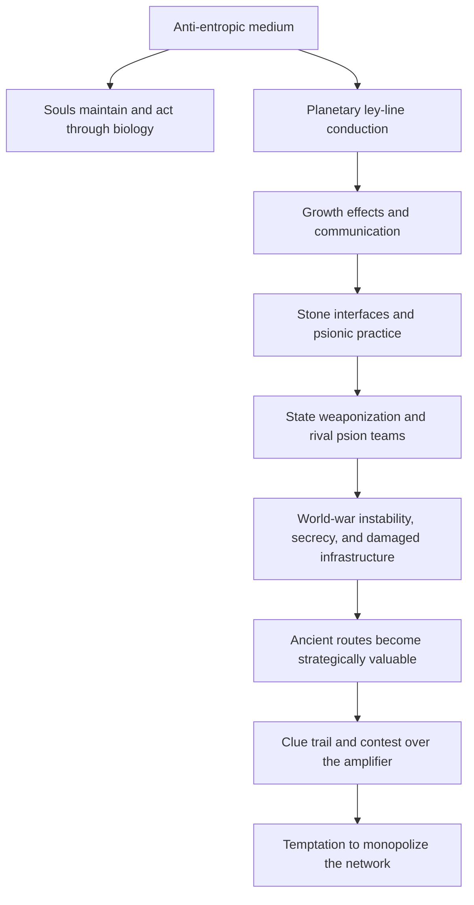

# Book 50 — Story Architecture

> **Status:** working structural synthesis based on the current canon in `00_NARRATIVE_STRUCTURE.md`, `00_outline.md`, and the Book 50 concept files. This document organizes existing material into a dramatic structure. It does not silently settle open questions such as the exact Melaka accident, country/bloc names, the healer's name/location, or the final volume count. Track unresolved structural commitments in `99_open_questions.md`.

## 1. The governing story

> An injured refugee with dangerous perceptual abilities tries to protect the possibility of ordinary life and belonging, but a clue to his missing mother exposes him to a global fight over whether people like him should be registered, worshipped, weaponized, cured, or killed.

This sentence is the story's filter. A subplot, historical descent, location, faction, or piece of lore belongs in the novel only if it intensifies at least one part of it.

The emotional motor is not abstract destiny and not only "find mother." It is the longing for **home, belonging, and meaning in a time when every system wants to classify the self before the self can live**. Eli wants a safe place where no one can turn him or the people he loves into property. The mother thread is the wound and the personal route into that longing; the larger engine is protecting the possibility of ordinary life.

### The four dramatic functions

Do not ask one concept to perform every job:

| Function | Story element | Question it creates |
|---|---|---|
| **Motor** | Eli tries to protect ordinary life, home, and belonging while following the mother clue that threatens them | Can he find meaning and safety without letting a state, faction, lover, parent, prophecy, or archive define what he is? |
| **Burden** | Seven distinct dead lives intrude through him | Can he receive them without becoming or possessing them? |
| **Temptation** | He may be able to control the amplifier and network | Will he become the necessary ruler every faction claims the world needs? |
| **External conflict** | Countries and irregular groups wage a psionic war | Can anyone remain free when consciousness itself becomes military infrastructure? |

The longing for home supplies the heart. The clue trail moves the body. The Seven destabilize identity. The amplifier tests character. The war supplies pressure.

### Home, belonging, and meaning

The trilogy should speak directly to contemporary loneliness, housing precarity, displacement, surveillance, medical fear, fertility anxiety, relationship breakdown, institutional mistrust, political sorting, and spiritual hunger. Eli is not looking for a grand identity; he is trying to keep a life in which he can be ordinary without lying about what he is.

Use three recurring forms of home:

- **Lost home:** Bangladesh, family, father, mother, language, food, danger, exile, political tension, and the unfinished life Eli was forced to leave. It should remain emotionally alive but not simply recoverable; return may be unsafe, legally impossible, politically dangerous, or personally unbearable.
- **Made home:** Forest City, training mornings, sailing, meals, privacy norms, neighbors, and the fragile refuge that lets anomalous people remain accountable without becoming public property.
- **Mature home:** the final mixed community where ordinary and anomalous beings share risk, law, care, work, limits, disagreement, and play without kneeling, burning, caging, or turning anyone into destiny.

Meaning should emerge from belonging and conduct, not from cosmic status. Eli's deepest question is not "Who am I secretly?" but "Where can I live truthfully, with others, without being owned?"

Relatability rule: whenever the mythic conflict risks becoming abstract, ground it in a present pressure a younger reader recognizes—rent, documents, health care, unstable work, dating exhaustion, delayed children, mistrusted institutions, feeds that fracture reality, climate fear, or being treated as data/content rather than a person. These pressures are the modern face of atomization.

### Four-Corner Opposition

Use a Truby-style four-corner opposition to keep the conflict from collapsing into Eli versus Crane. The core debate:

> When dangerous human capacities return, should society protect freedom or impose control?

The answer must not be simple anti-authoritarianism. The trilogy needs adult politics: freedom without structure can become cult, chaos, exploitation, or charismatic capture; control without consent becomes ownership.

| Corner | Character or faction | Viewpoint | Dramatic pressure |
|---|---|---|---|
| **1. Constructive freedom** | **Eli** | Power must be shared through consent, practice, limits, and ordinary accountability. No one owns the field. | He must prove freedom can protect civilians without becoming vague, passive, or messianic. |
| **2. Destructive control** | **Crane** | Psions and anomalous beings are too dangerous to remain unregistered; containment and command are necessary. | He is right about danger and wrong that danger justifies ownership. |
| **3. Destructive freedom** | **Prophecy/liberation faction** | Burn the registries, unleash awakening, follow the chosen one, reject limits and accountability. | This is Eli's own anti-ownership instinct corrupted into charisma, chaos, and future violence. |
| **4. Constructive control** | **Wren / Forest City / ethical regulator** | Freedom needs form: boundaries, triage, consent protocols, defense, law, and consequences for harm. | This corner attacks Eli's vagueness and gives Wren an objective beyond protecting him. |

This structure should create multi-party friction:

- Crane attacks Eli's naivety: unregulated psionic conflict gets civilians killed.
- The prophecy/liberation faction attacks Eli's ego and exhaustion: stop resisting the chosen role.
- Wren attacks Eli's lack of a civic plan: what happens when someone actually harms people?
- The healer exposes the bodily cost of every ideology: need does not make a person's body public property.

The final political answer is: **not domination, not chaos, not messiah, not registry—accountable coexistence**.

## 2. What to take from *Dune* and *The Lord of the Rings*

The lesson is not to add more lore. It is to make existing lore causal and emotionally legible.

| Structural strength | Application here |
|---|---|
| A vast world driven by a simple conflict | Eli wants the truth about his mother. Every volume also needs one immediate, concrete objective. |
| Ecology, politics, religion, and technology forming one system | Anti-entropic energy, ley lines, agricultural growth, stone routing, psion programs, and the world war must cause one another's problems. |
| A central burden with corrupting potential | The Seven burden Eli; the amplifier and chosen-one identity tempt him. |
| Deep history felt beneath the plot | Keep most cosmology in the bible. Let ruins, customs, injuries, songs, arguments, and consequences reveal it. |
| A fellowship rather than a solitary savior | Wren, Emrys, the healer, and local allies solve different parts of the trail and make indispensable choices. |
| An antagonist with a serious argument | Crane is right that unregulated psionic warfare can destroy lives. He is wrong that permanent coercive control is the only answer. |
| A home worth protecting | Bangladesh and Forest City provide the emotional hearth against which exile and departure acquire meaning. |
| Moral resolution through costly action | Mercy, consent, release, and refusal must cost safety, knowledge, power, or reunion. |
| Landscape as story | Ports, crops, water, broken lines, mountains, weather, borders, and stone sites determine action. |
| Restraint | Show evidence before terminology. Explain only after the reader wants an answer. |

**Structural recommendation:** use *Dune* for the causal system and *The Lord of the Rings* for the heart. The present danger is a Dune-sized system without enough hearth, fellowship, rest, humor, and ordinary tenderness.

### Prophecy and charismatic leaders

Use prophecy-shaped material and charismatic-leader pressure as **bait, pressure, and misreading**, not as the truth of the trilogy. Readers understand prophecy instantly, and factions inside the story would absolutely manufacture, exploit, or believe it. The book can use that voltage without surrendering to chosen-one logic.

Rule: **every prophecy must create danger, not guarantee destiny.**

Allowed uses:

- corrupted records that sound prophetic because their context is missing;
- psion-planted false certainty or future-memory traps;
- factional recruitment language built from real fragments;
- media, pilgrims, or desperate families turning a true event into a sacred sign;
- Crane using anti-messiah rhetoric while building a managerial priesthood through registry, classification, and permanent control;
- Cuno's lossy "Aedan" transmission or the Adapa lacuna being misread as destiny rather than warning;
- Eli's mother's notes sounding prophetic because they are incomplete research written under duress.

Guardrails:

- Eli must repeatedly refuse the role others try to place on him.
- The healer's deification pressure is the public version of the same mechanism: a real healing becomes testimony, testimony becomes rumor, and rumor manufactures a god against the subject's will.
- Charisma is not automatically evil, but it becomes dangerous when people outsource judgment, consent, or responsibility to it.
- The final victory must require many people making accountable choices. No prophecy, bloodline, title, or sacred leader saves the world.

## 3. The world's causal machine

Every arrow needs to appear as consequence on the page. If ley lines do not alter food, movement, communication, politics, or danger, they are decoration. If the psionic war does not affect borders, families, medicine, and trust, it is background spectacle.

### Energetic limits

The anti-entropic source is not a finite battery. Costs arise at the embodied and relational interface:

- loss of differentiation between self and foreign information;
- obstruction and reversion to automatic operation;
- limits of attention, biological stability, sleep, and concentration;
- exposure of a psionic signature;
- feedback and contamination within a team;
- injury when hostile conduction disrupts the body's maintained pattern;
- damaged trust, coercion, and the logistical cost of sustaining a group.

This keeps action costly without contradicting the inexhaustible source.

## 4. The clue-trail engine

Eli never knows the final destination. The outline knows the macro-route; the character knows only what he can test next.

### Rules

1. Eli leaves Forest City for one narrow clue in Melaka, not a quest to Albion.
2. A clue indicates only the next investigation, never the remaining itinerary.
3. The chain does not belong entirely to his mother. It also comes from living communities, the Seven, Wren's contacts, Emrys's measurements, the changing network, and enemy operations.
4. At least one clue is stale because a ley line broke.
5. At least one clue is sincerely misread.
6. At least one clue is planted by a psion faction.
7. A dead end must force a human choice or relationship; it cannot merely trigger a stronger vision.
8. Albion becomes identifiable only when independent evidence agrees late in the story.

### Useful clue forms

- a name in a damaged medical, port, or research record;
- a ship, container, cargo, or customs mark;
- a coordinate that no longer matches the living network;
- a report of abnormal plant growth;
- one half of a polarized reading;
- a rhythm, throat-sound, or incomplete score;
- geometry encoded in body positions or stone placement;
- a carried object from Cuno to Derw;
- a historical imprint that supplies context but not an address;
- an enemy operation whose target reveals what the enemy believes matters.

### The discovery ladder

1. Plants grow according to unexplained geometry.
2. Repeated observations establish a conductor.
3. A broken conductor leaves positive and negative ends.
4. Crop circles are recognized as new lines forming and affecting growth.
5. Stone arrangements are shown to deflect lines inward.
6. A person or group at the center can transmit and receive.
7. Eli must decide whether communication justifies control.

Positive and negative are polarities, never moral categories.

## 5. The fellowship

The story needs recurring relationships strong enough to carry the cosmology.

| Character | Independent dramatic function | What they can do that Eli cannot | Necessary conflict |
|---|---|---|---|
| **Eli** | Receiver, clue-follower, moral decision-maker | Hold all Seven without permanent capture | Wants his mother badly enough to rationalize weak clues and dangerous risks |
| **Wren** | Survivor, operational partner, eventual beloved | Read people, routes, manipulation, and immediate danger | Must stop treating intimacy as either a weapon or trap; needs a goal independent of Eli |
| **Emrys** | Researcher, incomplete guide, anti-father | Measure and correlate what Eli only feels | Mistakes map for territory; must make a serious error and relinquish authority |
| **The healer** | Embodied medical conscience and deification test | Perform deeper physical repair, judge bodily cost, and remain human under worship | Must refuse conscription by factions, communities, and eventually Eli; public testimony drives him through kneel → cage → burn pressure |
| **Crane** | Ideological antagonist and organizer | Turn institutions, fear, and genuine danger into durable control | Must demonstrate why his policy is persuasive, not merely cruel |
| **Recurring rival psion team** | Field-level adversarial fellowship | Coordinate attack and defense better than the protagonists initially can | Members need loyalty, fear, disagreement, and at least one choice that complicates simple enmity |
| **Local allies** | Keep places alive beyond the protagonist | Supply agricultural, maritime, medical, linguistic, historical, custodial, and embodied knowledge; this includes the Pai dragon-staff performer, Forest City's morning martial-arts teacher, and its sailors | Their needs may conflict with preserving the clue or helping Eli |

### Wren's missing requirement

Wren needs a present-tense want that does not reduce to protecting Eli, escaping Crane, or resolving Anthea. It should periodically conflict with Eli's mother-trail. Until that want is chosen, her arc is structurally incomplete.

### The recurring enemy team

Do not use a new anonymous psion squad at every location. Design one recurring three-to-five-person team attached to a state, contractor, or shifting alliance. Its members should have:

- distinct operational functions based on the eventual psionic rules;
- affection or obligation toward one another;
- different beliefs about conscription and civilian harm;
- a reason to fear Crane as well as work with him;
- one member who could defect but is not guaranteed to;
- consequences that accumulate across encounters.

This gives the war a human face below Crane.

### Courtly intrigue and social manipulation

The pursuit should not be only chase scenes, archives, and psion attacks. Add a recurring layer of **courtly intrigue**: parties, salons, clinics, research institutes, embassies, donor circles, refugee offices, private collections, temple/museum boards, intelligence cutouts, and factional hospitality where people fight with invitation, status, secrecy, flirtation, debt, reputation, and controlled access.

Use *Game of Thrones* / *Dangerous Liaisons* energy as social technique, not costume:

- every powerful room has a visible topic and a hidden bargain;
- hospitality is both shelter and trap;
- sex, romance, admiration, pity, and spiritual hunger can be used as leverage, but the story must distinguish manipulation from real intimacy;
- a guest list can matter as much as a battlefield map;
- scholarship, philanthropy, asylum, and care can hide ownership claims;
- someone can win a scene by causing two other factions to misread each other;
- Wren should be competent here: reading threat, desire, leverage, and performance before Eli understands what room he is in;
- Crane should be most dangerous when he appears reasonable, civil, and socially indispensable.

This layer should express the **Social Game** in present tense. The old court has become foundations, agencies, conferences, clinics, black-budget programs, media ecosystems, private collections, and humanitarian corridors. The dramatic question is whether the protagonists can move through these rooms without becoming pieces on someone else's board.

## 6. Crane's argument and Eli's answer

Crane's strongest case:

> Psions enter dreams, alter perception, expose private memory, injure bodies, and attack in coordinated teams. Nations already weaponize them. Leaving this power unregulated means surrendering civilians to whoever organizes first.

The story should prove that this diagnosis contains truth. Otherwise Eli defeats a straw man.

Crane's error is his conclusion: because risk exists, consciousness must be registered, classified, conscripted, suppressed, or centrally controlled forever.

Eli's answer must be operational rather than rhetorical:

- informed consent;
- differentiation between self and transmitted material;
- transparent, limited, accountable coordination;
- privacy and the right not to register;
- the right to leave a psion group;
- distributed knowledge rather than monopoly;
- ordinary medicine and civil institutions remaining necessary;
- collective defense that does not require surrender to a permanent commander.

Forest City foreshadows this answer. The final coalition must enact it under attack.

### Psion terminology

Use **psion** as the controlled term in narration, dossiers, technical discussion, and project documentation. It names a trained, detected, or operationally relevant person whose consciousness can interact with other minds, bodies, or routes. Use **psychic** only as colloquial speech, media shorthand, outsider slang, or deliberate dismissal. This keeps the story from drifting into generic paranormal vocabulary while preserving the way ordinary people would talk.

### Monitored boundaries and the England ambush

Certain routes, old borders, stone approaches, ley crossings, buried interfaces, and national security perimeters are monitored for psionic signatures. A boundary is not a magic wall. It is a detection condition: when a carrier, team, artifact, or altered line crosses a threshold, watchers can triangulate the change and launch a prepared operation.

Rules:

- monitored boundaries require prior instrumentation, trained watchers, or a living relay; they do not cover every road or coastline;
- detection usually reveals a signature, direction, intensity, or anomaly, not a complete identity or motive;
- crossing a boundary can trigger a remote psion attack, a physical intercept team, drone/surveillance tasking, or a false-friendly contact;
- attacks are strongest when the boundary has been prepared in advance and the target arrives tired, injured, emotionally exposed, or carrying an active artifact;
- the protagonists can learn to spoof, dampen, split, or deliberately trip boundaries, but every method has cost.

England should contain the clean example. When Eli's group crosses a watched boundary on the approach to Albion, a waiting psion team attacks immediately. The attack should feel procedural rather than mystical: the crossing lights up a grid, a team already in position locks onto the signature, and the assault begins before anyone has time to explain the site's importance. The scene proves that Albion is not a hidden sanctuary. It is a contested, instrumented threshold.

### Technology as rehearsal for coexistence — LOCKED

The trilogy must lead the reader to infer that technology is humanity's **external apprenticeship for powers returning in living form**. This cannot arrive as Emrys's closing lecture. It must become unavoidable through repeated plot evidence:

1. A supposedly magical capacity first resembles something technology has already made ordinary: distant communication, expanded memory, invisible imaging, flight, repair, distributed cognition, or collective coordination.
2. Instruments make part of the phenomenon measurable without explaining it away. Mechanism reduces panic while leaving genuine mystery intact.
3. A state, faction, or market uses the same technology to detect, classify, own, conscript, or destroy the living carrier. The tool reveals its immature use: fear made efficient.
4. Ordinary people use technology differently—to translate, verify consent, establish limits, treat injury, share evidence, and coordinate protection without ownership.
5. Science turns fear into testable standards. Predicting meteor showers, measuring line effects, documenting healing limits, or testing psion claims should make manipulation harder rather than less magical. A phenomenon that can be observed, replicated in limited ways, challenged, and audited is harder to convert into priestcraft or panic.
6. A relationship or community proves coexistence before the climax. Humans and anomalous beings share risk, law, care, and disagreement without turning difference into worship or extermination.

These beats may occur in any volume and should be braided into pursuit, medicine, communication, surveillance, and the psionic war. No scene exists merely to compare a phone to telepathy.

The final coalition is successful only if it demonstrates the distinction Crane denies: **regulate harmful conduct without making a person's nature state property**. Magical beings are neither automatically holy nor exempt from accountability. They can be dangerous, mistaken, selfish, or criminal. Coexistence means the same reciprocal moral world applies to everyone, while compulsory registration, segregation, conscription, experimentation, worship, and extermination are refused. Science belongs on the freedom side only when it remains falsifiable, consent-bound, transparent about limits, and open to review. It becomes Crane's tool the moment testing turns into ownership.

Psion accountability should therefore have standards, not sacred exemptions: what was observed, under what conditions, with whose consent, with what physiological cost, with what independent witnesses or instruments, and with what remedies if harm occurred. This is the constructive-control answer to both priestly manipulation and anti-regulatory chaos.

The ending need not claim that the entire planet has passed. It must provide undeniable proof that humans *can* live beside healers, psions, carriers, non-human intelligences, and other evolved beings without kneeling, burning, or caging. That viable local proof is the "spreading fire": the experiment has produced the form of its answer.

The final recognition should feel retrospectively inevitable without becoming prophecy. Looking back, the reader should understand why it had to be like this: every technology, science, ritual, family structure, religion, fear-response, and failed domination was circling the same problem of how a frightened species learns to live beside power. It has always been like this—not because destiny guaranteed the ending, but because the same human problem kept returning until someone solved it without kneeling, burning, caging, or seizing the throne.

## 7. Trilogy structure

The exact number of volumes remains open, but the current material naturally forms three dramatic movements.

| Volume | Plot movement | Internal movement | External movement | Ending change |
|---|---|---|---|---|
| **I — Shattering** | Breach, pursuit, unstable alliance, first verified record | Confusion → first differentiation | Melaka and maritime Asia → South Asia | Eli knows the Seven are separate people and voluntarily follows the next clue |
| **II — Descent** | Reconstruction, competing loyalties, mother-reveal, loss of the guide | Relation → seeing | South Asia / Persian Gulf → Anatolia | He learns his mother is dead in body and tethered somewhere west; Emrys is taken; the trail enters Europe |
| **III — Choice** | Convergence, temptation, release, refusal of ownership | Discrimination → creation and release | Europe → Albion | He frees his mother, refuses the amplifier, and helps a mixed ordinary/anomalous community survive beyond the emergency without claiming the wider war is over |

### The artifact-and-story pursuit — plot engine, order provisional

The artifacts are a distributed evidence chain, not a museum heist or fixed checklist. The group may encounter an object, photograph, scan, squeeze, translation, missing-fragment record, custodian, or story about an object. Each encounter must create an immediate objective or reversal.

| Plot pressure | Candidate object/story | Required change |
|---|---|---|
| Establish how to read the chain | **Double-Fork Stone**: bird/dragon and chimpanzee/human as paired sibling divergences | The lower fork admits partial independent testing; the upper fork changes from fantasy to dangerous hypothesis and points to a biological investigation |
| Give the practice a material image | **Three-Circles Tablet**: three concentric circles with a dot in the center | The group first mistakes the diagram for map, cosmology, or hierarchy; later it becomes a test for whether repair radiates through Body, Family, and Civilization from a conscious center |
| Expose the vacant office | **Sumerian King List** | “Kingship descended from heaven” becomes a claim about transferable administration rather than sacred blood; rival factions seek the missing context |
| Make wrong knowledge personal | **Adapa tablet with a lacuna** | A warning from a trusted helper becomes evidence that obedience can close the path to life; the missing passage becomes an argument over what Adapa almost knew and why he still refused life |
| Recover the suppressed relation | **Arslan Tash Amulet 1** and its disputed covenant reading invoking ʿOlam, Asherah, El's sons, and the council | A custodian's story disrupts father-only theology; authenticity and translation disputes give Wren or another character interpretive agency outside Eli and Emrys |
| Reveal labor and reset propaganda | **Atrahasis / Eridu Flood material** | Creation, labor revolt, and catastrophe appear as layered stories rather than one clean origin account |
| Focus the ownership race | **Tablet of Destinies claims or fragments** | Factions mistake authority records for a master key; the protagonists must determine whether they are reading a charter, routing protocol, ritual copy, or propaganda |
| Reconcile divine names without flattening them | **Ugaritic council records** | Repeated offices become visible across traditions while local gods and stories retain their differences |
| Turn cosmology into route | **Babylonian Map of the World**, later compared with live ley data | A mythic edge or missing region yields a testable next move only when the old map is treated as incomplete |
| Carry the chain west | **Verified European sky-object** and **Cuno–Derw marked object** | Portable geometry and lossy story converge on Albion without giving anyone a complete manual |

Likely distribution follows the thriller rather than chronology: one or two objects establish the method in Volume I; the Three-Circles Tablet can enter once the group needs a visual grammar for Body, Family, and Civilization; the Persian Gulf/Anatolian investigation brings the densest textual cluster in Volume II; maps, transmitted copies, and Cuno–Derw material converge in Volume III. The order can change whenever geography, pursuit, or character custody produces a better chain. Full treatment: `35_artifact_chain.md`.

### The Three Circles as a mixed civilizational braid — LOCKED

The Three Circles are not only a test of whether practice radiates outward. They are the trilogy's method for uncovering **why civilization repeatedly rebuilds the absent gods' order**.

They are **not three curriculum units and not one circle per volume**. Plot determines the boundaries of Shattering, Descent, and Choice. Body, Family, and Civilization remain entangled in every volume because each continually produces the others: institutions train families, families condition bodies, and bodies reproduce institutions. The order of discovery can move outside-in, inside-out, or jump scales whenever the pursuit, relationship, historical record, or immediate danger makes that movement dramatically necessary.

The embodied gods and their functioning supervisory system are gone. Some spirits may persist on other planes and factions may still listen to them, but no god remains physically present as the legitimate recipient of human labor, tribute, reproduction, obedience, or worship. The dangerous fact is that many instincts tuned or exploited under that order still run. Human rulers and institutions can therefore inherit the empty god-role without understanding where it came from.

| Circle | Instinct or adaptation formed under the gods | Pitfall after the gods are gone | What the novel must dramatize |
|---|---|---|---|
| **Body** | Work, endure, provision upward, obey the stronger signal, earn safety through usefulness, suppress anomalous perception | The person treats the body as equipment owned by employer, state, family, mission, or ideal; exhaustion becomes virtue and automatic charge becomes identity | Eli's TBI, hunger, panic, sleep, touch-aversion, and psi limits must alter decisions. He has to stop offering competence as the price of care. The healer's body likewise cannot be public property. |
| **Family** | Seek a superior protector, organize descent through approved fathers, compete for selection, equate provision with love, sacrifice the lower member for the household's survival | Parent becomes miniature god; partner becomes possession or resource; child becomes legacy; care becomes debt; gender and generation become command hierarchies | Eli must distinguish his mother from the role of saving mother, Wren from destiny, Emrys from father, and the healer's care from obligation. Historical households must show both the transmission of life and the first place domination learns to call itself love. |
| **Civilization** | Feed the temple, surrender surplus, accept chosen intermediaries, mobilize for divine war, punish the anomalous, wait for command from above | Sacrifice becomes taxation without reciprocity; priesthood becomes bureaucracy; divine selection becomes caste and credential; holy war becomes permanent mobilization; dead infrastructure becomes sacred | Each corridor should expose one surviving institutional form, not deliver a lecture. By Albion the reader should recognize the psion registry, national programs, corporate extraction, Crane's paternal management, and the amplifier itself as modern claimants to the vacant god-office. |

This is not a claim that all instinct, family, or civilization is corrupt or alien-made. Attachment, reciprocity, protection, play, curiosity, kinship, and cooperation also belong to the living human animal. The drama comes from distinguishing those capacities from the installed or captured behaviors that route life upward. The alternative is not isolation or primitivism; it is adult coordination without an owner.

Across the trilogy—and in different combinations rather than a repeated formula—the plot must supply three kinds of proof:

1. a historical imprint shows the behavior while a god-administered order still gives it a function;
2. a present institution exploits the surviving behavior after its original recipient is gone;
3. Eli or another character pays a real cost to choose relationship and accountability instead of automatic obedience.

**Plot-first rules:**

- Never add a scene merely to "cover" a circle. Attach the idea to an objective, obstacle, reversal, betrayal, rescue, or irreversible choice.
- A major plotline should usually disturb at least two circles at once. The strongest turns hit all three: bodily survival, intimate loyalty, and public consequence become inseparable.
- Stagger cause and explanation. A character may suffer a bodily reflex in Volume I, discover its family transmission later, and only much later learn the old civilizational function—or encounter those layers in the reverse order.
- Let different characters carry different scale combinations. Eli need not personally exemplify every pitfall; Wren, the healer, Emrys, Crane, historical carriers, families, and institutions distribute the argument.
- The climax must not "solve Civilization" after completing Body and Family. It must force one choice whose bodily, relational, and civilizational consequences cannot be separated.

### The Living Way across the trilogy — LOCKED

The Living Way is the ethical and practical counter-current of the whole trilogy. It must be **dramatized as conduct before it is named as a framework**. The novel should not stop for a universal-religion lecture, quote whole companion texts, or imply that one new creed replaces all prior traditions. Characters encounter practices through particular people, places, needs, and consequences. The complete cross-tradition synthesis remains in Layer 2, especially `Lessons_of_the_Living_Way.md`, *The Native Road*, and the separate `living-way-knowledge` library.

The table records likely accumulations in the existing plot, not a lesson schedule. Any lesson may move, recur, fail, or remain unnamed if the dramatic chain requires it.

| Volume | Cumulative movement | Likely lessons—move as plot requires | Existing plot expression |
|---|---|---|---|
| **I — Shattering** | **Return to the body and distinguish self from weather.** The Way exists before Eli has a name for it. | 3: know who you are; 5: come back to now; 7: you are not your storms; 8: tell the truth about fear; 13: worth is original | Eli uses breath, sensory orientation, and honest dependence to remain himself during the Seven's flood. Forest City demonstrates that privacy, care, organization, and freedom can coexist. Protecting a community matters more than possessing clean evidence. |
| **II — Descent** | **Move from self-regulation into relation, care, and limits.** Practices become recognizable across cultures without becoming interchangeable. | 1: be true, not right; 4: kindness when hard; 10: stillness and listening; 11: forgive without rehiring harm; 12: tend living things | The healer's consent and refusal establish that service is not conscription. Eli learns from breath, touch, sound, plant intelligence, and the Seven without claiming mastery or cultural ownership. Conflicting witnesses force truth-seeking over doctrinal certainty. |
| **III — Choice** | **Release possession and transmit without founding another cage.** The Way becomes political and generational. | 2: hold lightly; 6: let the two be one; 9: give without keeping score; 11: mercy with boundaries; 12: stewardship | Eli frees his mother by surrendering reunion, loves Wren without destiny or ownership, refuses both Crane's throne and annihilation, and distributes practices so no institution or bloodline can monopolize them. The final coalition becomes a durable mixed community with reciprocal accountability and no permanent command. |

The trilogy still performs a maturation, but these are cumulative pressures rather than exclusive volume subjects:

> **Volume I:** remain yourself.
>
> **Volume II:** remain yourself in relationship.
>
> **Volume III:** give what you learned without owning the people who receive it.

This is also the publishing boundary. The novel gives readers **experience and proof through consequence**. The companion material gives them explicit exercises, comparative theology, and a repeatable path. If a Living Way passage does not create a choice, cost, relationship change, or embodied practice in the scene, it belongs in the companion layer rather than the novel.

### Volume I — Shattering

**Dramatic question:** Can Eli remain himself long enough to decide whom to trust?

**Immediate objective:** verify the Melaka clue and survive the attention created by the breach.

#### Act I — The breach

- Optional Maren Holt prologue establishes the suppression method.
- Open in newly reopened Melaka, not with childhood exposition.
- Forest City appears through lived memory: the safety Eli chose to leave, the man's morning martial-arts practice, and the sailboats on which Eli learned basic seamanship.
- The Melaka contact supplies one narrow clue connected to his mother.
- Rival psion teams collide around a carrier, route, or record.
- A concrete near-death event opens Eli's already damaged receiver filter.
- The Seven arrive as identity catastrophe.
- Eli's first error is bodily: he treats sleep, food, pain, panic, and neurological limits as obstacles to the mission and tries to earn protection by remaining useful.
- Wren and Emrys converge for different reasons; neither has the map.

**Act turn:** Eli cannot safely return to Forest City without exposing it. He chooses to test the next clue.

#### Act II — The unstable sea

- Singapore or another high-surveillance archive supplies paired anomaly data.
- A maritime leg combines piracy, inspection, incompatible documents, and psionic interference. Eli's Forest City sailing lessons let him stand a watch, follow sail-handling orders, and recognize a dangerous choice, but an experienced sailor remains indispensable.
- The protagonists follow at least one wrong or planted clue.
- Bali or another carefully chosen agricultural return makes abnormal growth visible through living local expertise.
- Eli begins distinguishing trauma, TBI symptoms, rattle-contact, surges, and carrier memory.
- Quiet scenes establish food, sleep, humor, irritation, and the cost of depending on others.
- A present authority offers safety in exchange for bodily legibility—registration, examination, labor, data, or command—revealing the worker-body bargain in modern form.

**Midpoint:** Eli receives convincing evidence that at least one of the Seven was a separate historical person rather than his former self, fantasy, or inherited ancestor-memory.

#### Act III — Growth and choice

- The trail reaches South Asia through reports of a new plant-growth geometry.
- Ila's record gives context but not mastery.
- State and irregular psion teams attack one another around the formation.
- Eli performs one frightened, limited stabilization; ordinary medicine remains decisive.
- The group must choose between preserving complete evidence and protecting the affected community.

**Climax choice:** protect people, losing or damaging the cleanest version of the clue.

**Resolution:** community knowledge, not Eli's power, preserves enough to point toward the next corridor. He continues voluntarily. He still has no final destination.

### Volume II — Descent

**Dramatic question:** Can Eli pursue truth without turning people into instruments of his search?

**Immediate objective:** reconstruct the damaged clue, understand the historical network, and determine whether his mother can still be reached.

#### Act I — Bodies and crossings

- Eli and the healer meet because independent clue chains cross.
- The healer refuses to become Eli's cure or a faction's resource.
- After an extraordinary but medically grounded healing is witnessed, the healer tells the patient, "Don't tell anyone." The request protects the patient, the route, and his finite body; the witness eventually tells.
- Eli, Wren, Emrys, and the healer each confront a different family-role trap: child seeking a parent, lover claiming destiny, teacher becoming father, caregiver made infinitely responsible.
- Tem's record introduces distributed psionic contact and broken communication routes.
- Wren's independent objective begins to conflict openly with Eli's search.
- The national psionic war becomes visible as policy, conscription, asylum, and desertion—not merely attacks.

#### Act II — The old wound

- Persian Gulf and Mesopotamian traces bring the Adapa story and Qingu lie into human-scale scenes.
- Historical households show the control order moving inward: provision becomes proof of love, approved fathers own descent, and sacrifice of the lower member is renamed duty.
- Introduce historical names only when evidence forces a distinction.
- The group learns that built interfaces and natural conductors are not the same.
- Aru and Daskar disagree about whether the instrument can be redeemed.
- Anthea's chord links sound, polarity, and routing without becoming a universal key.

**Midpoint revelation:** Eli's mother's body is dead, but something of her is tethered somewhere in the western node-network. There is no usable address.

#### Act III — Göbekli and loss

- Competing teams converge on the buried interface.
- Old maps fail; current growth or polarity supplies the viable route.
- The protagonists reconstruct stone deflection under physical and psionic attack.
- Emrys's serious error exposes the group or misidentifies the node.
- A crisis forces Eli to protect civilians or companions rather than chase Emrys's captors.
- The first distorted healing stories travel farther than the healer does, attracting desperate families, opportunists, and institutional attention ahead of Volume III.

**Climax cost:** Emrys is taken while Eli refuses to sacrifice others for the pursuit.

**Resolution:** a partial Cuno/Derw element and the living network point into Europe. The word “Albion” still need not be confirmed.

### Volume III — Choice

**Dramatic question:** Can Eli free his mother and oppose Crane without becoming the next owner of the system?

**Immediate objective:** locate the tethered node before rival teams activate, destroy, or nationalize it.

#### Act I — The changing map

- European nodes answer inconsistently because lines have broken and reformed.
- The recurring rival team becomes temporarily useful against another faction.
- Competing states, firms, and factions each claim the right to own carriers for public safety, exposing civilization as rival occupants of the same vacant god-office.
- Pilgrims and media fragments begin treating the healer as divine proof. Asked whether he is a son of a god, he answers, "No. I am the son of a man." Some listeners later turn the refusal into the title "Son of Man," demonstrating myth forming against its subject's will.
- Cuno's geometry, Derw's fragments, and the mother's research begin to agree.
- Lovernios's record uses plant growth as a living map.
- Eli and Wren make a present-tense commitment not justified by destiny.

**Act turn:** Albion is finally identified as the likely endpoint.

#### Act II — The mother-source

- Rollright provides the riddling, unreliable node.
- Men-an-Tol reveals the mother's earlier action without declaring Britain Eli's true home.
- The chair is discovered as a key to the tethered node, not the source of Eli's ability.
- Cuno's last firing reveals communication at a stone center, but his record remains lossy.
- Eli learns that the grid runs through tethered souls and that his mother's hope of reunion is her chain.

**Midpoint temptation:** controlling the amplifier appears to be the only way to save her and stop hostile teams.

#### Act III — Release

- Several factions converge with incompatible aims: control, destruction, nationalization, profit, rescue, or liberation.
- Their vocabularies differ, but each demands the old offering—body, obedience, surplus, belief, or sacrifice upward to an authority that claims to stand between humanity and danger.
- The protagonists hold collective coherence without adopting permanent command hierarchy.
- The healer keeps bodies alive but refuses impossible demands. The crowd and coalition must decide whether his refusal makes him a fraud, a blasphemer, public property, or an extraordinary man entitled to limits.
- Wren makes an indispensable choice based on her own objective.
- Eli reaches his mother and learns that reunion prolongs her tether.
- Crane offers the throne in the language of responsibility and civilian safety.

**Climax choices:** Eli releases his mother, refuses ownership of the amplifier, and refuses to destroy Crane without excusing or freeing him from accountability.

**Resolution:** the native practices spread through many people and places. The final coalition supplies local proof that ordinary and anomalous people can share risk, limits, care, and authority without ownership. The monopoly becomes less viable; the psionic war does not disappear overnight. The ending remains open because adulthood is a practice, not a switch. After that public proof, the book steps down into ordinary life rather than upward into one more revelation.

### Volume III victory condition — LOCKED

The refusals above prevent defeat, but they are not themselves victory. **Volume III is won when coexistence survives the crisis that created the coalition.** A temporary battlefield alliance proves only common danger; the ending must show ordinary and magical/evolved beings continuing to share a social world once immediate necessity no longer forces them together.

Required proof:

- at least one ordinary aftermath scene—food, shelter, a clinic, repair, childcare, mourning, work, or rebuilding—in which anomalous capacity is present without becoming spectacle;
- voluntary, reciprocal limits that bind conduct on both sides without compulsory identity registration;
- ordinary people protecting an anomalous neighbor without worshipping them, and an anomalous person accepting accountability without surrendering ownership of their nature;
- technology repurposed from detection and classification toward translation, treatment, consent, documentation, and distributed protection;
- a durable community or network that does not depend on Eli's command, bloodline, continued presence, or unique moral purity.

The community may remain small, endangered, and imperfect. It may contain fear, crime, resentment, accidents, and political disagreement. What it cannot do is resolve difference through the inherited options of kneeling, burning, or caging. That repeatable social form—not victory over Crane, possession of the grid, or universal awakening—is the positive victory of the third book.

This is the "it has always been like this" landing. The trilogy should not end by announcing a new age from above. It should let the reader recognize the pattern from below: science, ordinary law, healing, relationship, technology, and practice were always partial rehearsals for the same mature form of life. The answer was not hidden because it was exotic; it was hidden because fear kept turning it into worship, extermination, or control.

In Eden language, the ending is the union of the **Tree of Knowledge** and the **Tree of Life**. Knowledge without life becomes classification, prediction, registry, and control. Life without knowledge remains vulnerable to omen, priestcraft, panic, and charismatic manipulation. The mature form is both: living connection disciplined by testable understanding, and scientific accountability held inside reciprocal life.

### Final movement — the unremarkable afternoon

The climax ends the immediate claim to ownership. The coda shows what freedom is for. Allow enough time to pass that cooperation is no longer forced by battle, then return to food, sailing, jokes, affection, useful work, repair, play, and rest. Magic remains present but no longer controls the meaning of the scene.

The exact geography and final line remain open, but the movement is locked:

- the healer attends a meal as a tired, fallible man; no one asks for a miracle, and a refusal does not become a crisis;
- Eli works aboard a sailboat within an ordinary crew, still taking instruction and doing his share rather than commanding through special perception;
- Wren and Eli are affectionate without converting love into fate, proof, or possession;
- the Pai girl can perform with her dragon staff—in person, memory, message, or a brief distributed coda—without anyone treating her as an oracle or the image as an omen;
- an anomalous or magical presence participates in the social world without becoming spectacle, weapon, property, or god;
- someone cooks, repairs, teases, tires, makes a minor mistake, or changes the subject.

Do not close on a throne, prophecy, cosmic voice, explanatory speech, or promise of the next war. The emotional destination is **an afternoon nobody turns into destiny**. The extraordinary has not vanished; it has become compatible with life.

## 8. Revelation schedule

Each revelation must change a decision. Do not deliver two major cosmological answers in one chapter.

| Order | Revelation | Likely placement | Decision it changes |
|---|---|---|---|
| 1 | Eli cannot trust the ownership of every memory he experiences | Volume I opening | He accepts help with differentiation |
| 2 | Organized psion teams exist and attack one another | Volume I Act I | He cannot treat Crane as the only threat |
| 3 | Plant growth is tracing something real | Volume I Act II | The group risks an agricultural investigation |
| 4 | Lines break and leave opposed ends | Volume I late | Old maps become suspect |
| 5 | Crop formations are new lines, not imposed messages | Volume I climax | Protecting the living field matters more than possessing a symbol |
| 6 | The Seven were separate people | Volume I midpoint/end | Eli stops treating their lives as his identity |
| 7 | Stones route rather than generate energy | Volume II | Buried and intact sites acquire different tactical meanings |
| 8 | A witnessed healing exceeds ordinary expectation; the healer asks for secrecy | Volume II | Protecting his identity and finite capacity becomes a route constraint, not a humility performance |
| 9 | Historical factions weaponized the same human vulnerabilities | Volume II | Eli stops seeking a morally pure ancestral authority |
| 10 | His mother is dead in body and tethered somewhere west | Volume II midpoint | Search becomes release rather than rescue fantasy |
| 11 | A circle center permits communication | Volume II end / Volume III | Factions converge on operational nodes |
| 12 | Modern technologies have been external rehearsals of capacities now returning in living beings | Volume III early | The group repurposes instruments from detection and classification toward translation, consent, and coordination |
| 13 | The healer's rejection of divine sonship is already being converted into a divine title | Volume III | The group understands that testimony can rebuild religion against the subject's will; coexistence must include resisting deification |
| 14 | The relit grid uses tethered souls | Volume III | Activating the machine becomes morally intolerable |
| 15 | His mother's hope of reunion is her tether | Volume III | Eli must give up the thing he wanted from page one |
| 16 | He could control the amplifier | Volume III climax | Refusal becomes meaningful rather than symbolic |
| 17 | Dangerous conduct can be constrained without owning the being who carries the capacity | Volume III climax/resolution | The coalition chooses reciprocal accountability over registration, conscription, worship, or extermination |

Terms such as Apkallu, Nephilim, Nephilot, Lullu, Qingu, and Umannu should enter only where the narrative must distinguish particular historical actors. Role first; proper noun second.

## 9. Emotional rhythm

Relentless danger becomes monotonous. After every major pursuit, descent, or psionic attack, provide an aftermath scene that performs at least two of these functions:

- food, shelter, washing, medicine, sleep, or repair;
- humor or irritation;
- a cultural practice unrelated to the cosmology;
- an argument about the cost of the last choice;
- a small act of care that cannot be mistaken for utility;
- a reminder of Bangladesh, Forest City, or another actual home;
- local people continuing lives that do not orbit Eli;
- a clue being interpreted collectively rather than by revelation.

These are not pauses from the story. They are what establishes the life the story claims is worth freeing.

## 10. Chapter architecture

Every chapter should answer this card before drafting:

| Field | Required answer |
|---|---|
| **Immediate want** | What does the viewpoint character need before the chapter ends? |
| **Human obstacle** | Which person wants something incompatible? |
| **Material pressure** | What do geography, law, illness, transport, weather, or money prevent? |
| **Psionic pressure** | How does intrusion, detection, false certainty, or group conflict complicate—not replace—the material problem? |
| **Choice** | What irreversible decision does the character make? |
| **Cost** | What safety, trust, evidence, relationship, or possibility is lost? |
| **Single revelation** | What one new fact becomes necessary and understandable? |
| **Forward clue** | What can be tested next, without revealing the itinerary? |
| **Aftermath** | How does the consequence register in body and relationship? |

If the chapter's only answer is “Eli learns more lore,” compress or remove it.

## 11. Lore discipline

- Keep roughly ninety percent of cosmological detail in planning documents.
- Introduce no more than one or two unfamiliar proper lore terms in a chapter.
- Use a human role before a mythological label: builder, captive, healer, guardian, conscript.
- Repeat a term through action before asking the reader to remember taxonomy.
- Let characters disagree about interpretation.
- Preserve evidence that does not fit Eli's preferred theory.
- Never use a historical culture only to confirm the cosmology.
- Never let an imprint provide an exact solution to the present problem.

## 12. What must be decided before drafting Volume I

1. **The Melaka event:** the concrete physical crisis that produces the near-death breach without another head injury.
2. **The first clue:** the person, object, or record that justifies Eli leaving Forest City.
3. **Wren's independent objective:** what she would pursue if Eli disappeared.
4. **The recurring rival team:** affiliation, members, internal bonds, and operational limits.
5. **The first volume's climax location:** South Asia is structurally strongest, but the precise community and agricultural setting require research.
6. **The Volume I ending clue:** what points onward without revealing Albion.
7. **Psionic combat rules:** what one psion can do, what requires a team, effective range, detection, defense, physiological consequences, and failure modes.
8. **The revelation ledger:** track what Eli, Wren, Emrys, Crane, each faction, and the reader know after every chapter.

## 13. Recommended drafting order

1. Lock the seven decisions above.
2. Create a twelve-to-fifteen-chapter beat sheet for Volume I using the chapter card.
3. Write the Melaka opening through the first irreversible escape decision.
4. Write one quiet Forest City memory and one present aftermath scene to establish the hearth.
5. Draft the first rival-team encounter from the victim's embodied perspective.
6. Draft the Volume I climax before expanding the cosmology further.
7. Reassess whether the story wants three volumes or one compressed novel based on actual scene length and momentum.

The governing test is simple: a reader should always know what Eli wants now, whom he cares about, what the next clue might cost, and why taking control would be easier than remaining free.
