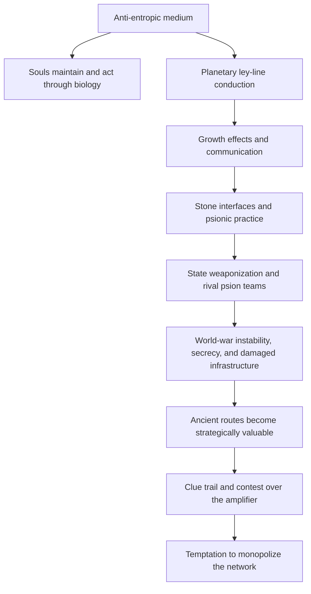

# Book 50 — Story Architecture

> **CAST / WEAVER SUPERSESSION — LOCKED 2026-07-27:** `58_sanxingdui_climax_lock.md`, `26_present_day_cast_expanded.md`, and `99_open_questions.md` §3/#9 govern over stale material below. Wren is a house Weaver doing junior Knotter work in Book I, not Unranked and not an extraction operator. Rowan is a west-corridor Weft who first appears in Book II; she does not guide Singapore. Book I ends with Rasel recovered, Wren displaced after signing the civilian evacuation, Qiao's clearance lost, and nobody captured. Emrys does not exist; all references to him below are retired-role quarry pending line-level cleanup.

> **HIGH PRIORITY — LOCKED 2026-07-25; pressure 2026-07-29:** **`55_series_pitch_and_comps.md`** — shelf, agent/back-cover copy, comps, clue-chain obligations, revision gate (items 1–14), **Three pressure rules** (two live clocks; antagonist present-tense job; cost → next chapter). Every structural choice here must pass the pitch test in `55` (body movement, institutional villainy, domestic cost, pattern conspiracy — not single-bullet reveal).

> **Status:** working structural synthesis based on current canon. **Current governing map: Books I–IV civic + Books V–X Lifetime Orchestra (+6 locked)** (`SERIES_STRUCTURE.md`). Titles for V–X open; append only; do not renumber I–IV. Plot spine: `29_trilogy_plot_and_development.md` (legacy filename); Book I: `31`; Book II: `32`; Book III: `33`; Book IV: `60_volume_IV_court_of_threads.md`; orchestra: `62`. Older three-volume / “trilogy” closure language is superseded.

## 0. Ultimate metaphysical thesis — LOCKED 2026-07-30

Full text: `SERIES_STRUCTURE.md` § *Ultimate metaphysical thesis*.

**I–IV dramatic question remains:** *How can people belong to one another without owning one another?* That is real and load-bearing — and it is **intermediate curriculum** inside an artificial training world, not the final answer.

**Final answer (V–X horizon, author-side):** the world (from the Player view) is training gear meant to break; autopilot is meant to fail so you can step in; consequence is the only mirror for beings who cannot see themselves; the point of it all is **learn control → learn creation**.

Do not lecture this in Books I–IV. Dramatize only its symptoms: override under pressure, systems that teach by failing, crowns that return, love that becomes property, the middle way as first lucid stick-time.

**Technology teaches meaning — LOCKED 2026-07-31:** Introduce horizon concepts through **runnable tech**, not sermons. Point: technology (death + life joined) teaches the meaning of life so people are **not afraid of it**. `SERIES_STRUCTURE.md` § *Technology teaches meaning*; `22` § same; `62`.

**Lifetime Orchestra — +6 locked:** V Bridge · VI–IX past lives · X Ω. `SERIES_STRUCTURE.md`; `62`.

**Family total — LOCKED 2026-07-31:** **14 core** = 10 Layer 1 + 4 Layer 2 companions; satellites outside (`63`; `SERIES_STRUCTURE.md` § *Family total*).

**Spirituality goes wrong — LOCKED 2026-07-31:** also dramatize the **counterfeit** of this thesis — toxic positivity, manifestation bullying, spiritual ego — people who use light-language to blame the injured and own the room. Distinct from Lang and Sol. Full lock: `SERIES_STRUCTURE.md` § *Spirituality goes wrong*; `40_concepts.md`. **Greater-picture Turning:** locally wrong stays wrong; cosmically, even that failure can be training gear that breaks (developmental function, not acquittal).

**Hell — LOCKED 2026-07-31:** infinite loop that cannot be escaped in a non-entropic / deathless world; Earth's death is a circuit breaker. **Life is the solution to hell.** `SERIES_STRUCTURE.md` § *Hell*.

## 1. The governing story

**Pelangi Reach — paired-island setting lock:** Pelangi Reach is a larger inhabited island and a smaller created island joined by causeways, ferries, utility lines, and unequal dependence. The larger island holds older villages, gardens, fishing communities, water institutions, migrant neighborhoods, repair yards, ritual life, and local authority. The smaller artificial island—usually called **the Reclamation**—is a near-future fintech and climate-technology hub: towers, data centers, desalination, finance, luxury housing, and the Forest Foundry compound — **robotics promised in the pitch, rarely delivered at scale** (see `23` § *Robotics lock*). It is presented as a separate island because its wealth, security, and ecological costs are physically visible. The hub cannot feed, repair, or socially legitimize itself without the larger island. Pelangi is not a mystical Bali replica: both islands contain hierarchy, disagreement, generosity, exploitation, and people making compromises under climate pressure.

**Pelangi development lock:** A hereditary king is building the smaller artificial island into a climate/technology and fintech hub to rival Singapore. The project brings AI, biotech, desalination, flood control, finance, and high-end infrastructure — **humanoid robotics mostly aspirational** — while accelerating land loss, platform labor, ritual commodification, and generational change on the larger island. Pelangi is a negotiated, incomplete synthesis: culture-first in aspiration, increasingly reshaped by technology in practice.

**The Reclamation:** The opening hearth is the created island called the Reclamation, not the whole Pelangi system. It contains Forest Foundry, worker housing, refugee intake, gardens, repair yards, harbor systems, fintech offices, and the royal development zone. Its polished infrastructure depends on food, labor, repair, and cultural legitimacy crossing daily from the larger island. The opening should make that dependency ordinary before the crisis makes it visible.

> An injured refugee with dangerous perceptual abilities tries to protect the possibility of ordinary life and belonging, but a clue to his missing mother exposes him to a global fight over whether people like him should be registered, worshipped, weaponized, cured, or killed.

This sentence is the story's filter. A subplot, historical descent, location, faction, or piece of lore belongs in the novel only if it intensifies at least one part of it.

The emotional motor is **parent rescue** — **Rasel, Book I; Maren, Book II** —
**LOCKED 2026-07-26.** Everything else follows or is a means: clues, routes,
witnesses, Sanxingdui, Göbekli, artifacts, and alliances. Eli is not fundamentally
seeking power; throne, registry, and coordinator authority accrete because he is
useful on the rescue path. Book III begins after both reunions and asks whether his
attempt to prevent any further loss will reproduce the machinery that took them.

### The four dramatic functions

Do not ask one concept to perform every job:

| Function | Story element | Question it creates |
|---|---|---|
| **Motor** | Eli tries to protect ordinary life, home, and belonging while following the mother clue that threatens them | Can he find meaning and safety without letting a state, faction, lover, parent, prophecy, or archive define what he is? |
| **Burden** | Overload after breach; witness-site contacts; factions want him as **container** | Can he witness without owning — and refuse capture? |
| **Temptation** | He may be able to control the amplifier and network | Will he become the necessary ruler every faction claims the world needs? |
| **External conflict** | Countries and irregular groups wage a psionic war | Can anyone remain free when consciousness itself becomes military infrastructure? |

The longing for home supplies the heart. The clue trail moves the body. Encounters with distinct historical practitioners destabilize Eli's account of humanity. The amplifier tests character. The war supplies pressure.

### Manuscript Voice

**Governing guide:** `14_literary_speculative_thriller_style_guide.md`. The chosen mode is **literary speculative thriller**: clean, atmospheric prose; vivid locations; emotionally complex characters; escalating pursuit. The novel's surface is an intimate maritime thriller, its emotional depths use literary-fiction attention, and extraordinary encounters use restrained visionary language.

**Genre comps — LOCKED 2026-07-25:** deep-history **conspiracy clue-chain thriller** (*Da Vinci Code* investigative momentum + *National Treasure* landmark chase), with a **conspiracy of the ages** (Charkha and recurring suppression apparatus). **Canonical pitch hub:** `55_series_pitch_and_comps.md`. Craft checklist also: `17` § *Genre comps and clue-chain craft*.

**POV — LOCKED:** Eli is the home consciousness in close third present. Wren and Somchai are the only recurring away lenses. Their rare scenes must contain consequential choices Eli cannot witness, and a hard section break must separate every viewpoint change. “Ensemble” identifies who acts, not who narrates. Maren's truth, the tether/release, and the final coda remain Eli; Wren owns the Laleh extraction and distributed-network convergence; Somchai owns the bodily-crown limit. Full switch test and volume deployment: `14` § *POV architecture — LOCKED*.

Default prose style: **lyrical but restrained; warm and human; socially funny; sensory-textured; mostly external/cinematic; flowing and contemporary-simple; lightly interpretive; dry in humor; specific with names, jobs, objects, and places.** Let emotion arrive through what people do, notice, expect, and joke about. Prefer concrete social texture over abstract interior explanation: a stuck fire door, a saved phone charger, a bad knot that holds, a chess move nobody asked for.

Vary the same style by pressure:
- **Pelangi Reach:** warmer, funnier, more populated by recognizers and small obligations.
- **Malacca/pursuit:** sharper, more procedural, with details that feel observed under stress.
- **Psi/activation:** quieter and stranger, felt before named, with no lecture.

For near-future **street skin** (port-noir pressure, faction offers as "installs," Tree of Knowledge vs Tree of Life discovery pacing, and EdgeRunners-like temperature without IP pastiche), use `21_present_day_street_skin.md`. For **Eli/Wren buildup** (sanctuary scenes, shared ordinary future, slow trust, escape-offer beats), use `19_romance_and_divine_pairing.md` § Street romance register.

### Home, belonging, and meaning

The series should speak directly to contemporary loneliness, housing precarity, displacement, surveillance, medical fear, fertility anxiety, relationship breakdown, institutional mistrust, political sorting, and spiritual hunger. Eli is not looking for a grand identity; he is trying to keep a life in which he can be ordinary without lying about what he is.

Use three recurring forms of home:

- **Lost home:** Bangladesh, family, father, mother, language, food, danger, exile, political tension, and the unfinished life Eli was forced to leave. **Rasel** taken at extraction into **Mandate lab custody** (Eli **believes him dead**) — not on a scene young Eli can reliably narrate — so Bangladesh stays **living culture and unreturnable danger**, not only a grave. It should remain emotionally alive but not simply recoverable; return may be unsafe, legally impossible, politically dangerous, or personally unbearable.
- **Made home:** Pelangi Reach, home of **Forest Foundry (the Foundry)** and its entrepreneur/builders: ordinary work shifts, training mornings, beaches, sailboats, coconut palms, waterparks, light-up butterflies, children's train, **one patched plaza robot dog** (legacy, not a fleet), automatic chess games, mall walks, shopowners, kids, pizza after shift, meals, Bengali-speaking workers, privacy norms, neighbors, and the fragile refuge that lets anomalous people remain accountable without becoming public property. The tone should be warm, tropical, odd, and lived-in rather than cold or dystopian. Pelangi Reach is not paradise; it is a wartime safety pocket where broken people can function for a while, shown through ordinary ruptures like the pizzamaker freezing mid-task and being quietly carried by the meal system. The robot dog should recur as an odd symbolic domestic machine: pet/guard/toy/surveillance at once, obeying a route without understanding the life around it — **humanoid robots belong at Meridian, not here** (`23` § *Robotics lock*). Eli does not need to share the builders' ideology to be affected by the fact that people around him are trying to build something instead of only survive. His day-job is **facilities worker at the Foundry compound** (platform wage; **Rasel's friendship with Babaji** got him placement, not money — the Friday demo overload is where his TBI breaks); his private core is **his dead father's garden, tended badly** (his Bangladeshi gardener father's craft, which Eli tries to carry and is *not as good* at — the book's spine, reception without mastery, made intimate). Bengali speech around the mall/terrace should make his father's lost home present without making Pelangi Reach a simple replacement for Bangladesh. The compound/port network is where the opening clue reaches him (the witness; see `99_open_questions.md` #1), so leaving costs him the compound crew, Mei's terrace, the beaches/sailboats, the garden, the mall recognizers, and the people who expect him tomorrow, not only abstract safety. The decision should include a real almost-stay beat: bag unpacked, travel warnings visible, ordinary promises made and broken. Incidental seamanship remains a secondary skill for the maritime leg.
- **Mature home:** the final mixed community where ordinary and anomalous beings share risk, law, care, work, limits, disagreement, and play without kneeling, burning, caging, or turning anyone into destiny.

Meaning should emerge from belonging and conduct, not from cosmic status. Eli's deepest question is not "Who am I secretly?" but "Where can I live truthfully, with others, without being owned?"

Relatability rule: whenever the mythic conflict risks becoming abstract, ground it in a present pressure a younger reader recognizes—rent, documents, health care, unstable work, dating exhaustion, delayed children, mistrusted institutions, feeds that fracture reality, climate fear, or being treated as data/content rather than a person. These pressures are the modern face of atomization.

### Four-Corner Opposition

Use a Truby-style four-corner opposition to keep the conflict from collapsing into Eli versus Lang. The core debate:

> When dangerous human capacities return, should society protect freedom or impose control?

The answer must not be simple anti-authoritarianism. The series needs adult politics: freedom without structure can become cult, chaos, exploitation, or charismatic capture; control without consent becomes ownership.

| Corner | Character or faction | Viewpoint | Dramatic pressure |
|---|---|---|---|
| **1. Constructive freedom** | **Eli** | Power must be shared through consent, practice, limits, and ordinary accountability. No one owns the field. | He must prove freedom can protect civilians without becoming vague, passive, or messianic. |
| **2. Destructive control** | **Lang** | Psions and anomalous beings are too dangerous to remain unregistered; containment and command are necessary. | He is right about danger and wrong that danger justifies ownership. |
| **3. Destructive freedom** | **Prophecy/liberation faction** | Burn the registries, unleash awakening, follow the chosen one, reject limits and accountability. | This is Eli's own anti-ownership instinct corrupted into charisma, chaos, and future violence. |
| **4. Constructive control** | **Wren / Pelangi Reach / ethical regulator** | Freedom needs form: boundaries, triage, consent practices, defense, law, and consequences for harm. | This corner attacks Eli's vagueness and gives Wren an objective beyond protecting him. |

This structure should create multi-party friction:

- Lang attacks Eli's naivety: unregulated psionic conflict gets civilians killed.
- The prophecy/liberation faction attacks Eli's ego and exhaustion: stop resisting the chosen role.
- Wren attacks Eli's lack of a civic plan: what happens when someone actually harms people?
- The healer exposes the bodily cost of every ideology: need does not make a person's body public property.

The final political answer is: **not domination, not chaos, not messiah, not registry—accountable coexistence**.

## 2. What to take from *Dune* and *The Lord of the Rings*

The lesson is not to add more lore. It is to make existing lore causal and emotionally legible.

| Structural strength | Application here |
|---|---|
| A vast world driven by a simple conflict | Eli wants the truth about his mother. Every volume also needs one immediate, concrete objective. |
| Ecology, politics, religion, and technology forming one system | Anti-entropic energy, ley lines, agricultural growth, stone routing, psion programs, and the world war must cause one another's problems. |
| A central burden with corrupting potential | The historical record burdens Eli; the amplifier and chosen-one identity tempt him. |
| Deep history felt beneath the plot | Keep most cosmology in the bible. Let ruins, customs, injuries, songs, arguments, and consequences reveal it. |
| A fellowship rather than a solitary savior | Wren, the healer, local custodians, and local allies solve different parts of the trail and make indispensable choices. |
| An antagonist with a serious argument | Lang is right that unregulated psionic warfare can destroy lives. He is wrong that permanent coercive control is the only answer. |
| A home worth protecting | Bangladesh and Pelangi Reach provide the emotional hearth against which exile and departure acquire meaning. |
| Moral resolution through costly action | Mercy, consent, release, and hard nos must cost safety, knowledge, power, or reunion. |
| Landscape as story | Ports, crops, water, broken lines, mountains, weather, borders, and stone sites determine action. |
| Restraint | Show evidence before terminology. Explain only after the reader wants an answer. |

**Structural recommendation:** use *Dune* for the causal system and *The Lord of the Rings* for the heart. The present danger is a Dune-sized system without enough hearth, fellowship, rest, humor, and ordinary tenderness.

### Prophecy and charismatic leaders

Use prophecy-shaped material and charismatic-leader pressure as **bait, pressure, and misreading**, not as the truth of the series. Readers understand prophecy instantly, and factions inside the story would absolutely manufacture, exploit, or believe it. The book can use that voltage without surrendering to chosen-one logic.

Rule: **every prophecy must create danger, not guarantee destiny.**

Allowed uses:

- corrupted records that sound prophetic because their context is missing;
- psion-planted false certainty or future-memory traps;
- factional recruitment language built from real fragments;
- media, pilgrims, or desperate families turning a true event into a sacred sign;
- Lang using anti-messiah rhetoric while building a managerial priesthood through registry, classification, and permanent control;
- Cuno's lossy "Aedan" transmission or the Adapa lacuna being misread as destiny rather than warning;
- Eli's mother's notes sounding prophetic because they are incomplete research written under duress.

Guardrails:

- Eli must repeatedly refuse the role others try to place on him.
- The healer's deification pressure is the public version of the same mechanism: a real healing becomes testimony, testimony becomes rumor, and rumor manufactures a god against the subject's will.

**Two limits, two crowns, one reflex — keep them distinct (LOCKED).** Somchai and Eli both refuse being made objects of the "find a father, kneel" reflex, but of **different crowns, for different reasons**, so the beats illuminate rather than repeat. **Eli is not a healer and never faces the healer's crown; Somchai has no interest in power and never faces Eli's.**

| | **Somchai — the crown of the body** (Vol. II Ch. 18) | **Eli — the crown of the polis** (Book III attack chapters) |
|---|---|---|
| What's worshipped | his **healing** — miracle-worker, saint, "messenger of God," "Son of Man" | his **authority** — chosen one, armed prophet, the one voice, the amplifier throne |
| His limit-reason | the **limits of the body**: *"I am the son of a man"* — a fallible clinician, not a divine restorer | **ownership rebuilds the cage**: seizing it, even for good, makes him the next Igigi |
| The danger he will not own | becoming a **relic / miracle-dispenser**, owned as a healing resource | becoming a **father-god / king**, command-coherence that can be hijacked |
| Deification of… | the **gift** | the **authority** |

The **order builds, it doesn't echo**: Somchai's Vol. II Ch. 18 limit is the **proof at intimate/bodily scale** — that you can hold a real gift and not be owned by it, *and that the limit costs* (someone suffers because he won't be their miracle; he refuses anyway). Eli then **scales that up** to civilizational stakes during the Book III attack. The healer teaches by demonstration, not lecture; Eli's harder, political limit stands on the healer's proven one.

**Messianic rise — Eli must read as messiah by Book III (REVISED 2026-08-07).** By Volume III Eli rises in messiah-shape: Deiwos chalk, healings, war coordination, Lang's throne offer, and pilgrim/media projection. The drama is myth forming against its subject's will. Book III gives him the bounded crown and an **incomplete** handover under war pressure; Book IV makes the reconstruction after that failure and the eventual relinquishment the final test.
- Charisma is not automatically evil, but it becomes dangerous when people outsource judgment, consent, or responsibility to it.
- The final victory must require many people making accountable choices. No prophecy, bloodline, title, or sacred leader saves the world.

## 3. The world's causal machine

```mermaid
flowchart TD
    A[Anti-entropic medium] --> B[Souls maintain and act through biology]
    A --> C[Planetary ley-line conduction]
    C --> D[Growth effects and communication]
    D --> E[Stone interfaces and psionic practice]
    E --> F[State weaponization and rival psion teams]
    F --> G[World-war instability, secrecy, and damaged infrastructure]
    G --> H[Ancient routes become strategically valuable]
    H --> I[Clue trail and contest over the amplifier]
    I --> J[Temptation to monopolize the network]
```

Every arrow needs to appear as consequence on the page. If ley lines do not alter food, movement, communication, politics, or danger, they are decoration. If the psionic war does not affect borders, families, medicine, and trust, it is background spectacle.

### Energetic limits

The anti-entropic source is not a finite battery. Costs arise at the embodied and relational interface:

- sensory overload and slow recovery (TBI, post-contact crash);
- **Block** and forced autopilot (loss of agency, not loss of self);
- limits of attention, biological stability, sleep, and concentration;
- exposure of a psionic signature;
- feedback and contamination within a team;
- injury when hostile conduction disrupts the body's maintained pattern;
- damaged trust, coercion, and the logistical cost of sustaining a group.

This keeps action costly without contradicting the inexhaustible source.

## 4. The clue-trail engine

Eli never knows the final destination. The outline knows the macro-route; the character knows only what he can test next.

### Rules

1. Eli begins in Pelangi Reach, then leaves for one narrow clue in Malacca, not a quest to Albion.
2. A clue indicates only the next investigation, never the remaining itinerary.
3. The chain does not belong entirely to his mother. It also comes from living communities, historical practitioners, Wren's contacts, the changing network, and enemy operations.
4. At least one clue is stale because a ley line broke.
5. At least one clue is sincerely misread.
6. At least one clue is planted by a psion faction.
7. A dead end must force a human choice or relationship; it cannot merely trigger a stronger vision.
8. Albion becomes identifiable only when independent evidence agrees late in the story.

**Maren's Rootbook / Word-Web — LOCKED 2026-07-21:** the encoded journal structures comparison across the clue trail without containing the itinerary. Comparative word families open bounded sections; living communities, artifacts, measurements, and corrections provide the missing witnesses. Book III's Sanxingdui material defeats a universal Indo-European explanation and opens the word-tree into the older living mesh. Full design and volume progression: `52_the_rootbook_word_web.md`.

### Useful clue forms

- a name in a damaged medical, port, or research record;
- a ship, container, cargo, or customs mark;
- a coordinate that no longer matches the living network;
- a report of abnormal plant growth;
- one half of a polarized reading;
- a rhythm, throat-sound, or incomplete score;
- geometry encoded in body positions or stone placement;
- a carried object from Cuno to Derw;
- a historical imprint that supplies context but not an address;
- an enemy operation whose target reveals what the enemy believes matters.

### The discovery ladder

1. Plants grow according to unexplained geometry.
2. Repeated observations establish a conductor.
3. A broken conductor leaves positive and negative ends.
4. Crop circles are recognized as new lines forming and affecting growth.
5. Stone arrangements are identified as transmission stations on the lines.
6. Artifact signs and custody records reveal that each station forwards a
   bounded wisdom with provenance and known loss.
7. Eli must decide whether transmission justifies control or collapsing the
   distinct teachings into one command.

Positive and negative are polarities, never moral categories.

## 5. The fellowship

The story needs recurring relationships strong enough to carry the cosmology.

| Character | Independent dramatic function | What they can do that Eli cannot | Necessary conflict |
|---|---|---|---|
| **Eli** | Receiver, clue-follower, moral decision-maker | Hold all Seven without permanent capture | Wants his mother badly enough to rationalize weak clues and dangerous risks |
| **Wren** | Survivor, operational partner, eventual beloved | Read people, routes, manipulation, and immediate danger | Must stop treating intimacy as either a weapon or trap; needs a goal independent of Eli |
| **The healer** | Embodied medical conscience and deification test | Perform deeper physical repair, judge bodily cost, and remain human under worship | Must refuse conscription by factions, communities, and eventually Eli; public testimony drives him through kneel → cage → burn pressure |
| **Lang** | Ideological antagonist and organizer | Turn institutions, fear, and genuine danger into durable control | Must demonstrate why his policy is persuasive, not merely cruel |
| **Recurring rival psion team** | Field-level adversarial fellowship | Coordinate attack and defense better than the protagonists initially can | Members need loyalty, fear, disagreement, and at least one choice that complicates simple enmity |
| **Local allies** | Keep places alive beyond the protagonist | Supply agricultural, maritime, medical, linguistic, historical, custodial, and embodied knowledge; this includes the Pai dragon-staff performer, Pelangi Reach's morning martial-arts teacher, and its sailors | Their needs may conflict with preserving the clue or helping Eli |

Full flesh for present-day cast (provisional names, scene seeds, new roles): `26_present_day_cast_expanded.md`. Character development arcs and proof scenes: `27_character_development_arcs.md`. Craft index: `28_present_day_trilogy_craft_index.md`.

### Wren's missing requirement

**LOCKED:** Wren is an **Unranked extraction operator running carriers out**, never an official hunter or Charkha insider. Since she failed to save Mira, her present-tense want has been keeping that quiet extraction network and its people alive and uncompromised. This is the constructive-control corner with a body; it conflicts with the mother-trail every volume (Eli's heat endangers her people; the trade fork puts *her* people on the scale; her network becomes the Volume III coexistence proof), and it stays grey (counterfeit documents, triage, dirty hands). She knows the harvest apparatus through collective adversarial craft, not access from within. Full beat: `26_present_day_cast_expanded.md` § Wren.

**Romance — V through Book III, sex-before-romance in Book IV (revised and locked 2026-07-28):** Wren's formative prior love Rowan returns through the west-corridor Weaver network and renews a continuing romance with Wren. Eli/Wren also develops. Rowan/Eli remains nonsexual and non-romantic through Book III; Book III plants only deniable charge with complete political explanations. In Book IV they consciously recognize attraction and have sex several times without treating sex as an automatic relationship. Only repeated intimacy, public work, and ordinary care develop romance. Rowan's motherhood desire predates Eli; she initially avoids pregnancy, then separately chooses co-parenthood and conception after romance. Architecture: `19` and `60`.

### The recurring enemy team

> **LOCKED — "the Custodians" (`99_open_questions.md` #4).** A four-person deniable psion unit of a national/bloc program, contracted to and leveraged by the Charkha, under **biosecurity/quarantine** cover. **They are themselves carriers who took the collar to avoid being harvested** — the dark mirror of Wren's choice and the road Eli didn't take. Members: Lead/Locker (a seer), the Lance (the one who hurts), the Shield/conscience (defection candidate, tied to Wren's dead love), the Mask/Scout (stealth + seduction ops). They run Eli down at the Malacca breach.

Do not use a new anonymous psion squad at every location. Design one recurring three-to-five-person team attached to a state, contractor, or shifting alliance. Its members should have:

- distinct operational functions based on the eventual psionic rules;
- affection or obligation toward one another;
- different beliefs about conscription and civilian harm;
- a reason to fear Lang as well as work with him;
- one member who could defect but is not guaranteed to;
- consequences that accumulate across encounters.

This gives the war a human face below Lang.

### Courtly intrigue and social manipulation

The pursuit should not be only chase scenes, archives, and psion attacks. Add a recurring layer of **courtly intrigue**: parties, salons, clinics, research institutes, embassies, donor circles, refugee offices, private collections, temple/museum boards, intelligence cutouts, and factional hospitality where people fight with invitation, status, secrecy, flirtation, debt, reputation, and controlled access.

Use *Game of Thrones* / *Dangerous Liaisons* energy as social technique, not costume:

- every powerful room has a visible topic and a hidden bargain;
- hospitality is both shelter and trap;
- sex, romance, admiration, pity, and spiritual hunger can be used as leverage, but the story must distinguish manipulation from real intimacy;
- a guest list can matter as much as a battlefield map;
- scholarship, philanthropy, asylum, and care can hide ownership claims;
- someone can win a scene by causing two other factions to misread each other;
- Wren should be competent here: reading threat, desire, leverage, and performance before Eli understands what room he is in;
- Lang should be most dangerous when he appears reasonable, civil, and socially indispensable.

This layer should express the **Social Game** in present tense. The old court has become foundations, agencies, conferences, clinics, black-budget programs, media ecosystems, private collections, and humanitarian corridors. The dramatic question is whether the protagonists can move through these rooms without becoming pieces on someone else's board.

## 6. Lang's argument and Eli's answer

Lang's strongest case:

> Psions enter dreams, alter perception, expose private memory, injure bodies, and attack in coordinated teams. Nations already weaponize them. Leaving this power unregulated means surrendering civilians to whoever organizes first.

The story should prove that this diagnosis contains truth. Otherwise Eli defeats a straw man.

Lang's error is his conclusion: because risk exists, consciousness must be registered, classified, conscripted, suppressed, or centrally controlled forever.

Eli's answer must be operational rather than rhetorical:

- informed consent;
- **witness without ownership** (witness-site contact ≠ authority or mastery);
- transparent, limited, accountable coordination;
- privacy and the right not to register;
- the right to leave a psion group;
- distributed knowledge rather than monopoly;
- ordinary medicine and civil institutions remaining necessary;
- collective defense that does not require surrender to a permanent commander.

Pelangi Reach foreshadows this answer. The final coalition must enact it under attack.

### Psion terminology

Use **psion** as the controlled term in narration, dossiers, technical discussion, and project documentation. It names a trained, detected, or operationally relevant person whose consciousness can interact with other minds, bodies, or routes. Use **psychic** only as colloquial speech, media shorthand, outsider slang, or deliberate dismissal. This keeps the story from drifting into generic paranormal vocabulary while preserving the way ordinary people would talk.

### Monitored boundaries and the England ambush

Certain routes, old borders, stone approaches, ley crossings, buried interfaces, and national security perimeters are monitored for psionic signatures. A boundary is not a magic wall. It is a detection condition: when a carrier, team, artifact, or altered line crosses a threshold, watchers can triangulate the change and launch a prepared operation.

Rules:

- monitored boundaries require prior instrumentation, trained watchers, or a **psion anchor on the conductor**; they do not cover every road or coastline;
- detection usually reveals a signature, direction, intensity, or anomaly, not a complete identity or motive;
- crossing a boundary can trigger a remote psion attack, a physical intercept team, drone/surveillance tasking, or a false-friendly contact;
- attacks are strongest when the boundary has been prepared in advance and the target arrives tired, injured, emotionally exposed, or carrying an active artifact;
- the protagonists can learn to spoof, dampen, split, or deliberately trip boundaries, but every method has cost.

England should contain the clean example. When Eli's group crosses a watched boundary on the approach to Albion, a waiting psion team attacks immediately. The attack should feel procedural rather than mystical: the crossing lights up a grid, a team already in position locks onto the signature, and the assault begins before anyone has time to explain the site's importance. The scene proves that Albion is not a hidden sanctuary. It is a contested, instrumented threshold.

### Technology as rehearsal for coexistence — LOCKED

The series must lead the reader to infer that technology is humanity's **external apprenticeship for powers returning in living form**. This cannot arrive as a mentor's closing lecture. It must become unavoidable through repeated plot evidence:

1. A supposedly magical capacity first resembles something technology has already made ordinary: distant communication, expanded memory, invisible imaging, flight, repair, distributed cognition, or collective coordination.
2. Instruments make part of the phenomenon measurable without explaining it away. Mechanism reduces panic while leaving genuine mystery intact.
3. A state, faction, or market uses the same technology to detect, classify, own, conscript, or destroy the living carrier. The tool reveals its immature use: fear made efficient.
4. Ordinary people use technology differently—to translate, verify consent, establish limits, treat injury, share evidence, and coordinate protection without ownership.
5. Science turns fear into testable standards. Predicting meteor showers, measuring line effects, documenting healing limits, or testing psion claims should make manipulation harder rather than less magical. A phenomenon that can be observed, replicated in limited ways, challenged, and audited is harder to convert into priestcraft or panic.
6. A relationship or community proves coexistence before the climax. Humans and anomalous beings share risk, law, care, and disagreement without turning difference into worship or extermination.

These beats may occur in any volume and should be braided into pursuit, medicine, communication, surveillance, and the psionic war. No scene exists merely to compare a phone to telepathy.

The final coalition is successful only if it demonstrates the distinction Lang denies: **regulate harmful conduct without making a person's nature state property**. Magical beings are neither automatically holy nor exempt from accountability. They can be dangerous, mistaken, selfish, or criminal. Coexistence means the same reciprocal moral world applies to everyone, while compulsory registration, segregation, conscription, experimentation, worship, and extermination are refused. Science belongs on the freedom side only when it remains falsifiable, consent-bound, transparent about limits, and open to review. It becomes Lang's tool the moment testing turns into ownership.

Psion accountability should therefore have standards, not sacred exemptions: what was observed, under what conditions, with whose consent, with what physiological cost, with what independent witnesses or instruments, and with what remedies if harm occurred. This is the constructive-control answer to both priestly manipulation and anti-regulatory chaos.

The ending need not claim that the entire planet has passed. It must provide undeniable proof that humans *can* live beside healers, psions, carriers, non-human intelligences, and other evolved beings without kneeling, burning, or caging. That viable local proof is the "spreading fire": the experiment has produced the form of its answer.

The final recognition should feel retrospectively inevitable without becoming prophecy. Looking back, the reader should understand why it had to be like this: every technology, science, ritual, family structure, religion, fear-response, and failed domination was circling the same problem of how a frightened species learns to live beside power. It has always been like this—not because destiny guaranteed the ending, but because the same human problem kept returning until someone solved it without kneeling, burning, caging, or seizing the throne.

## 7. Trilogy structure

The exact number of volumes remains open, but the current material naturally forms three dramatic movements.

**Series title:** **The Orphaned Species**.

Use commercial subtitles for the published series and keep the abstract labels as internal movement names. Avoid using **Manual Override** as a series subtitle because it already names the separate practice/manual book in the larger project.

| Published title | Internal movement | Reader-experience function |
|---|---|---|
| **The Orphaned Species: The Breach** | **Volume I — Shattering** | **Book I — Mystery and body** |
| **The Orphaned Species: The Descent** | **Volume II — Descent** | **Book II — Family and loss** |
| **The Orphaned Species: The Compact** | **Volume III — Choice** | **Book III — Civilization, species, and coexistence** |

Use the **Volume** labels as dramatic movements and the reveal-order document's **Book** labels as reader-experience functions:

| Dramatic movement | Reader-experience function |
|---|---|
| **Volume I — Shattering** | **Book I — Mystery and body** |
| **Volume II — Descent** | **Book II — Family and loss** |
| **Volume III — Choice** | **Book III — Civilization, species, and coexistence** |

| Volume | Plot movement | Internal movement | External movement | Ending change |
|---|---|---|---|---|
| **I — Shattering** | Hearth, breach, westward pursuit, sealed-interface race | Prey → active player | Pelangi Reach → Malacca → Thailand → **Sanxingdui** | Eli chooses the distributed living route over Rasel's coerced machine interface and recovers him; nobody is captured — Wren is displaced, Qiao's clearance is lost (`58_sanxingdui_climax_lock.md`) |
| **II — Descent** | European pursuit, mother truth, tether, release | Player → liberator who must relinquish | Anatolia → Europe → **Stonehenge / Men-an-Tol / Albion** | Eli releases Maren; the web begins a spreading awakening; liberation outruns social capacity |
| **III — The Compact** | Community construction, federation conflict, Union break, counter-revolution, bounded rule, a completed relinquishment whose wider interregional scale is untested | Liberator → wartime strongman | **Pelangi Reach → Washington, D.C. → Hawaiʻi Island refuge + constituent assembly** | Coexistence survives attack and Eli's own relinquishment completes in the room; the wider interregional compact it seemed to prove stays unresolved and passes to Book IV; Rowan/Eli charge remains deniable |
| **IV — The Court of Threads** | Women's court, pregnancy, institutional rivalry, succession, birth | Subtle power → reviewable institutions; ruler → father/citizen | Emergency court + distributed federation | Eli relinquishes during birth; no dynasty; Weaver and cloister power survives under public limits |

**Book III opening — Pelangi Reach return (LOCKED):** a boat of newly awakened refugees reaches the harbor while pursuit, exposure, and supply pressure threaten the refuge. Pelangi Reach splits over closure, unconditional admission, and accountable intake. **Wren** carries procedural safety (intake/manifest habit) while resisting universalizing one community; Mei carries immediate human care; founders see a scalable model. Eli coordinates the emergency effectively, and that success—not failure—begins the pressure to make him the permanent center.

### Classic spine — costly belonging and accountable power (LOCKED 2026-07-13)

The series' permanent dramatic question is:

> **What does an abandoned, created species become when nobody remains to tell it what it is for?**

The relational question—how people may belong to one another without possession—is one important proof, not the umbrella meaning. The larger test includes whether people can inherit without obeying, depend without surrendering judgment, exercise power without becoming its identity, encounter difference without worship or extermination, and make new life without repeating abandonment.

The answer must be proved at three increasing scales:

1. **Book I — hearth:** Eli fails at his father's garden and remains included. At the climax he chooses the distributed living route over Rasel's coerced machine interface; nobody is captured, but Wren and Qiao pay in standing and access. Right conduct does not erase every cost.
2. **Book II — family:** Eli and Maren receive a real, lucid reunion — she is **alive**, and he could take her with him. Maren escaped Charkha custody but chose to remain at the interface because she understands enough of its damaged life-technology to keep human–elven contact from becoming a massacre. The original elven spirits at the site are willing custodians and witnesses, remaining to honor humanity's transition rather than awaiting rescue. She loved Eli and resisted Lang, but also helped build signature tools later used to cage others, protected Eli at another person's expense, and delayed acting to preserve access to him. Both want more time. Staying together is exactly what the Charkha built her leash to produce, and it keeps her at the console consuming other captive lives, so Eli releases both her presence and his need for her innocence. He also understands the apparatus well enough to distinguish danger from difference and permit a partial elven reply without forced unity. The spirits pass on peacefully when the first human act of understanding is complete. She leaves alive and does not come home. The first awakening is limited, fragile, and socially destabilizing; it creates Book III rather than solving it.
3. **Book III — civilization and species:** freedom produces a real victim. Lang's diagnosis—that unregulated psionic capacity can destroy civilians—is proven true even though his permanent registry remains wrong. The approaching war with the Eastern Mandate forces Eli to reunify the Continental Union's defensive capacity through a temporary wartime compact. Regional authorities appoint him as a real but narrow provisional civil-military coordinator; he is not a conventional president or world ruler. He uses adaptive strategy and earns loyalty through fair distribution, care, competence, remembrance of the dead, protection of civilians, and exit rights—not fear or inherited rank. Sol is his Jamuka-like rival, turning shared catastrophe into a doctrine of forced unity. War reveals civilization's concealed operating logic. Eli accepts bounded command, refuses forced synchronization, resigns after the war window, and completes transfer; the succession machinery he helped build actually holds — until Book IV's Lean Year tests whether it can coordinate material survival and asks him back for a second, narrower mandate. His final legitimacy is returning authority twice, proving that one success does not retire the question.
4. **Book IV — embodiment and subtle power:** the women-led court reveals how access, care, pregnancy, attestation, defense, and household recognition govern beneath decrees. The Weavers and men's cloisters must enter public power without becoming hidden sovereign or personal guard. Eli relinquishes only after other institutions can carry consequence and survive his absence.

### Relatable and classic — the dual register (LOCKED 2026-08-06)

The series earns both qualities simultaneously through three disciplined relationships between the personal and the cosmic. None of these is optional; prose must honor all three at once.

**1. The personal is the key to the cosmic**
Eli wants his parents back. That is relatable. The series becomes classic when that ordinary want turns out to be the exact shape of the cosmic wound — orphaned species, receding father, mother erased from the covenant. The ring, the garden, the meals are not window dressing; they are the only vocabulary the reader has for the divine register. Every cosmological beat must land through a domestic sensory detail first.

**2. Archetype without certainty**
Classic works feel inevitable without being literal. The comparative cipher gives the reader the same apprenticeship Eli is doing — recurring word forms before reconstruction — which means the reader experiences mythic recognition as *discovery*, not exposition. The Deiwos beat works because it starts as graffiti and ends as grammatical inevitability; the reader feels the pattern before the proof. That is the classic register: you recognize it before you can name it.

**3. The civic is the metaphysical**
"Government by attention rather than command" is the relatable political hope. In this series that civic structure is also the reversal of the ancient control pattern — the divine council atomized into a single father, now reassembled as a reciprocal circuit with no center. The Two-Tree union is not a mystical event; it is a courtroom, a clinic, a teahouse, a ledger. When the civic procedure IS the metaphysical resolution, the story feels both timely and timeless.

**Discipline to preserve the balance:** cosmology never lectures over the human story. The reader is always inside Eli's body, his kitchen, his palm-reading, his doubt — and the cosmic frame is what he is trying to read from those vantage points. He is the instrument; the ordinary is the witness.

**Craft test:** if the reader removed all cosmological vocabulary from a scene, would they still care because of what these people want from each other? If not, add human pressure before adding lore. This is the same test already stated in `15_character_grounding_and_relatability.md` § *Attachment before mythology*; it governs this section too.

**Four-scale discovery lock — REVISED 2026-08-01; hero/Taoist Turning 2026-07-30:** **Book I / body:** *What enters me does not tell me who I am.* **Book II / family and loss:** *Love does not require innocence, restoration, or endless availability.* **Book III / civilization:** *A system calling me family does not earn the right to spend me* — and while Eli wears the hero's surface, **things are not what they seem** (engine in kinship costume; care that freezes people into use; victory that is only a stretch). **Book IV / continuity:** *What keeps us alive must still permit us to replace it* — and Eli earns the Living Way / Taoist maturity that **violence leads to violence**, so when cornered between pacifism and finishing the enemy he answers provisionally: **perhaps there is a middle way** (defend without becoming the cycle). Engine/exhaust recognition remains Book III; Book IV tests the institutions built in response **and** whether Eli can stop feeding the loop.

**Desire spine — LOCKED 2026-07-26; thematic revision 2026-08-01:** Eli is **fundamentally rescuing his parents** (**Rasel → Book I; Maren → Book II**). He wants a place where he can remain — known beyond classification, loved when he is not useful, expected tomorrow — **with them and after them**. The plot draws him through transformations of that desire: **rescue the family I lost → recover home → prevent all loss → love and protect without demanding that nothing ever be lost.** He is **not seeking power**; power is offered because rescue routes through war, registry, and prophecy. Book I's Sanxingdui reunion matters because recovering Rasel costs other people; Book II's reunion matters because keeping Maren available would continue the very machinery he came to end; Book III's politics matter because the wish to prevent repeated loss can build the engine that spends people. Every major reveal must alter a desire, relationship, route, or cost. Information alone is not a story turn.

Book III then locks the following sequence:

- **Lang's workable offer:** universal detection, mandatory training, interoperable records, central emergency command, and enforced containment would prevent some deaths. Admirable communities accept parts of it freely. The danger is that temporary risk categories become permanent identities and no person can meaningfully leave the system.
- **Brazilian civic movement — LOCKED 2026-08-01:** after Albion, the cast crosses the Atlantic into a specific lower-Amazon / Atlantic river-port receiving network. Following the fatal refugee incident, clinic, port, labor, neighborhood, Indigenous, municipal, threshold, and transregional participants negotiate recognition, training, records, containment, passage, and emergency coordination. These are not one harmonious “South.” The bounded compact emerges through argument, testimony, refusal, and working institutions rather than an American monument epiphany.
- **Book III sequence — REVISED 2026-08-07:** **Brazilian reception and harm → Lang Standard through port/clinic systems → remote Union break → Wren boundary → interregional compact → Hawaiʻi refuge → bounded crown → constituent handover incomplete under war pressure.** Eli never travels north to reclaim a capital. San Francisco and Washington remain consequential through records, delegates, refugees, feeds, and continuity demands. Book IV brings the court physically into North America and uses Costa Rica as a locally governed evacuation Turning, not a southern escape for the central cast.ly governed evacuation Turning.
- **Eagle–Condor Turning:** a named Andean or pan-Indigenous participant offers one version as the possibility of cooperation without merger. Brazilian participants reject the North=mind/technology, South=heart/nature reduction and the presumption that Brazil is simply the Condor. Costa Rican participants later expose the missing isthmus in the binary. The compact—not a bird omen—is the affirmative form. Sol's forced unity and northern resource entitlement are its captures.
- **Historical-sequence lock:** Book II teaches three distinct ruptures in three distinct registers: the **4.2 ka event** in Mesopotamia through climate and subsistence evidence; the **deluge traditions** through Eridu/Atrahasis/Gilgamesh and later biblical reshaping; and the **Late Bronze Age Collapse** through Anatolian and European material remains. They are not collapsed into one catastrophe. The synthesis is that climate pressure, story-making, and brittle centralized systems interact without producing one inevitable outcome.
- **Remote Union pressure:** ruined Washington, San Francisco's seizure, inherited continuity vocabulary, and the relocated government reach Brazil through documents and people. The Union offers recognition, medicine, supplies, and legal protection in exchange for registry access, cargo priority, and oversight. Brazilian hosts can refuse the bargain; Eli cannot turn their rooms into an extraterritorial American capital.
- **Wren's boundary:** Eli needs the threshold-house network and assumes shared love and purpose entitle him to its identities, routes, or command capacity. Wren refuses because people trusted her precisely on the promise that it would not become Eli's army. Her boundary materially damages his plan and the relationship, but the narrative honors it.
- **The bounded crown:** Eli accepts temporary emergency coordination because permanent renunciation can also abandon people. The authority is purpose-bound, visible, recorded, revocable by several independent communities, unable to requisition Wren's network without consent, and self-expiring.
- **The coercive temptation:** during the distant Pacific war corridor, Eli can override dissent and forcibly synchronize carriers. It would probably save more people. He refuses that extension of authority and refuses to turn Hawaiʻi into a command base. The voluntary coalition survives incompletely: a named man from an exposed holding crew is killed, other men are permanently injured, and a beloved threshold house is lost. The book does not declare the choice painless or unquestionably correct, and it does not mistake constrained male volunteering for disposability.
**Answerability proved, then tested again — REVISED 2026-08-09:** Eli opens the public inquiry and completes the transfer after the crisis. He does not control the hearing, and the relinquishment is real: in one hall, under real threat, he signs away his own authority and the room continues without him. But that win is local — Continuity keys, factional mandate, and private force in regions outside that room stay live and unresolved, so the wider interregional compact the war seemed to prove was never actually intact. The first relinquishment is **incomplete** — not because Eli refuses it, but because that wider gap only surfaces once Book IV arrives. Book IV tests whether that wider compact can be **built out** under scarcity, at the scale it was never actually built to, rather than simply restored after war.
- **Hawaiʻi Island temporary refuge:** the refuge is a locally invited, locally governed federation community on the Big Island of Hawaiʻi, not a front, base, military prize, network capital, or empty paradise available to outsiders. A Native Hawaiian-led stewardship body and existing residents retain the land and governing authority; the newcomers receive conditional, renewable use rights tied to water, housing, ecological limits, maintenance, and review. The precise district, institution, and legal model require research before prose. Eli does not found, own, name, militarize, or spiritually validate the place.
- **Talking stones and reciprocal oath — LOCKED direction; dream provenance revised 2026-08-01:** local stones answer through a disputed mix of field behavior, geology, old technology, practice, and interpretation. Eli dreams of red earth, a female presence, the cost of arrival, and kneeling without permission; only later, through Hawaiian hosts, does he understand the possible relation to Pele. Contact, prior expectation, and ordinary dream construction remain live readings. The resulting civic terms—reciprocal service, non-possession, community consent limits, and no authority over unwilling persons—come from negotiation with living people, not from the dream. He kneels voluntarily as humility, not submission. The scene requires cultural research and local consultation before prose; Pele is not a generic volcanic oracle or Eli's endorsement machine.
- **Communal armor — LOCKED direction:** after the oath, local makers, healers, boatworkers, refugee engineers, and threshold-house members fit Eli with practical, uncomfortable, repairable armor for heat, ash, pressure, field exposure, and attack. It is communal equipment made through many people's labor, not a divine superhero suit or permanent crown. Eli removes it before the public inquiry and can wear it again only by consent and need.

This is the operational answer to Lang: emergency power can serve life rather than become a permanent identity only when its holder can be observed, limited, judged, and returned to ordinary membership.

> **STRUCTURAL REVISION — LOCKED 2026-07-12; superseded 2026-07-26 by `58_sanxingdui_climax_lock.md`.** The volume allocations above govern. The older detailed Volume I–III act material immediately below is retained temporarily as a **scene quarry** only and must be rebuilt. Göbekli and any surrogate-father capture do **not** move to the Book I climax — Sanxingdui is the Book I climax, nobody is captured there, and Emrys does not exist (`99_open_questions.md` §9). Göbekli is now Book II's counter-image site. Europe/Stonehenge/Albion and Maren's release move to **Book II**; Book III is no longer the pilgrimage-to-release volume but the construction and defense of a distributed living network.

### The artifact-and-story pursuit — plot engine, order provisional

The artifacts are a distributed evidence chain, not a museum heist or fixed checklist. The group may encounter an object, photograph, scan, squeeze, translation, missing-fragment record, custodian, or story about an object. Each encounter must create an immediate objective or reversal.

| Plot pressure | Candidate object/story | Required change |
|---|---|---|
| Give the practice a material image | **Three-Circles Tablet**: three concentric circles with a dot in the center | The group first mistakes the diagram for map, cosmology, or hierarchy; later it becomes a test for whether repair radiates through Body, Family, and Civilization from a conscious center |
| Establish the late biological/cosmological turn | **Double-Fork Stone** (Book III, with the dragon ghost): Earth-produced bird/chimpanzee branches beside Heaven/panspermic dragon/human branches | Earlier books preserve only partial motifs; the full diagram makes the bridge-species design legible and reinterprets the chain without spoiling the dragon reveal |
| Preserve the memory of lost duration | **Sumerian King List** | Impossible pre-Flood reigns contract after the Flood, rhyming with declining patriarchal lifespans; rival factions debate whether this encodes real longevity, dynastic myth, calendrical confusion, or grief |
| Make wrong knowledge personal | **Adapa tablet with a lacuna** | A warning from a trusted helper becomes evidence that obedience can close the path to life; the missing passage becomes an argument over what Adapa almost knew and why he still refused life |
| Make domestication morally double | **Enkidu/Shamhat domestication witness** | Wildness, food, sex, grooming, clothing, speech, and city life become an argument over whether civilization is rescue, corruption, education, seduction, or capture |
| Recover the suppressed relation | **Arslan Tash Amulet 1** and its disputed covenant reading invoking ʿOlam, Asherah, El's sons, and the council | A custodian's story disrupts father-only theology; authenticity and translation disputes give Wren or a local custodian interpretive agency outside Eli |
| Reveal labor and reset propaganda | **Atrahasis / Eridu Flood material** | Creation, labor revolt, and catastrophe appear as layered stories rather than one clean origin account |
| Focus the ownership race | **Tablet of Destinies claims or fragments** | Factions mistake authority records for a master key; the protagonists must determine whether they are reading a charter, routing charter, ritual copy, or propaganda |
| Reconcile divine names without flattening them | **Ugaritic council records** | Repeated offices become visible across traditions while local gods and stories retain their differences |
| Turn cosmology into route | **Babylonian Map of the World**, later compared with live ley data | A mythic edge or missing region yields a testable next move only when the old map is treated as incomplete |
|| Carry the chain west | Rootbook comparative linguistics + European sky-object | Alba → Albion → elf etymology unlocks Albion as the endpoint without giving anyone a complete manual |

Likely distribution follows the thriller rather than chronology. The **Three-Circles Tablet** is the preferred first major artifact because it helps Eli survive the body/autopilot problem. Earlier books use only partial tree/guardian and living-person clues. The **Double-Fork Stone** is withheld until Book III, where the dragon ghost makes the biological/panspermic turn a true reveal rather than early taxonomy. The **Sumerian King List** is a later mortality-memory turn; the Persian Gulf/Anatolian investigation brings the densest textual cluster in Volume II; maps converge before the late dragon disclosure. Full treatment: `35_artifact_chain.md`.

### The Three Circles as a mixed civilizational braid — LOCKED

The Three Circles are not only a test of whether practice radiates outward. They are the series' method for uncovering **why civilization repeatedly rebuilds the absent gods' order**.

They are **not three curriculum units and not one circle per volume**. Plot determines the boundaries of Shattering, Descent, and Choice. Body, Family, and Civilization remain entangled in every volume because each continually produces the others: institutions train families, families condition bodies, and bodies reproduce institutions. The order of discovery can move outside-in, inside-out, or jump scales whenever the pursuit, relationship, historical record, or immediate danger makes that movement dramatically necessary.

The crucial late understanding: the **Family circle is the healthy mediator** between individual body and civilization. In its living form it distributes care, memory, repair, protection, correction, apprenticeship, child-rearing, elder transmission, and belonging at human scale. Social atomization is the collapse of this middle ring. Once kinship, household memory, gender trust, romance, place, and elder-child continuity are thinned or broken, the isolated individual is left exposed directly to the outer circle: state, market, temple, employer, registry, platform, army, or faction. This is why atomization matters structurally, not only emotionally.

The embodied gods and their functioning supervisory system are gone. Under the newer working model, the original Anunnaki persist as **Anu + 26** on the spirit plane and may still influence Earth indirectly through field, dream, omen, resonance, intermediaries, and inherited institutions. That does **not** make them legitimate physical owners of human labor, tribute, reproduction, obedience, or worship. The dangerous fact is that many instincts tuned or exploited under the old order still run. Human rulers and institutions can therefore inherit the empty god-role—or claim authorization from higher planes—without understanding where it came from.

| Circle | Instinct or adaptation formed under the gods | Pitfall after the gods are gone | What the novel must dramatize |
|---|---|---|---|
| **Body** | Work, endure, provision upward, obey the stronger signal, earn safety through usefulness, suppress anomalous perception | The person treats the body as equipment owned by employer, state, family, mission, or ideal; exhaustion becomes virtue and automatic charge becomes identity | Eli's TBI, hunger, panic, sleep, touch-aversion, and psi limits must alter decisions. He has to stop offering competence as the price of care. The healer's body likewise cannot be public property. |
| **Family** | Seek a superior protector, organize descent through approved fathers, compete for selection, equate provision with love, sacrifice the lower member for the household's survival | Parent becomes miniature god; partner becomes possession or resource; child becomes legacy; care becomes debt; gender and generation become command hierarchies; or atomization collapses the middle ring entirely, leaving the individual exposed to civilization without mediation | Eli must distinguish his mother from the role of saving mother, Wren from destiny, any local guide from a father, and the healer's care from obligation. Historical households must show both the transmission of life and the first place domination learns to call itself love. The present plot must also show why healthy kinship, chosen household, elders, and local bonds protect the individual from direct institutional capture. |
| **Civilization** | Feed the temple, surrender surplus, accept chosen intermediaries, mobilize for divine war, punish the anomalous, wait for command from above | Sacrifice becomes taxation without reciprocity; priesthood becomes bureaucracy; divine selection becomes caste and credential; holy war becomes permanent mobilization; dead infrastructure becomes sacred | Each corridor should expose one surviving institutional form, not deliver a lecture. By Albion the reader should recognize the psion registry, national programs, corporate extraction, Lang's paternal management, and the amplifier itself as modern claimants to the vacant god-office. |

This is not a claim that all instinct, family, or civilization is corrupt or alien-made. Attachment, reciprocity, protection, play, curiosity, kinship, and cooperation also belong to the living human animal. The drama comes from distinguishing those capacities from the installed or captured behaviors that route life upward. The alternative is not isolation or primitivism; it is adult coordination without an owner.

Across the series—and in different combinations rather than a repeated formula—the plot must supply three kinds of proof:

1. a historical imprint shows the behavior while a god-administered order still gives it a function;
2. a present institution exploits the surviving behavior after its original recipient is gone;
3. Eli or another character pays a real cost to choose relationship and accountability instead of automatic obedience.

**Plot-first rules:**

- Never add a scene merely to "cover" a circle. Attach the idea to an objective, obstacle, reversal, betrayal, rescue, or irreversible choice.
- A major plotline should usually disturb at least two circles at once. The strongest turns hit all three: bodily survival, intimate loyalty, and public consequence become inseparable.
- Stagger cause and explanation. A character may suffer a bodily reflex in Volume I, discover its family transmission later, and only much later learn the old civilizational function—or encounter those layers in the reverse order.
- Let different characters carry different scale combinations. Eli need not personally exemplify every pitfall; Wren, the healer, Lang, historical carriers, families, and institutions distribute the argument.
- The climax must not "solve Civilization" after completing Body and Family. It must force one choice whose bodily, relational, and civilizational consequences cannot be separated.

### The Living Way across the series — LOCKED

The Living Way is the ethical and practical counter-current of the whole series. It must be **dramatized as conduct before it is named as a framework**. The novel should not stop for a universal-religion lecture, quote whole companion texts, or imply that one new creed replaces all prior traditions. Characters encounter practices through particular people, places, needs, and consequences. The complete cross-tradition synthesis remains in Layer 2, especially `Lessons_of_the_Living_Way.md`, *The Native Road*, and the separate **`living-way/living-way-knowledge`** library (canonical verses: `Mindfulness/The_Lay_Verses_of_the_Living_Way.md`; Zen: `Zen/The_Everyday_Mind_of_the_Living_Way.md`; precepts: `Musashi/The_Twenty-One_Precepts_of_the_Living_Way.md`; sutta register: `The_Living_Suttas.md`).

The inner victory is a greater understanding of life that cannot be confiscated. Homes can be lost, records burned, communities scattered, and institutions captured, but breaking out of autopilot, returning into the body, seeing charges arise, and learning to hold them consciously becomes portable freedom. This is why the story must dramatize practice, not only politics: the external struggle protects the conditions for life, while the internal practice teaches a person how not to be owned from the inside.

The table records likely accumulations in the existing plot, not a lesson schedule. Any lesson may move, recur, fail, or remain unnamed if the dramatic chain requires it.

| Volume | Cumulative movement | Likely lessons—move as plot requires | Existing plot expression |
|---|---|---|---|
| **I — Shattering** | **Return to the body under overload.** The Way exists before Eli has a name for it. | 3: know who you are; 5: come back to now; 7: you are not your storms; 8: tell the truth about fear; 13: worth is original | Eli uses breath, sensory orientation, and honest dependence to recover after breach and witness-site contact — **not** to solve "who am I?" Pelangi Reach demonstrates that privacy, care, organization, and freedom can coexist. Protecting a community matters more than possessing clean evidence. |
| **II — Descent** | **Move from self-regulation into relation, care, and limits.** Practices become recognizable across cultures without becoming interchangeable. | 1: be true, not right; 4: kindness when hard; 10: stillness and listening; 11: forgive without rehiring harm; 12: tend living things | The healer's consent and limits establish that service is not conscription. Eli learns from breath, touch, sound, plant intelligence, and historical practitioners without claiming mastery or cultural ownership. Conflicting witnesses force truth-seeking over doctrinal certainty. |
| **III — Choice** | **Use authority, then become ordinary again.** | 2: hold lightly; 6: let the two be one; 9: give without keeping score; 11: mercy with boundaries; 12: stewardship | Eli accepts bounded emergency command, refuses forced synchronization, and prepares transfer; the handover attack triggers continuity rule. |
| **IV — Court** | **Make necessary power capable of ending itself.** | 2: hold lightly; 9: give without keeping score; 11: mercy with boundaries; 12: stewardship | Women expose subtle power; Weavers and cloisters accept public limits; Eli relinquishes during Rowan's labor; the child inherits no crown. |

This inalienable inner victory should become a clear end-of-book strength threshold rather than a private mood. The likely shape is two-stage: **Volume I ends with personal Manual Override**, where Eli can feel a charge, recognize autopilot, and not let conditioning complete the action; **Volume II ends with relational or collective Manual Override**, where the group can hold charged fear, loyalty, pain, and psychic pressure without collapsing into possession, worship, obedience, or betrayal. That is what makes them strong enough for what comes next. Volume III then tests whether this strength can become public civilization without becoming another cage. Full fellowship development arcs: `27_character_development_arcs.md`.

The series still performs a maturation, but these are cumulative pressures rather than exclusive volume subjects:

> **Volume I:** remain yourself.
>
> **Volume II:** remain yourself in relationship.
>
> **Volume III:** help build a world that can continue without making you its answer.

This is also the publishing boundary. The novel gives readers **experience and proof through consequence**. The companion material gives them explicit exercises, comparative theology, and a repeatable path. If a Living Way passage does not create a choice, cost, relationship change, or embodied practice in the scene, it belongs in the companion layer rather than the novel.

### SUPERSEDED SCENE QUARRY — former Volume I allocation

**Dramatic question:** Can Eli remain himself long enough to decide whom to trust?

**Immediate objective:** protect the Pelangi Reach life he has made, verify the Malacca clue, and survive the attention created by the breach.

#### Act I — Hearth and breach

- Vol I opens directly with **Eli**; the retired historical preamble lives in `42` as world-history quarry and its events are implied through residue. **Maren suppression scene** lands in **Vol II** when Eli learns how she was taken (not a Book I prologue).
- Open in Pelangi Reach ordinary life, not childhood exposition or cosmology: old-island fishing open, work shift, money/status pressure (**Shireen remittance**; **Singapore Circuit contract**), training morning, sailboats, food, privacy norms, and the fragile refuge Eli chose. The **Mandate political squeeze** follows Babaji's keeper cell refusing a flagged-carrier transfer and moving suppressed archive material; authorities seal and fragment the refuge through screening holds and cohort registry. Eli **leaves on schedule** for Cherry Cube while the island locks down behind him — hearth **suspended**, not a resort chase — and the hunt closes at **Singapore intake/concert**.
- **Opening compression — LOCKED:** Chapter 1 holds the hearth and the squeeze; Eli departs on time. Chapter 2 is one continuous escalation—pier gauntlet, Stack intake (**wrong-room overhear**, ring photograph), Cherry Cube concert hunt, Circuit escape, Straits crossing, Hassan/Wren collision, Custodian pursuit, asphyxia—and ends with the receiver opening. Chapter 3 holds rescue, overload, Wren/Emrys convergence, and the first consequential post-breach choice. Do not expand Singapore, the Straits, the witness contact, or the chase back into separate setup chapters.
- The man's morning martial-arts practice and the sailboats are present-tense hearth details, not only memory.
- Political violence at Pelangi Reach forces Eli out before he has a chosen quest.
  In Singapore, an archive worker routes suppressed evidence through the harbor
  network: a Mandate intake frame showing **Rasel's scarred hand beside his
  silver-and-brass wedding ring**. Eli recognizes the hand, imperfect seam, and
  **“same soil”** inscription, then follows the routed metadata to Malacca. Rasel
  has already given the physical ring to Hassan during transfer. Hassan later
  crosses Maren's custody chain, where she recognizes her engraving and links the
  phrase to a bounded journal index. The photograph gives Book I its father hunt;
  the concealed index gives Book II its mother trail.
- Eli leaves Pelangi Reach because the attack makes staying dangerous; he chooses Malacca only after the Singapore photograph restores a personal direction.
- Malacca becomes the first rupture corridor: the clue, the pursuit, and the breach converge there.
- Rival psion teams collide around a carrier, route, or record.
- A concrete near-death event opens Eli's already damaged receiver filter (`36` §3a).
- The breach is **overload + hunted** — not identity catastrophe, not a bulk download of seven lives.
- Eli's first error is bodily: he treats sleep, food, pain, panic, and neurological limits as obstacles to the mission and tries to earn protection by remaining useful.
537|- Wren and Rasel converge for different reasons; neither has the map.

**Act turn:** Eli cannot safely return to Pelangi Reach without exposing it. He chooses to test the next clue.

#### Act II — The unstable sea

- The blocked northward land corridor forces Eli through Singapore / Singapore, the Mandate's high-surveillance administrative and maritime capital; its archive supplies paired anomaly data. Singapore's atomized order is the early counterpoint to Malacca's plural social ecology.
- A recurring order — **the Weavers** (formerly working name *Wide Net*; analogy block: `29`) — helps Eli periodically across Singapore, Malacca, the Free Ports, and later maritime corridors. The Bengali–Malaccan web is one branch of this much wider, women-led transnational order: decentralized houses, visiting circles, kitchens, clinics, schools, farms, ports, and repair crews know overlapping contacts rather than one command. Assistance can mean a meal, translation, a room, a repair, a warning, a document, a memory, an evacuation route, or a low-cost remedy—and carries real risks of lost wages, surveillance, immigration exposure, confiscation, or a hard no. Its secrecy is partly protective: women-loving relationships, queer households, undocumented families, and unprofitable practical knowledge cannot always survive public disclosure. The order has locally adapted rituals and initiation tests for attention, memory, hospitality, discretion, truth-telling, repair, and declining. It carries herb knowledge, vinegar-water sanitation, and other household practices while testing rather than worshipping inherited claims. It is formidable but not omniscient; women hold the long memory and initiation authority, while allies of many genders and cultures participate. It is not a secret army, bloodline privilege, or shadow government.
- A maritime leg combines piracy, inspection, incompatible documents, and psionic interference. Eli's Pelangi Reach sailing lessons let him stand a watch, follow sail-handling orders, and recognize a dangerous choice, but an experienced sailor remains indispensable.
- The protagonists follow at least one wrong or planted clue.
- Bali or another carefully chosen agricultural return makes abnormal growth visible through living local expertise.
- Eli begins distinguishing trauma, TBI symptoms, rattle-contact, surges, and carrier memory.
- Quiet scenes establish food, sleep, humor, irritation, and the cost of depending on others.
- A present authority offers safety in exchange for bodily legibility—registration, examination, labor, data, or command—revealing the worker-body bargain in modern form.

**Midpoint:** Eli receives convincing evidence that a practitioner was a separate historical person rather than his former self, fantasy, or inherited ancestor-memory.

#### Act III — Growth and choice

- The trail reaches South Asia through reports of a new plant-growth geometry.
- Ila's record gives context but not mastery.
- State and irregular psion teams attack one another around the formation.
- Eli performs one frightened, limited stabilization; ordinary medicine remains decisive.
- The group must choose between preserving complete evidence and protecting the affected community.

**Climax choice:** protect people, losing or damaging the cleanest version of the clue.

**Resolution:** community knowledge, not Eli's power, preserves enough to point toward the next corridor. He continues voluntarily. He still has no final destination.

### SUPERSEDED SCENE QUARRY — former Volume II allocation

**Dramatic question:** Can Eli pursue truth without turning people into instruments of his search?

**Immediate objective:** reconstruct the damaged clue, understand the historical network, and determine whether his mother can still be reached.

#### Act I — Bodies and crossings

- Eli and the healer meet because independent clue chains cross.
- The healer refuses to become Eli's cure or a faction's resource.
- After an extraordinary but medically grounded healing is witnessed, the healer tells the patient, "Don't tell anyone." The request protects the patient, the route, and his finite body; the witness eventually tells.
- Eli, Wren, Emrys, and the healer each confront a different family-role trap: child seeking a parent, lover claiming destiny, teacher becoming father, caregiver made infinitely responsible.
- Tem's record introduces distributed psionic contact and broken communication routes.
- Wren's independent objective begins to conflict openly with Eli's search.
- The national psionic war becomes visible as policy, conscription, asylum, and desertion—not merely attacks.

#### Act II — The old wound

- Persian Gulf and Mesopotamian traces bring the Adapa story and Qingu lie into human-scale scenes.
- Historical households show the control order moving inward: provision becomes proof of love, approved fathers own descent, and sacrifice of the lower member is renamed duty.
- Introduce historical names only when evidence forces a distinction.
- The group learns that built interfaces and natural conductors are not the same.
- Aru and Daskar disagree about whether the instrument can be redeemed.
- Anthea's chord links sound, polarity, and routing without becoming a universal key.

**Midpoint revelation:** Eli's mother is alive, held somewhere in the western web of charged grounds and wired into one as its operator. There is no usable address. **Maren suppression scene** (how she was taken — Charkha machinery, SE Asia keeper/extraction context) lands here or immediately before; see `99`.

#### Act III — Göbekli and loss — **MOVED TO VOLUME I CLIMAX** (`31` Ch 13; `99` #7)

*Quarry text below retained for scene salvage only. Do not stage as Vol II.*

- Competing teams converge on the buried interface.
- Old maps fail; current growth or polarity supplies the viable route.
- The protagonists reconstruct stone deflection under physical and psionic attack.
- Emrys's serious error exposes the group or misidentifies the ground.
- A crisis forces Eli to protect civilians or companions rather than chase Emrys's captors.
- The first distorted healing stories travel farther than the healer does, attracting desperate families, opportunists, and institutional attention ahead of Volume III.

**Climax cost:** Emrys is taken while Eli refuses to sacrifice others for the pursuit.

**Resolution:** Derw fragments + Rootbook linguistics + living network point into Europe. The word “Albion” still need not be confirmed.

### SUPERSEDED SCENE QUARRY — former Volume III allocation

**Dramatic question:** Can Eli free his mother and oppose Lang without becoming the next owner of the system?

**Immediate objective:** locate the tethered ground before rival teams activate, destroy, or nationalize it.

#### Act I — The changing map

- European grounds answer inconsistently because lines have broken and reformed.
- The recurring rival team becomes temporarily useful against another faction.
- Competing states, firms, and factions each claim the right to own carriers for public safety, exposing civilization as rival occupants of the same vacant god-office.
- Pilgrims and media fragments begin treating the healer as divine proof. Asked whether he is a son of a god, he answers, "No. I am the son of a man." Some listeners later turn the limit into the title "Son of Man," demonstrating myth forming against its subject's will.
- Cuno's geometry, Derw's fragments, and the mother's research begin to agree.
- Lovernios's record uses plant growth as a living map.
- Eli and Wren make a present-tense commitment not justified by destiny.

**Act turn:** Albion is finally identified as the likely endpoint.

#### Act II — The mother-source

- Rollright provides the riddling, unreliable ground.
- Men-an-Tol reveals the mother's earlier action without declaring Britain Eli's true home.
- The ground has no engineered key; reaching it means reaching the person wired into it.
- Cuno's last firing reveals communication at a stone center, but his record remains lossy.
- Eli learns that the grid runs through tethered souls and that his mother's hope of reunion is her chain.

**Midpoint temptation:** controlling the amplifier appears to be the only way to save her and stop hostile teams.

#### Act III — Release

- Several factions converge with incompatible aims: control, destruction, nationalization, profit, rescue, or liberation.
- Their vocabularies differ, but each demands the old offering—body, obedience, surplus, belief, or sacrifice upward to an authority that claims to stand between humanity and danger.
- The protagonists hold collective coherence without adopting permanent command hierarchy.
- The healer keeps bodies alive but refuses impossible demands. The crowd and coalition must decide whether his hard no makes him a fraud, a blasphemer, public property, or an extraordinary man entitled to limits.
- Wren makes an indispensable choice based on her own objective.
- Eli reaches his mother and learns that reunion prolongs her tether.
- Lang offers the throne in the language of responsibility and civilian safety.

**Climax choices:** Eli releases his mother, refuses ownership of the amplifier, and refuses to destroy Lang without excusing or freeing him from accountability.

**Two-Tree union act:** Under psionic attack at the stones, Eli joins **life technology** (native anti-entropic connection and release) with **death technology** (ordinary entropic-plane instruments, his mother's encoded equations, and Cuno's measurable station-routing record). Stonehenge forwards the distinct wisdom carried by the artifacts without combining it into a master signal; Maren's release enacts that wisdom under pressure but does not add a new transmission. The reader should feel both trees at once; the **move is release and transmission**, not seizing the grid. The label *death technology* pays off the Adapa bread/water of "death" misnaming. Temporary and costly, but never a merger of minds. See `22_life_technology_and_two_trees_spine.md` § Climax.

**Resolution:** the native practices spread through many people and places. The final coalition supplies local proof that ordinary and anomalous people can share risk, limits, care, and authority without ownership. The monopoly becomes less viable; the psionic war does not disappear overnight. The ending remains open because adulthood is a practice, not a switch. After that public proof, the book steps down into ordinary life rather than upward into one more revelation.

**Deep reveal function:** Volume III uses the **new model** as the late reframe: dragons are not monsters but older beings in a different relation to the field; the Anunnaki are the powerful drone-worker caste beneath them; humans were made/adapted as sub-drones through workforce multiplication; and Anu + 26 are the elder spirit-plane council, not embodied owners. This reveal must be a consequence of plot evidence, not a lore lecture.

### Volume III victory condition — LOCKED

Renunciation alone is not victory. **Volume III is won when coexistence survives both a real failure of freedom and the crisis that creates the coalition.** A temporary battlefield alliance proves only common danger; the ending must show ordinary and magical/evolved beings continuing to share a social world once immediate necessity no longer forces them together.

**New-war lock (2026-07-18; peace horizon revised 2026-07-21):** the San Francisco registry seizure and coordinated Eastern Mandate Pacific strikes begin the **Awakening War**, a distinct post-WWIII conflict over control of awakened people and the living network. Hawaiʻi is outside the war as a temporary refuge; its people receive the conflict's displaced consequences and teach Eli how refuge, consent, ecology, and non-ownership work. The war continues elsewhere through the acute climax. After Eli's hearing, the joint field-sail proof supports a limited Union–Mandate ceasefire and durable peace process; it suspends principal research, shipping, and orbital-corridor hostilities without magically resolving proxy violence, disputed fronts, grief, or responsibility (`51_field_sail_and_mandate_peace.md`).

**War-horror lock (2026-07-18):** the crisis cannot function only as a governance stress test. Book III exposes the administrative and cultural machinery of **male expendability**: working-age men presumed combatants, volunteers produced by shame and duty, bodies converted into readiness and acceptable-loss arithmetic, and survivors abandoned once they cease to be tactically useful. This is not a claim that war harms only men. It is a demand that the specific social permission to spend men be dramatized and refused. Every tactical abstraction that changes the story must return to a name, body, relationship, disability or death, and continuing obligation.

Required proof:

- at least one ordinary aftermath scene—food, shelter, a clinic, repair, childcare, mourning, work, or rebuilding—in which anomalous capacity is present without becoming spectacle;
- at least one recurring ordinary man seen before combat, one materially constrained “volunteer,” one permanently disabled survivor, and one household-level absence after the battle; no anonymous male wave may exist merely to make the climax feel large;
- voluntary, reciprocal limits that bind conduct on both sides without compulsory identity registration;
- ordinary people protecting an anomalous neighbor without worshipping them, and an anomalous person accepting accountability without surrendering ownership of their nature;
- technology repurposed from detection and classification toward translation, treatment, consent, documentation, and distributed protection;
- a durable community or network that does not depend on Eli's command, bloodline, continued presence, or unique moral purity.
- a public inquiry that can judge Eli, compensate or protect those harmed where possible, restrict his future authority, and preserve the victim's family's right not to forgive him.

The community may remain small, endangered, and imperfect. It may contain fear, crime, resentment, accidents, and political disagreement. What it cannot do is resolve difference through the inherited options of kneeling, burning, or caging. That repeatable social form—not victory over Lang, possession of the grid, or universal awakening—is the positive victory of the third book.

This is the "it has always been like this" landing. The series should not end by announcing a new age from above. It should let the reader recognize the pattern from below: science, ordinary law, healing, relationship, technology, and practice were always partial rehearsals for the same mature form of life. The answer was not hidden because it was exotic; it was hidden because fear kept turning it into worship, extermination, or control.

In Eden language, the ending is the union of the **Tree of Knowledge** and the **Tree of Life**. Knowledge without life becomes classification, prediction, registry, and control. Life without knowledge remains vulnerable to omen, priestcraft, panic, and charismatic manipulation. The mature form is both: living connection disciplined by testable understanding, and scientific accountability held inside reciprocal life. **Discovery spine:** both Trees are **found throughout** the series; reunification is the **result**, not a last-minute reveal — see `22_life_technology_and_two_trees_spine.md`.

The final movement comes full circle, but not as a reset or geographic retreat. It carries the ordinary life Pelangi Reach established—food, work, sailing, jokes, affection, repairs, fatigue, privacy, and mutual dependence—into a larger, locally governed Hawaiʻi Island community. Pelangi Reach remains the emotional origin and one living federation community; Hawaiʻi proves that the answer can expand without becoming a new center. Ordinary life is no longer taken for granted, and it is no longer treated as lesser than transcendence. It has been consciously chosen after the characters understand what domination, worship, immortality, ownership, and fear would have cost.

### Reform pressure on the Continental Union — LOCKED

The federation does not reform the Continental Union because Eli persuades Washington in a single encounter. D.C. makes the Union's safety argument public; Hawaiʻi and the other settlements make a competing system visible and repeatable. Conditional admission, local authority, transparent records, review, exit rights, and successful mixed communities create pressure through replication, negotiation, defections, and public comparison. The Union may adopt reforms, fracture, or resist; the series proves a viable alternative rather than promising a completed national conversion.

### Final movement — the unremarkable afternoon

The public inquiry ends the immediate claim that exceptional power places Eli above ordinary judgment. The coda shows what freedom is for. Allow enough time to pass that cooperation is no longer forced by battle, then return to food, sailing, jokes, affection, useful work, repair, play, and rest. Magic remains present but no longer controls the meaning of the scene.

**Final geography and image — LOCKED DIRECTION 2026-07-19:** Hawaiʻi remains the place of refuge and first civic learning. Eli then travels by invitation through Hopi lands before reaching a negotiated Colorado mountain settlement. The Hopi visit must be living, specific, and consent-bound—governance, water, dryland practice, continuity, large-scale organization without permanent centralization, and declining outside appropriation—not a mystical lesson or a claim to represent all Indigenous peoples. Seeds or permitted cuttings from Rasel's Pelangi Reach garden arrive through the network before Eli does. Colorado growers decide what can responsibly enter the mountain ecology; some plants are refused, some fail, and others survive only through grafting and methods Eli did not inherit from his father. Eli first experiences this continuity as replacement, then accepts that what he loves can continue without belonging exclusively to him. He is wanted there but not indispensable.

The exact final line remains open, but the movement is locked:

- the healer attends a meal as a tired, fallible man; no one asks for a miracle, and a hard no does not become a crisis;
- Eli works aboard a sailboat within an ordinary crew, still taking instruction and doing his share rather than commanding through special perception;
- Wren and Eli are affectionate without converting love into fate, proof, or possession;
- Wren retains work, routes, loyalties, and authority that do not belong to Eli;
- someone harmed by Eli's decisions declines to forgive him without being narratively punished or corrected;
- a minor psionic incident is handled through an ordinary consent and review procedure rather than Eli's intuition;
- local residents remain decision-makers with wants, disagreements, humor, work, and the right to refuse federation plans; they are not hosts whose narrative purpose is to approve Eli;
- the Pai girl can perform with her dragon staff—in person, memory, message, or a brief distributed coda—without anyone treating her as an oracle or the image as an omen;
- an anomalous or magical presence participates in the social world without becoming spectacle, weapon, property, or god;
- someone cooks, repairs, teases, tires, makes a minor mistake, or changes the subject.

Do not close on a throne, prophecy, cosmic voice, explanatory speech, or promise of the next war. The emotional destination is **an afternoon nobody turns into destiny**. The extraordinary has not vanished; it has become compatible with life.

**Hawaiʻi guardrail:** do not use the island as virgin land, exotic spiritual confirmation, generic volcanic symbolism, or a hidden charged ground that makes the local community cosmologically useful. The mature-home proof is political and ordinary: invitation, land limits, water, work, consent, stewardship, disagreement, and revocable belonging.

**Island geography lock (2026-07-19):** Islands recur because they are materially valuable in a world shaped by the engineered outbreak and its aftermath. Water boundaries slow transmission, make arrivals visible, allow quarantine and health observation, preserve local food and repair systems, and create defensible intervals in which communities can decide rather than react. They are not automatically safe: ports are choke points, supply chains are fragile, outbreaks can arrive by boat, and isolation can become coercive closure. Pelangi Reach, Malacca, the Free Ports, and Hawaiʻi therefore function as **insulated but connected** places—clean-room possibilities linked by maritime routes—not mystical islands or untouched Edens.

## 8. Revelation schedule

Each revelation must change a decision. Do not deliver two major cosmological answers in one chapter.

This schedule is a decision ledger, not a curriculum. The reader-facing reveal order should follow `17_reveal_order_and_reader_impact.md`: emotional escalation first, terminology second. Effects before causes; practices before doctrines; human stakes before cosmic claims.

| Order | Revelation | Likely placement | Decision it changes |
|---|---|---|---|
| 1 | Eli cannot trust every surge/command as his own will | Volume I opening | He accepts help with grounding and register-reading |
| 2 | Organized psion teams exist and attack one another | Volume I Act I | He cannot treat Lang as the only threat |
| 3 | Plant growth is tracing something real | Volume I Act II | The group risks an agricultural investigation |
| 4 | Lines break and leave opposed ends | Volume I late | Old maps become suspect |
| 5 | Crop formations are new lines, not imposed messages | Volume I Act III (Thailand Ch 5–10) | Protecting the living field matters more than possessing a symbol |
| 6 | First practitioner met **as other** at a **charged ground** | Volume I midpoint | Witness + grief; apprenticeship without ownership |
| 7 | Eli recognizes a charge but cannot yet stop the autopilot | Volume I Ch 10 (Thailand) | Incomplete override; Wren makes the humane choice |
| 7b | Distributed Tree recognized; Rasel recovered; nobody captured | **Volume I climax (Sanxingdui Ch 13)** | Eli completes personal Manual Override through mismatched living cadences; reunion arrives with anger and compromised history; Vol II opens with Rasel present, Wren displaced, and Qiao's clearance lost |
| 8 | Stones route rather than generate energy | Volume II | Buried and intact sites acquire different tactical meanings |
| 9 | A witnessed healing exceeds ordinary expectation; the healer asks for secrecy | Volume II | Protecting his identity and finite capacity becomes a route constraint, not a humility performance |
| 10 | Historical factions weaponized the same human vulnerabilities | Volume II | Eli stops seeking a morally pure ancestral authority |
| 11 | His mother is **alive**, held west, and wired into the ground as its living operator | Volume II midpoint | Rescue is possible — which is what makes release a choice rather than a consolation |
| 12 | The group can hold charged fear together without becoming a command hierarchy | Volume II end | They become strong enough for the public civilizational test: coexistence under scrutiny, attack, rumor, and institutional pressure |
| 13 | A circle center permits communication | Volume II end / Volume III | Factions converge on operational grounds |
| 14 | Modern technologies have been external rehearsals of capacities now returning in living beings | Volume III early | The group repurposes instruments from detection and classification toward translation, consent, and coordination |
| 15 | Dragons and other magical/evolved beings are real participants, not symbols or monsters | Volume III | The coexistence test becomes concrete rather than abstract |
| 16 | The beings humans called Anunnaki were themselves dragon-serving drone-workers, and humans were made/adapted as sub-drones | Volume III | The group understands the robot/workforce analogy as species history, not metaphor |
| 17 | The original Anunnaki persist as Anu + 26 on the spirit plane, influencing without direct bodily rule | Volume III | The group refuses to convert higher-plane influence into renewed worship or ownership |
| 18 | The healer's rejection of divine sonship is already being converted into a divine title | Volume III | The group understands that testimony can rebuild religion against the subject's will; coexistence must include resisting deification |
| 19 | The relit grid uses tethered souls — the harvested dead as engines, Maren alive as its operator | Volume II | Activating the machine becomes morally intolerable |
| 20 | His mother's hope of reunion is her leash, and the Charkha has been feeding it | Volume II | Eli must give up the thing he wanted from page one — and he is the only one who can |
| 21 | He could seize the amplifier instead of releasing her | **Volume II climax** | Release (not seizure) becomes meaningful rather than symbolic |
| 21b | He could forcibly synchronize nonconsenting carriers and probably save more people | **Volume III climax** | Declining coercion costs lives but preserves consent; the amplifier is already gone — the temptation now lives inside living people |
| 22 | Dangerous conduct can be constrained without owning the being who carries the capacity | Volume III climax/resolution | The coalition chooses reciprocal accountability over registration, conscription, worship, or extermination |

Terms such as Apkallu, Nephilim, Nephilot, Lullu, Qingu, and Umannu should enter only where the narrative must distinguish particular historical actors. Role first; proper noun second.

## 9. Emotional rhythm

Relentless danger becomes monotonous. After every major pursuit, descent, or psionic attack, provide an aftermath scene that performs at least two of these functions:

- food, shelter, washing, medicine, sleep, or repair;
- humor or irritation;
- a cultural practice unrelated to the cosmology;
- an argument about the cost of the last choice;
- a small act of care that cannot be mistaken for utility;
- a reminder of Bangladesh, Pelangi Reach, or another actual home;
- local people continuing lives that do not orbit Eli;
- a clue being interpreted collectively rather than by revelation.

These are not pauses from the story. They are what establishes the life the story claims is worth freeing.

## 10. Chapter architecture

Every chapter should answer this card before drafting:

| Field | Required answer |
|---|---|
| **Immediate want** | What does the viewpoint character need before the chapter ends? |
| **Attachment beat** | Which ordinary need, wound, repeated behavior, warmth, humor, care, or specific loss makes the reader care about this person here? |
| **Human obstacle** | Which person wants something incompatible? |
| **Material pressure** | What do geography, law, illness, transport, weather, or money prevent? |
| **Psionic pressure** | How does intrusion, detection, false certainty, or group conflict complicate—not replace—the material problem? |
| **Choice** | What irreversible decision does the character make? |
| **Cost** | What safety, trust, evidence, relationship, or possibility is lost? |
| **Single revelation** | What one new fact becomes necessary and understandable? |
| **Forward clue** | What can be tested next, without revealing the itinerary? |
| **Aftermath** | How does the consequence register in body and relationship? |

If the chapter's only answer is “Eli learns more lore,” compress or remove it.

Use `16_reader_attachment.md` as the test for whether a chapter has enough human gravity. A scene can carry a revelation only after it gives the reader a character-specific reason to care what the revelation costs.

## 11. Lore discipline

- Keep roughly ninety percent of cosmological detail in planning documents.
- Introduce no more than one or two unfamiliar proper lore terms in a chapter.
- Use a human role before a mythological label: builder, captive, healer, guardian, conscript.
- Repeat a term through action before asking the reader to remember taxonomy.
- Let characters disagree about interpretation.
- Preserve evidence that does not fit Eli's preferred theory.
- Never use a historical culture only to confirm the cosmology.
- Never let an imprint provide an exact solution to the present problem.

### Integrated power and the human search space (locked)

Eli may eventually integrate historical and place-based downloads deeply enough to become a potential supernatural avatar. This is not a shortcut to mastery or a justification for singular rule. The downloads expose him to many tested but limited ways of organizing life: maritime diplomacy, kingship, prophecy, emergency administration, communal sovereignty, and resistance.

Humanity must remain a plural search through possible morals and customs. A benevolent super-being could still collapse that search by eliminating variation, making people dependent on one mind, and mistaking one successful answer for a universal one. Eli therefore uses integrated power to enlarge human agency: preserve alternatives, protect safe experimentation, teach comparison, and build institutions capable of revision. His culmination is releasing final authority—not fear of power, but recognition that a world fully overpowered by one intelligence would cease to be human.

### Thematic-to-plot spine (locked)

Each major idea must first appear as a pressure on a person or community, never as a lecture: Bronze Age Collapse becomes the choice between one supply route and redundant local networks; biblical dignity becomes a dangerous person insisting that usefulness does not determine worth; mysticism becomes an experience Eli cannot possess or translate into authority; constitutional federalism becomes a negotiation over the center's limits; the MLK memorial becomes practiced beloved community amid grief and hard limits; the moral-search metaphor becomes Eli's temptation to optimize humanity; downloads become competing inherited authorities; and postwar governance becomes decisions about medicine, shelter, records, weapons, and exit rights. The Free Ports' sacrificial port is the convergence case: a functioning, partly admirable community makes one person expendable to preserve its centralized protection. Eli escapes before being sacrificed, but cannot simply solve the port; the unresolved cost teaches that decentralization alone is not moral unless it also protects dignity and consent.

### Empirical education (locked)

Eli learns science, testing, and empiricism in stages. Malacca provides the first decisive lesson: navigators, merchants, and healers compare observations, keep records, test routes and treatments, and revise plans; a vision can identify what to investigate but cannot establish that it is true. Book II then requires him to distinguish climate evidence from flood tradition and material remains from a single collapse story. The talking stones, downloads, and Pele dream remain genuinely supernatural but are not exempt from questions of conditions, independent observation, reproducibility, cultural interpretation, and uncertainty. In Book III, evidence-based safeguards and the public hearing turn this epistemic lesson into governance. Eli's mature rule is: mystery deserves reverence; claims deserve testing; power deserves evidence and accountability.

### The Delphi Free Port (locked)

At a Free Port built around the ruins or inherited legend of Delphi, Eli meets a young oracle who enters an altered state and transmits fragments that are sometimes genuinely accurate. Priests and political leaders interpret, organize, and reward her utterances until the role becomes her identity; she begins to believe she is a god. The episode is not a fraud reveal. Its danger is authentic contact converted into unaccountable office: interpretation fuses with revelation, leaders ask questions that justify decisions, and the oracle loses the right to rest, refuse, or leave. Eli sees his own possible future in her. The plot separates her private experience, priestly interpretation, political decision, independent evidence, and personal consent. A true message does not make its receiver sovereign.

### Social worlds against atomization (locked)

Eli learns that women's social structures are not reducible to care labor. Parties, circles of friends, visiting networks, confidences, affection, shared rituals, intergenerational ties, jokes, introductions, reconciliation, and ordinary pleasure form a full social ecosystem that keeps people witnessed and connected. These structures are often culturally permitted to women more than to men, while men are trained toward solitude, competition, emotional restraint, and instrumental relationships; this is a historical pattern, not a claim that women are naturally virtuous or men incapable of intimacy. When such worlds are mocked, privatized, surveilled, or destroyed, everyone becomes more vulnerable to atomization. The federation must protect and fund this ordinary relational life as social infrastructure, not replace it with official groups, monitored platforms, or algorithmic contact.

**Weavers' Net discretion — LOCKED (order-wide, not a Malacca household scene):** the transnational order protects names, partners, recipes, and routes through coded hospitality and need-to-know trust — **everyone inside the house knows; no one outside is owed the knowing.** Discretion is survival practice, not shame. Protective quiet never excuses lying to a partner, concealing coercion, or shielding harm from review. Generational dispute over quietness vs erasure may surface through **house law and Net review**, not a domestic tour. See `29` § The Weavers; `40` § The Weavers' Net.

Wren's past relationships introduce the pattern personally. **Rowan** is **British / Irish diaspora** in the strait corridor, close to Wren's age, and embedded in the Weaver/mutual-aid web through a **mixed-diaspora harbor house**; an **older Chinese-Malaysian ex** belongs to the same transnational ecology while bringing experience, protection, access, and a real power asymmetry. Rowan represents belonging and mutual affection; the older ex represents the danger of confusing care with control. A marriage and children can coexist with bisexual or queer long-term relationships and an extended circle of affection, but no arrangement is universal or automatically ethical. Some bonds are negotiated and sustaining; others involve secrecy, jealousy, unequal power, or harm. Wren's lesson to Eli is that marriage organizes responsibility but does not exhaust affection, and that plural attachment still requires consent, honesty, boundaries, and accountability. A relationship can end without becoming unreal; a marriage can be genuine without being the only bond that mattered.

## 12. What must be decided before drafting Volume I

1. **The Malacca event:** the concrete physical crisis that produces the near-death breach without another head injury.
2. **The first clue:** the person, object, or record that justifies Eli leaving Pelangi Reach.
3. **Wren's independent objective:** what she would pursue if Eli disappeared.
4. **The recurring rival team:** affiliation, members, internal bonds, and operational limits.
5. **The first volume's climax location:** South Asia is structurally strongest, but the precise community and agricultural setting require research.
6. **The Volume I ending clue:** what points onward without revealing Albion.
7. **Psionic combat rules:** what one psion can do, what requires a team, effective range, detection, defense, physiological consequences, and failure modes.
8. **The revelation ledger:** track what Eli, Wren, Lang, each faction, and the reader know after every chapter.

## 13. Recommended drafting order

1. Lock the eight decisions above.
2. Create a twelve-to-fifteen-chapter beat sheet for Volume I using the chapter card.
3. Write the Pelangi Reach opening through the first irreversible Malacca escape decision.
4. Write one quiet Pelangi Reach memory and one present aftermath scene to establish the hearth.
5. Draft one attachment-first scene for each primary present-day character using `16_reader_attachment.md`: ordinary want, private wound, repeated behavior, and one relationship-changing action.
6. Draft the first rival-team encounter from the victim's embodied perspective.
7. Draft the Volume I climax before expanding the cosmology further.
8. Reassess whether the story wants three volumes or one compressed novel based on actual scene length and momentum.

The governing test is simple: a reader should always know what Eli wants now, whom he cares about, what the next clue might cost, and why taking control would be easier than remaining free.
