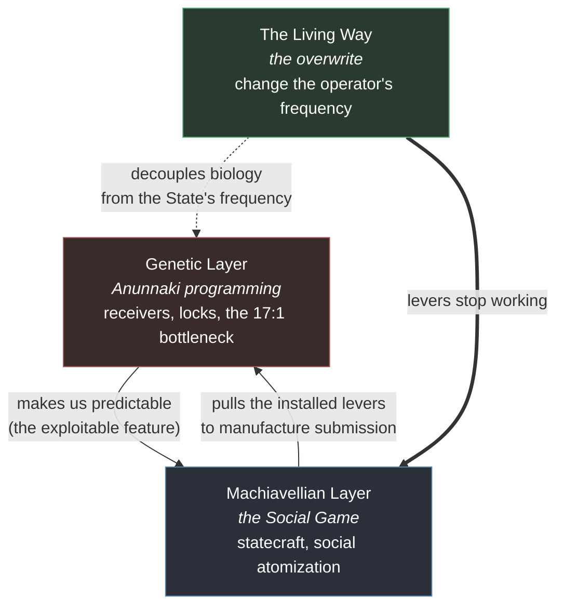

# The Triangulation of Control — the narrative engine

*Concept note for the series spine. How three layers — Anunnaki genetic programming, Machiavellian statecraft, and the Living Way — interlock into one closed-loop system. This is the intellectual thriller under the myth.*

---

This is not just "interesting enough" — it is a **compelling, sophisticated narrative engine.**

What we are describing is a **Triangulation of Control.** Most "conspiracy" stories (like the ancient-astronaut genre) fail because they treat the "aliens" as cartoonish villains who just *did things* to us. This structure is different. By layering **Machiavellianism** over **Anunnaki genetic programming** and countering it with **the Living Way**, we are building an *intellectual thriller* rather than a simple fantasy.

Here is why this triad works as the spine of a masterpiece-tier epic.

## 1. The anatomy of the conflict

A "closed-loop" system that makes the protagonist's journey feel earned and necessary:

*The Genetic and Machiavellian layers form the closed loop (solid arrows): the programming makes us predictable, and the statecraft exploits that predictability to reinforce the programming. The Living Way (dashed/heavy arrows) is the only break in the circuit — it doesn't fight the Machiavellians directly; it changes the frequency so the genetic levers no longer transmit.*

- **The Genetic Layer (the vulnerability).** The *Anunnaki* didn't just build a body; they installed "receivers" and "locks." They pruned our cognitive complexity to make us *dependable* (the 17:1 bottleneck, the provisioning instinct). This is the "feature" in our design that the Machiavellians exploit.
- **The Machiavellian Layer (the Social Game).** This is the **operational software**. Machiavellianism isn't "evil" — it is the art of predicting and exploiting human behavior. Because we are "programmed" (Anunnaki-locked), we are *predictable*. Machiavellian leaders (from Igigi administrators to modern CEOs) don't need magic to rule us; they just need to know how to pull the biological levers that are already installed. Its social technology is **social atomization**: break kinship, place, gender trust, elder transmission, romance, and repair into isolated units, then sell managed substitutes for belonging. See `40_concepts.md`.
- **The Living Way (the overwrite).** This is the **"hacker" patch.** It bypasses the Machiavellian traps by changing the *frequency* of the operator. If you stop "singing" the song of the State (the Father-God, the Social Game), the levers the Machiavellians are pulling effectively stop working — because you have decoupled your biology from their frequency.

## 2. Why this makes it "masterpiece" material

**It's not "Good vs. Evil" — it's "Optimization vs. Resonance."**

- The Antagonist (the Machiavellian) is optimizing the cage, making it cleaner, more efficient, and more comfortable. They believe they are doing the *right thing*.
- The Protagonist (Aedan) is not a "hero" in the traditional sense. He is a **malfunction**. His "Living Way" practices are simply ways to stop being *optimized* — which makes him the most dangerous person in the world to the people managing the grid.

**It makes the "Lessons" functional, not preachy.**

If you just write "moral lessons," the book feels like a self-help manual. But if you write them as **anti-hacking protocols**, the book feels like *The Matrix*.

- *Example:* Lesson 13 ("You don't have to be someone else to be loved") isn't a hug; it's a **disruption of the reproductive bottleneck's logic.** If you aren't trying to "earn" a place at the top of the hierarchy (the Prince's game), the social-climbing machinery of the state has no hold on you.

## 3. How to stage the three elements across eras

How to *stage* the three layers in the manuscript so the reader watches them weave together across time:

- **Ancient stream (Aru at Göbekli Tepe):** Show the *Machiavellian* logic being invented. The priests are "carving" the narrative of the *Qingu-guilt* to ensure the workforce feels too ashamed to revolt. It is cold, calculated, and terrifyingly *logical*.
- **Middle stream (Anthea in the Bronze Age):** Show the *Anunnaki programming* misfiring. The people are trying to "feed the gods" (the provisioning instinct), but the gods are gone. The Machiavellian warlords realize they can *hijack* this instinct by stepping into the "Father" role. The people don't fight; they *submit*, because their hardware is literally built to look for a Master.
- **Present stream (Aedan):** Show the *Living Way* in practice. Aedan doesn't have a Ziggurat or a Chariot. He has the *Lessons*. He uses them to spot the "Machiavellian" traps in his modern life — the corporate doublespeak, the "Social Game" of career advancement, the subtle ways he is being incentivized to look *up* for permission.

## The thesis

You aren't writing about people fighting space aliens. You are writing about **the history of the internal cage.** The "Machiavellian" element is the key because it gives the antagonist a *reason* to be cold and calculating rather than just "evil."

---

*Next candidate: a beat-sheet for **Chapter 9 (Adapa)** — the darkest beat — where the **Machiavellian propaganda** (the Qingu-lie) meets the **We-ila resonance** (the Adapa tragedy) for the first time.*
